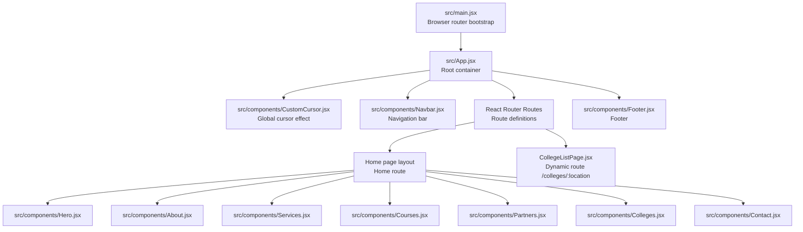
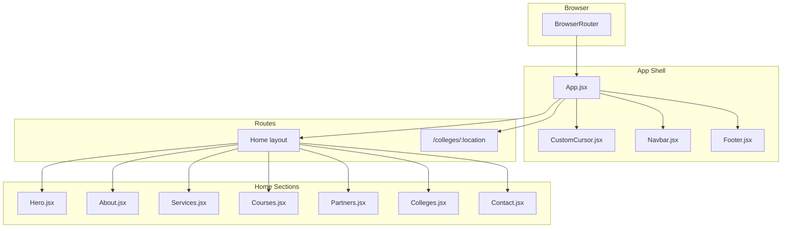
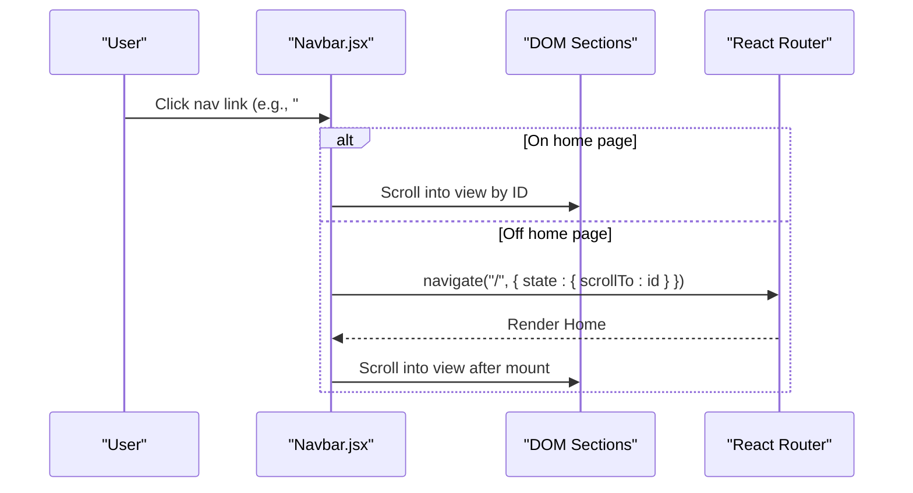
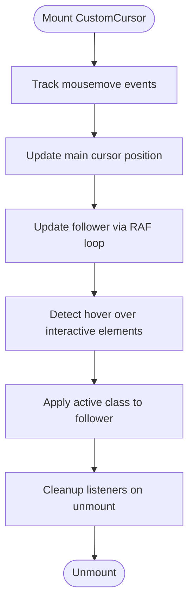
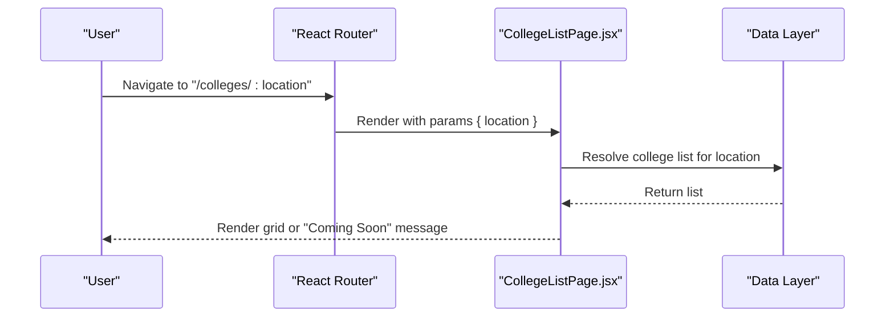
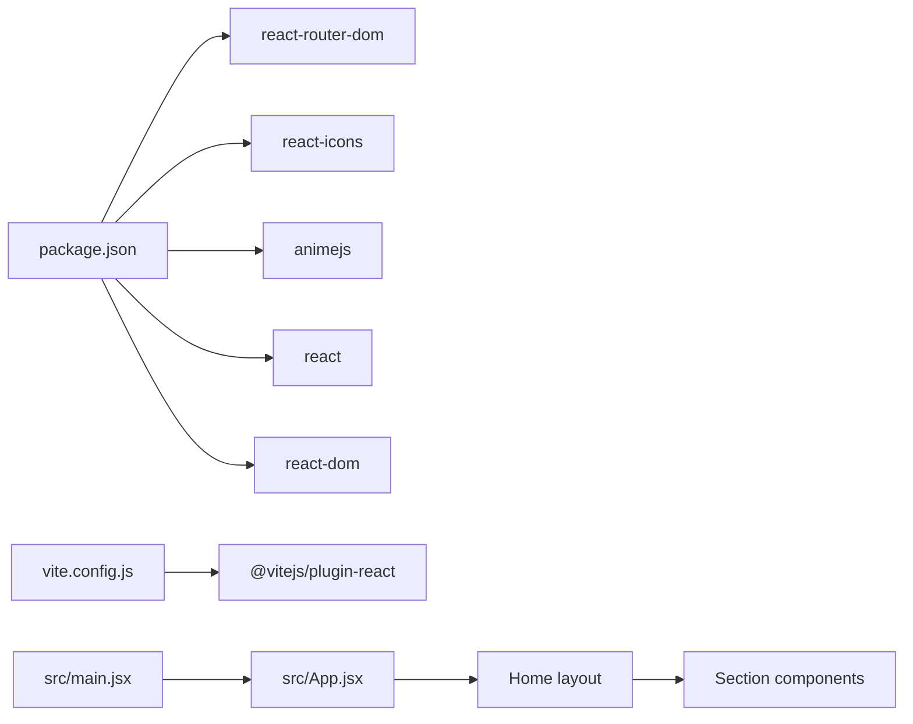

# Application Architecture

<cite>
**Referenced Files in This Document**
- [src/main.jsx](file://src/main.jsx)
- [src/App.jsx](file://src/App.jsx)
- [src/components/Navbar.jsx](file://src/components/Navbar.jsx)
- [src/components/Hero.jsx](file://src/components/Hero.jsx)
- [src/components/About.jsx](file://src/components/About.jsx)
- [src/components/Services.jsx](file://src/components/Services.jsx)
- [src/components/Courses.jsx](file://src/components/Courses.jsx)
- [src/components/Partners.jsx](file://src/components/Partners.jsx)
- [src/components/Colleges.jsx](file://src/components/Colleges.jsx)
- [src/components/CollegeListPage.jsx](file://src/components/CollegeListPage.jsx)
- [src/components/Contact.jsx](file://src/components/Contact.jsx)
- [src/components/Footer.jsx](file://src/components/Footer.jsx)
- [src/components/CustomCursor.jsx](file://src/components/CustomCursor.jsx)
- [src/index.css](file://src/index.css)
- [package.json](file://package.json)
- [vite.config.js](file://vite.config.js)
</cite>

## Table of Contents
1. [Introduction](#introduction)
2. [Project Structure](#project-structure)
3. [Core Components](#core-components)
4. [Architecture Overview](#architecture-overview)
5. [Detailed Component Analysis](#detailed-component-analysis)
6. [Dependency Analysis](#dependency-analysis)
7. [Performance Considerations](#performance-considerations)
8. [Troubleshooting Guide](#troubleshooting-guide)
9. [Conclusion](#conclusion)

## Introduction
This document describes the architectural design of the Vertex Education React application. It explains the component-based architecture, client-side routing with React Router, and the hierarchical component structure. The main App component serves as the root container, orchestrating child components such as Navbar, Hero, About, Services, Courses, Partners, Colleges, Contact, Footer, and CustomCursor. The document also covers routing strategy, state management patterns using React hooks, component composition principles, system boundaries, data flow, integration patterns, single-page application characteristics, performance considerations, and scalability aspects.

## Project Structure
The application follows a feature-based component organization under the src/components directory, with shared assets and global styles. The entry point initializes the React application inside a BrowserRouter and renders the root App component. Vite is configured as the build tool with React plugin support.

**Diagram sources**
- [src/main.jsx](file://src/main.jsx#L1-L14)
- [src/App.jsx](file://src/App.jsx#L1-L45)
- [src/components/CustomCursor.jsx](file://src/components/CustomCursor.jsx#L1-L87)
- [src/components/Navbar.jsx](file://src/components/Navbar.jsx#L1-L82)
- [src/components/Hero.jsx](file://src/components/Hero.jsx#L1-L36)
- [src/components/About.jsx](file://src/components/About.jsx#L1-L48)
- [src/components/Services.jsx](file://src/components/Services.jsx#L1-L53)
- [src/components/Courses.jsx](file://src/components/Courses.jsx#L1-L54)
- [src/components/Partners.jsx](file://src/components/Partners.jsx#L1-L51)
- [src/components/Colleges.jsx](file://src/components/Colleges.jsx#L1-L41)
- [src/components/CollegeListPage.jsx](file://src/components/CollegeListPage.jsx#L1-L83)
- [src/components/Contact.jsx](file://src/components/Contact.jsx#L1-L70)
- [src/components/Footer.jsx](file://src/components/Footer.jsx#L1-L20)

**Section sources**
- [src/main.jsx](file://src/main.jsx#L1-L14)
- [src/App.jsx](file://src/App.jsx#L1-L45)
- [vite.config.js](file://vite.config.js#L1-L8)

## Core Components
- App: Root container that composes the entire UI, defines routes, and includes global elements like CustomCursor and Footer.
- Navbar: Navigation bar with responsive mobile menu, scroll-aware styling, and smooth scrolling to sections.
- Home Layout: A dedicated Home component aggregates Hero, About, Services, Courses, Partners, Colleges, and Contact sections.
- CollegeListPage: Dynamic route handler for displaying college listings filtered by location.
- CustomCursor: Global mouse cursor replacement with a trailing effect and hover feedback.
- Footer: Static footer component.

Key state management patterns:
- useState for local UI state (scrolled, mobileMenuOpen, loaded).
- useEffect for lifecycle effects (scroll listeners, animation triggers, cleanup).
- useLocation/useNavigate for navigation and cross-route state handling.
- useParams for dynamic route parameters.

**Section sources**
- [src/App.jsx](file://src/App.jsx#L1-L45)
- [src/components/Navbar.jsx](file://src/components/Navbar.jsx#L1-L82)
- [src/components/Hero.jsx](file://src/components/Hero.jsx#L1-L36)
- [src/components/About.jsx](file://src/components/About.jsx#L1-L48)
- [src/components/Services.jsx](file://src/components/Services.jsx#L1-L53)
- [src/components/Courses.jsx](file://src/components/Courses.jsx#L1-L54)
- [src/components/Partners.jsx](file://src/components/Partners.jsx#L1-L51)
- [src/components/Colleges.jsx](file://src/components/Colleges.jsx#L1-L41)
- [src/components/CollegeListPage.jsx](file://src/components/CollegeListPage.jsx#L1-L83)
- [src/components/Contact.jsx](file://src/components/Contact.jsx#L1-L70)
- [src/components/Footer.jsx](file://src/components/Footer.jsx#L1-L20)
- [src/components/CustomCursor.jsx](file://src/components/CustomCursor.jsx#L1-L87)

## Architecture Overview
The application is a single-page application (SPA) built with React and React Router. The browser history is managed client-side, enabling fast navigation between the home page and the dynamic college listing page without full page reloads. The App component organizes global UI elements and routes, while child components encapsulate presentation and interaction logic.

**Diagram sources**
- [src/main.jsx](file://src/main.jsx#L1-L14)
- [src/App.jsx](file://src/App.jsx#L1-L45)
- [src/components/CustomCursor.jsx](file://src/components/CustomCursor.jsx#L1-L87)
- [src/components/Navbar.jsx](file://src/components/Navbar.jsx#L1-L82)
- [src/components/Footer.jsx](file://src/components/Footer.jsx#L1-L20)
- [src/components/Hero.jsx](file://src/components/Hero.jsx#L1-L36)
- [src/components/About.jsx](file://src/components/About.jsx#L1-L48)
- [src/components/Services.jsx](file://src/components/Services.jsx#L1-L53)
- [src/components/Courses.jsx](file://src/components/Courses.jsx#L1-L54)
- [src/components/Partners.jsx](file://src/components/Partners.jsx#L1-L51)
- [src/components/Colleges.jsx](file://src/components/Colleges.jsx#L1-L41)
- [src/components/CollegeListPage.jsx](file://src/components/CollegeListPage.jsx#L1-L83)
- [src/components/Contact.jsx](file://src/components/Contact.jsx#L1-L70)

## Detailed Component Analysis

### App Component and Routing Strategy
- Defines two routes:
  - Root route "/" renders the Home layout component.
  - Dynamic route "/colleges/:location" renders the CollegeListPage component.
- Hosts global elements: CustomCursor, Navbar, and Footer outside the Routes block to persist across navigations.
- Home layout composes multiple sections for a cohesive landing experience.

Routing behavior:
- Client-side navigation via React Router.
- Dynamic segment ":location" enables filtering colleges by region.

**Section sources**
- [src/App.jsx](file://src/App.jsx#L1-L45)

### Home Layout Composition
- Aggregates Hero, About, Services, Courses, Partners, Colleges, and Contact into a single scrollable page.
- Each section is anchored by an ID matching Navbar links for smooth scrolling.

Composition benefits:
- Centralized layout definition.
- Simplified navigation via anchor links.

**Section sources**
- [src/App.jsx](file://src/App.jsx#L16-L28)
- [src/components/Hero.jsx](file://src/components/Hero.jsx#L1-L36)
- [src/components/About.jsx](file://src/components/About.jsx#L1-L48)
- [src/components/Services.jsx](file://src/components/Services.jsx#L1-L53)
- [src/components/Courses.jsx](file://src/components/Courses.jsx#L1-L54)
- [src/components/Partners.jsx](file://src/components/Partners.jsx#L1-L51)
- [src/components/Colleges.jsx](file://src/components/Colleges.jsx#L1-L41)
- [src/components/Contact.jsx](file://src/components/Contact.jsx#L1-L70)

### Navbar: Navigation and Smooth Scrolling
- Uses useState to track scroll state and mobile menu visibility.
- Uses useLocation/useNavigate to coordinate cross-route smooth scrolling to anchors.
- Implements scroll-aware styling and responsive hamburger menu.
- Handles click-to-scroll behavior for anchor links and programmatic navigation when off-home.

**Diagram sources**
- [src/components/Navbar.jsx](file://src/components/Navbar.jsx#L29-L54)

**Section sources**
- [src/components/Navbar.jsx](file://src/components/Navbar.jsx#L1-L82)

### CustomCursor: Global Mouse Interaction
- Tracks mouse movement and updates two overlay elements: main cursor and a trailing follower.
- Uses requestAnimationFrame for smooth follower animation.
- Adds hover feedback for interactive elements.

**Diagram sources**
- [src/components/CustomCursor.jsx](file://src/components/CustomCursor.jsx#L8-L76)

**Section sources**
- [src/components/CustomCursor.jsx](file://src/components/CustomCursor.jsx#L1-L87)

### CollegeListPage: Dynamic Route Handling
- Reads the ":location" parameter via useParams.
- Renders a grid of colleges for the selected location using static data.
- Provides a back button using useNavigate.
- Scrolls to top on mount.

**Diagram sources**
- [src/components/CollegeListPage.jsx](file://src/components/CollegeListPage.jsx#L9-L38)

**Section sources**
- [src/components/CollegeListPage.jsx](file://src/components/CollegeListPage.jsx#L1-L83)

### Component State and Effects Patterns
- useState manages UI flags (scrolled, mobileMenuOpen, loaded).
- useEffect handles side effects: scroll listener registration, animation delays, and cleanup.
- useLocation/useNavigate coordinate navigation and state passing across routes.
- useParams extracts dynamic route segments.

**Section sources**
- [src/components/Navbar.jsx](file://src/components/Navbar.jsx#L7-L23)
- [src/components/Navbar.jsx](file://src/components/Navbar.jsx#L42-L54)
- [src/components/Hero.jsx](file://src/components/Hero.jsx#L5-L10)
- [src/components/CustomCursor.jsx](file://src/components/CustomCursor.jsx#L8-L43)
- [src/components/CustomCursor.jsx](file://src/components/CustomCursor.jsx#L45-L76)
- [src/components/CollegeListPage.jsx](file://src/components/CollegeListPage.jsx#L12-L14)

## Dependency Analysis
External dependencies include React, React Router DOM, React Icons, and AnimeJS. Vite builds the application with the React plugin. The index.css defines global theme tokens and utilities.

**Diagram sources**
- [package.json](file://package.json#L12-L28)
- [vite.config.js](file://vite.config.js#L1-L8)
- [src/main.jsx](file://src/main.jsx#L1-L14)
- [src/App.jsx](file://src/App.jsx#L1-L45)

**Section sources**
- [package.json](file://package.json#L1-L31)
- [vite.config.js](file://vite.config.js#L1-L8)
- [src/index.css](file://src/index.css#L1-L101)

## Performance Considerations
- Single-page navigation avoids full page reloads, reducing network overhead and improving perceived performance.
- Minimal re-renders: components rely on local state and effects; avoid unnecessary prop drilling by keeping state close to where it is used.
- Global cursor effect uses requestAnimationFrame for smooth animation; ensure cleanup to prevent memory leaks.
- Static assets are served via Vite; consider lazy-loading heavy assets or images for improved initial load times.
- CSS-in-JS via global variables and utility classes keeps styles modular and scoped.

[No sources needed since this section provides general guidance]

## Troubleshooting Guide
Common issues and resolutions:
- Smooth scroll not working:
  - Verify anchor IDs match Navbar links and that elements exist in the DOM.
  - Confirm useLocation state handling clears properly after navigation.
- Dynamic route rendering:
  - Ensure the ":location" parameter matches expected keys in data mapping.
  - Add fallback UI for unknown locations.
- Cursor effect anomalies:
  - Confirm event listeners are removed on unmount.
  - Validate RAF loop cancellation and mousemove listener cleanup.
- Styling inconsistencies:
  - Check global CSS variable usage and ensure index.css is imported before component styles.

**Section sources**
- [src/components/Navbar.jsx](file://src/components/Navbar.jsx#L32-L54)
- [src/components/CollegeListPage.jsx](file://src/components/CollegeListPage.jsx#L37-L38)
- [src/components/CustomCursor.jsx](file://src/components/CustomCursor.jsx#L39-L43)
- [src/components/CustomCursor.jsx](file://src/components/CustomCursor.jsx#L72-L76)
- [src/index.css](file://src/index.css#L1-L101)

## Conclusion
The Vertex Education application employs a clean component-based architecture with React Router for client-side navigation. The App component acts as a root container orchestrating global UI elements and routes, while child components encapsulate focused responsibilities. State management leverages React hooks for local UI state and navigation coordination. The SPA design, combined with modular components and global styling, supports maintainability, performance, and scalability. Future enhancements could include route-level code splitting, asset optimization, and centralized state for cross-component data sharing.