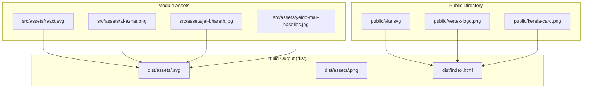
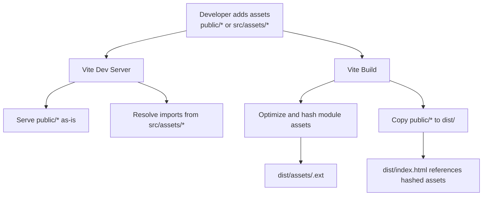
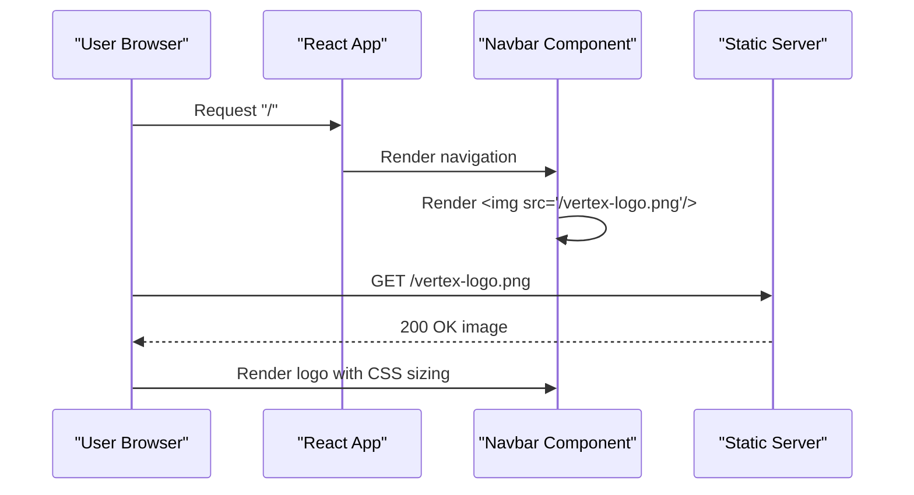
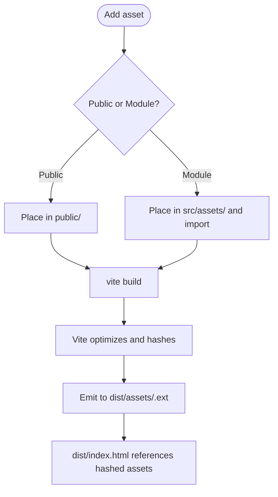
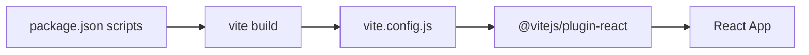

# Assets and Media Management

<cite>
**Referenced Files in This Document**
- [vite.config.js](file://vite.config.js)
- [package.json](file://package.json)
- [public/index.html](file://index.html)
- [public/vite.svg](file://public/vite.svg)
- [public/vertex-logo.png](file://public/vertex-logo.png)
- [public/kerala-card.png](file://public/kerala-card.png)
- [src/main.jsx](file://src/main.jsx)
- [src/App.jsx](file://src/App.jsx)
- [src/components/Navbar.jsx](file://src/components/Navbar.jsx)
- [src/components/Navbar.css](file://src/components/Navbar.css)
- [src/components/About.jsx](file://src/components/About.jsx)
- [src/components/Partners.jsx](file://src/components/Partners.jsx)
- [src/index.css](file://src/index.css)
</cite>

## Table of Contents
1. [Introduction](#introduction)
2. [Project Structure](#project-structure)
3. [Core Components](#core-components)
4. [Architecture Overview](#architecture-overview)
5. [Detailed Component Analysis](#detailed-component-analysis)
6. [Dependency Analysis](#dependency-analysis)
7. [Performance Considerations](#performance-considerations)
8. [Troubleshooting Guide](#troubleshooting-guide)
9. [Conclusion](#conclusion)
10. [Appendices](#appendices)

## Introduction
This document explains how assets and media are organized and managed in the Vertex Education website. It covers the distinction between public and module assets, branding and media usage, image optimization strategies, accessibility, responsive behavior, and the build and deployment pipeline. It also provides practical guidelines for adding new assets, optimizing image sizes, implementing lazy loading, and maintaining versioning.

## Project Structure
The project follows a standard Vite + React layout:
- public: Static assets served as-is by the dev server and copied to the build output. These are referenced via absolute paths from the app root.
- src/assets: Module assets imported directly into JavaScript/JSX. These are processed by Vite and bundled with the application.
- Build artifacts are emitted under dist with hashed filenames for cache busting.

Key asset locations:
- Public assets: public/vite.svg, public/vertex-logo.png, public/kerala-card.png
- Module assets: src/assets/react.svg, src/assets/al-azhar.png, src/assets/jai-bharath.jpg, src/assets/yeldo-mar-baselios.jpg

**Diagram sources**
- [public/vite.svg](file://public/vite.svg)
- [public/vertex-logo.png](file://public/vertex-logo.png)
- [public/kerala-card.png](file://public/kerala-card.png)
- [src/assets/react.svg](file://src/assets/react.svg)
- [src/assets/al-azhar.png](file://src/assets/al-azhar.png)
- [src/assets/jai-bharath.jpg](file://src/assets/jai-bharath.jpg)
- [src/assets/yeldo-mar-baselios.jpg](file://src/assets/yeldo-mar-baselios.jpg)
- [index.html](file://index.html)

**Section sources**
- [vite.config.js](file://vite.config.js#L1-L8)
- [package.json](file://package.json#L1-L31)
- [index.html](file://index.html)

## Core Components
- Public assets are referenced with leading slashes (e.g., "/vertex-logo.png") and are served from the app root. They bypass Vite’s module resolution and are ideal for brand assets and small media that do not require bundling.
- Module assets are imported inside components and JSX. Vite resolves them, optimizes them during build, and returns a URL string for use in img/src or CSS backgrounds.
- Branding assets: The primary logo is referenced from the public directory in the navigation bar.
- Promotional materials: The public directory includes a promotional card image suitable for direct serving.
- Institutional imagery: Module assets include several institutional images used within the application.

Practical implications:
- Use public for favicon, robots.txt, large media referenced globally, or assets referenced outside of component imports.
- Use module assets for images used directly in components to benefit from Vite’s optimization and versioning.

**Section sources**
- [src/components/Navbar.jsx](file://src/components/Navbar.jsx#L59-L61)
- [src/components/Navbar.css](file://src/components/Navbar.css#L29-L33)
- [public/vertex-logo.png](file://public/vertex-logo.png)
- [public/kerala-card.png](file://public/kerala-card.png)
- [src/assets/al-azhar.png](file://src/assets/al-azhar.png)
- [src/assets/jai-bharath.jpg](file://src/assets/jai-bharath.jpg)
- [src/assets/yeldo-mar-baselios.jpg](file://src/assets/yeldo-mar-baselios.jpg)

## Architecture Overview
The asset pipeline integrates Vite’s development server and build process with React rendering. Public assets are copied into the output directory and referenced via root-relative URLs. Module assets are resolved, optimized, and hashed for cache busting.

**Diagram sources**
- [vite.config.js](file://vite.config.js#L1-L8)
- [package.json](file://package.json#L6-L10)
- [index.html](file://index.html)

**Section sources**
- [vite.config.js](file://vite.config.js#L1-L8)
- [package.json](file://package.json#L6-L10)

## Detailed Component Analysis

### Logo Management
- The logo is placed in the public directory and referenced in the navigation bar using a root-relative path. This ensures it loads consistently across routes and pages.
- CSS controls the logo sizing and hover effects.

**Diagram sources**
- [src/components/Navbar.jsx](file://src/components/Navbar.jsx#L59-L61)
- [src/components/Navbar.css](file://src/components/Navbar.css#L29-L33)
- [public/vertex-logo.png](file://public/vertex-logo.png)

**Section sources**
- [src/components/Navbar.jsx](file://src/components/Navbar.jsx#L59-L61)
- [src/components/Navbar.css](file://src/components/Navbar.css#L29-L33)

### Partner Institution Images
- Institutional images are stored as module assets and imported into components. This enables Vite to optimize them and include them in the bundle with hashed filenames.
- The Partners page lists partner institutions but does not currently render images. To add logos, import the PNGs into the component and render them as needed.

Guidelines:
- Place per-page images in src/assets and import them into the relevant component.
- Keep image names descriptive and lowercase.

**Section sources**
- [src/assets/al-azhar.png](file://src/assets/al-azhar.png)
- [src/assets/jai-bharath.jpg](file://src/assets/jai-bharath.jpg)
- [src/assets/yeldo-mar-baselios.jpg](file://src/assets/yeldo-mar-baselios.jpg)

### Promotional Materials
- The promotional card image resides in the public directory and can be referenced directly in templates or pages that require global media assets.
- Ideal for banners, social sharing previews, or any asset referenced outside of component imports.

**Section sources**
- [public/kerala-card.png](file://public/kerala-card.png)

### Asset Pipeline and Build-Time Processing
- Vite processes module assets imported in components, applies optimization, and emits hashed filenames. Public assets are copied as-is.
- Scripts for development, build, and preview are defined in package.json.

**Diagram sources**
- [vite.config.js](file://vite.config.js#L1-L8)
- [package.json](file://package.json#L6-L10)

**Section sources**
- [vite.config.js](file://vite.config.js#L1-L8)
- [package.json](file://package.json#L6-L10)

## Dependency Analysis
- The application depends on Vite for asset processing and bundling. The React plugin is enabled.
- The build script triggers Vite’s build command, which handles both public and module assets.

**Diagram sources**
- [package.json](file://package.json#L6-L10)
- [vite.config.js](file://vite.config.js#L1-L8)

**Section sources**
- [package.json](file://package.json#L6-L10)
- [vite.config.js](file://vite.config.js#L1-L8)

## Performance Considerations
- Prefer module assets for images used inside components so Vite can optimize them (resize, compress, choose formats).
- Use appropriate image formats (PNG, JPEG, WebP) depending on content and browser support.
- Implement lazy loading for images below the fold to improve initial load performance.
- Maintain aspect ratios and specify width/height to prevent layout shifts.
- Use responsive breakpoints and consider delivering appropriately sized images for different viewports.

[No sources needed since this section provides general guidance]

## Troubleshooting Guide
- Broken public asset links: Verify the path starts with a slash and matches the filename in the public directory.
- Missing module assets: Ensure the import path is correct and the file exists in src/assets.
- Incorrect alt text: Add descriptive alt attributes for all meaningful images to satisfy accessibility requirements.
- Layout shifts: Set explicit dimensions on images to avoid Cumulative Layout Shift (CLS).
- Build errors: Confirm the asset extension is supported and the file is not corrupted.

**Section sources**
- [src/components/Navbar.jsx](file://src/components/Navbar.jsx#L60)
- [src/components/Navbar.css](file://src/components/Navbar.css#L30-L31)

## Conclusion
The Vertex Education site leverages a clear separation between public and module assets. Public assets are ideal for globally referenced items like logos, while module assets enable Vite-driven optimization and versioning for component-specific images. Following the guidelines in this document will help maintain a fast, accessible, and scalable media strategy.

## Appendices

### Adding New Assets
- Public assets: Place in public/ and reference with a leading slash in templates or CSS.
- Module assets: Place in src/assets/ and import them in components. Vite will optimize and hash them automatically.

**Section sources**
- [src/components/Navbar.jsx](file://src/components/Navbar.jsx#L60)
- [vite.config.js](file://vite.config.js#L1-L8)

### Image Optimization Strategies
- Choose modern formats (WebP) when supported; provide fallbacks.
- Compress images without sacrificing quality.
- Serve appropriately sized images for desktop and mobile.
- Use lazy loading for off-screen images.

[No sources needed since this section provides general guidance]

### Accessibility and Responsive Image Strategies
- Always provide descriptive alt text for meaningful images.
- Use responsive images with appropriate sizes and densities.
- Ensure sufficient color contrast and readable text alternatives.

**Section sources**
- [src/components/Navbar.jsx](file://src/components/Navbar.jsx#L60)

### Deployment Considerations
- Public assets are copied to the build output and served as-is.
- Module assets are hashed and cached efficiently by browsers.
- Ensure CDN caching policies align with hashed filenames for long-term caching.

**Section sources**
- [package.json](file://package.json#L8)
- [index.html](file://index.html)