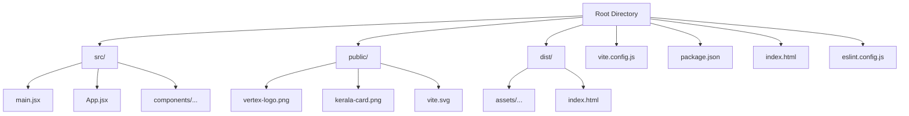
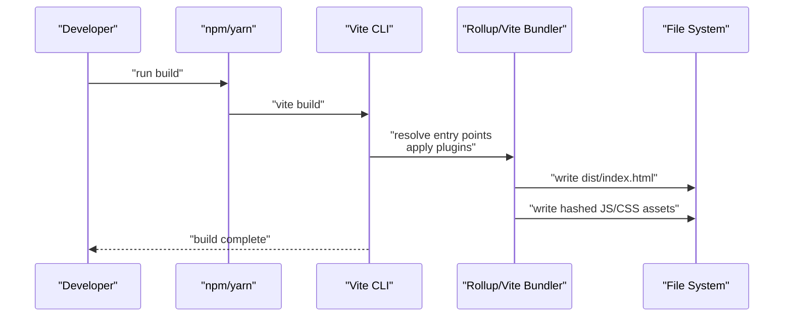

# Build and Deployment

<cite>
**Referenced Files in This Document**
- [vite.config.js](file://vite.config.js)
- [package.json](file://package.json)
- [index.html](file://index.html)
- [dist/index.html](file://dist/index.html)
- [src/main.jsx](file://src/main.jsx)
- [src/App.jsx](file://src/App.jsx)
- [src/components/Colleges.jsx](file://src/components/Colleges.jsx)
- [eslint.config.js](file://eslint.config.js)
- [README.md](file://README.md)
</cite>

## Table of Contents
1. [Introduction](#introduction)
2. [Project Structure](#project-structure)
3. [Core Components](#core-components)
4. [Architecture Overview](#architecture-overview)
5. [Detailed Component Analysis](#detailed-component-analysis)
6. [Dependency Analysis](#dependency-analysis)
7. [Performance Considerations](#performance-considerations)
8. [Troubleshooting Guide](#troubleshooting-guide)
9. [Conclusion](#conclusion)
10. [Appendices](#appendices)

## Introduction
This document provides comprehensive build and deployment guidance for the Vertex Education website. It explains the Vite build configuration, development versus production environments, optimization strategies, and deployment options for static hosting and CDN distribution. It also covers environment variable management, build artifact analysis, caching strategies, deployment checklists, troubleshooting, performance monitoring, CI/CD workflows, automated deployments, and rollback procedures.

## Project Structure
The project is a React application built with Vite. Key build-related files and directories include:
- Vite configuration for plugin setup
- Package scripts for development, building, and preview
- Application entry point and routing setup
- Root HTML template consumed by Vite
- Production build output structure under dist
- Linting configuration excluding the dist folder

**Diagram sources**
- [vite.config.js](file://vite.config.js#L1-L8)
- [package.json](file://package.json#L1-L31)
- [index.html](file://index.html#L1-L14)
- [dist/index.html](file://dist/index.html#L1-L15)
- [src/main.jsx](file://src/main.jsx#L1-L14)
- [src/App.jsx](file://src/App.jsx#L1-L45)
- [eslint.config.js](file://eslint.config.js#L1-L30)

**Section sources**
- [vite.config.js](file://vite.config.js#L1-L8)
- [package.json](file://package.json#L1-L31)
- [index.html](file://index.html#L1-L14)
- [dist/index.html](file://dist/index.html#L1-L15)
- [src/main.jsx](file://src/main.jsx#L1-L14)
- [src/App.jsx](file://src/App.jsx#L1-L45)
- [eslint.config.js](file://eslint.config.js#L1-L30)

## Core Components
- Vite configuration: Minimal setup enabling the React plugin for fast refresh and JSX transformations.
- Package scripts: Standard commands for local development, production builds, preview, and linting.
- Application entry: React root creation with routing and strict mode.
- Routing: Single-page application routes for home and dynamic college listings.
- Root HTML: Template injected by Vite with module script and favicon link.
- Build output: Dist directory containing hashed assets and a generated HTML file.

Key implementation references:
- Vite config export and plugin registration
- Scripts for dev/build/preview/lint
- Application bootstrap and router wiring
- Route definitions for home and dynamic path
- Root HTML template and asset links
- Generated dist HTML with cross-origin asset links

**Section sources**
- [vite.config.js](file://vite.config.js#L1-L8)
- [package.json](file://package.json#L6-L11)
- [src/main.jsx](file://src/main.jsx#L1-L14)
- [src/App.jsx](file://src/App.jsx#L30-L42)
- [index.html](file://index.html#L1-L14)
- [dist/index.html](file://dist/index.html#L8-L9)

## Architecture Overview
The build pipeline transforms source files into optimized static assets and an HTML shell. Vite compiles JSX, applies React plugin transformations, and bundles JavaScript/CSS. During production builds, Vite generates hashed filenames for cache busting and emits an HTML file linking to the bundled assets.

**Diagram sources**
- [package.json](file://package.json#L8-L8)
- [vite.config.js](file://vite.config.js#L5-L7)
- [dist/index.html](file://dist/index.html#L8-L9)

## Detailed Component Analysis

### Vite Build Configuration
- Purpose: Configure Vite with the React plugin for JSX transformations and fast refresh.
- Behavior: Enables React plugin; no custom rollup or output options are set, allowing Vite defaults for asset hashing and chunking.
- Implications: Default Rollup code splitting applies; assets receive hash suffixes for cache busting.

Optimization considerations:
- Enable explicit code splitting for route-based lazy loading.
- Add output configuration for custom asset paths or CDN base URLs.
- Integrate minification and compression plugins for production.

**Section sources**
- [vite.config.js](file://vite.config.js#L1-L8)

### Package Scripts and Environment
- Scripts:
  - dev: Starts Vite dev server with hot module replacement.
  - build: Produces optimized production bundle in dist.
  - preview: Serves the dist directory locally for testing.
  - lint: Runs ESLint across the project.
- Environment variables:
  - Not currently configured in scripts; consider adding NODE_ENV and optional feature flags for feature toggles.

Recommendations:
- Set NODE_ENV=production during build for minified output.
- Use environment variable prefixes (VITE_) for client-side values exposed to the browser.

**Section sources**
- [package.json](file://package.json#L6-L11)

### Application Entry and Routing
- Entry point initializes React root, wraps the app in strict mode and router, and imports global styles.
- App defines routes for home and a dynamic college listing page.
- Route composition renders a composite home page and footer.

Implications for build:
- Route-based code splitting can reduce initial bundle size.
- CSS imports are inlined or extracted by Vite; ensure styles are scoped appropriately.

**Section sources**
- [src/main.jsx](file://src/main.jsx#L1-L14)
- [src/App.jsx](file://src/App.jsx#L30-L42)

### Asset Loading and Public Assets
- Public assets (images) are referenced via absolute paths from the public root.
- Example usage in components demonstrates image paths served from the public directory.

Build implications:
- Public assets bypass Vite’s module resolution; ensure paths align with deployment base URL.
- For CDN distribution, host public assets on a CDN and update base URL accordingly.

**Section sources**
- [src/components/Colleges.jsx](file://src/components/Colleges.jsx#L15-L23)

### Root HTML Template
- Template includes meta tags, favicon link, and mounts the React app into a root div.
- Vite injects module script and asset links into the HTML during build.

Production considerations:
- Keep HTML minimal; rely on Vite’s injection for hashed assets.
- Ensure canonical and SEO metadata are present in the template.

**Section sources**
- [index.html](file://index.html#L1-L14)

### Production Build Output
- dist/index.html references hashed JS and CSS assets with cross-origin attributes.
- Assets in dist/assets are hashed for cache busting.

Artifact analysis:
- Inspect hashed filenames to confirm cache invalidation.
- Verify asset sizes and counts to track bundle growth.

**Section sources**
- [dist/index.html](file://dist/index.html#L8-L9)

### Linting and Quality Gates
- ESLint configuration excludes the dist directory and sets recommended rules for React hooks and Vite refresh.
- No TypeScript configuration is present; consider migrating to TS for stricter checks.

Recommendations:
- Add TypeScript and ts-eslint for type-aware linting.
- Integrate linting into CI workflows.

**Section sources**
- [eslint.config.js](file://eslint.config.js#L8-L8)
- [eslint.config.js](file://eslint.config.js#L11-L15)
- [README.md](file://README.md#L10-L16)

## Dependency Analysis
- Runtime dependencies include React, ReactDOM, React Router DOM, and UI icons.
- Dev dependencies include Vite, React plugin, ESLint, and related tooling.
- No explicit build-time dependencies beyond Vite and its plugins.

Coupling and cohesion:
- Application code is cohesive around React Router and component composition.
- Build configuration remains decoupled and minimal.

Potential improvements:
- Add explicit output paths and CDN base configuration.
- Introduce environment variable handling for feature flags.

**Section sources**
- [package.json](file://package.json#L12-L29)

## Performance Considerations
Current state:
- Default Vite behavior applies hashing and basic minification.
- No explicit code splitting or preloading directives are configured.

Recommended optimizations:
- Route-based lazy loading to split chunks for the home page and dynamic routes.
- CSS extraction and critical CSS inlining for above-the-fold content.
- Preload key resources and prefetch navigation targets.
- Enable compression (gzip/Brotli) on the web server or CDN.
- Implement long-term caching for hashed assets with immutable cache headers.

[No sources needed since this section provides general guidance]

## Troubleshooting Guide
Common build issues and resolutions:
- Missing dist after build: Ensure the build command runs successfully and dist exists post-build.
- Broken asset paths: Confirm public asset paths and base URL alignment; adjust if deploying under a subpath.
- Hot reload not working: Verify dev server is running and port is free; check firewall/proxy settings.
- Lint errors blocking commits: Fix reported issues or adjust ESLint rules as appropriate.

Environment variable pitfalls:
- Client-side env vars must use VITE_ prefix; otherwise they are ignored by the browser.
- NODE_ENV affects minification; ensure production builds set this variable.

**Section sources**
- [package.json](file://package.json#L6-L11)
- [eslint.config.js](file://eslint.config.js#L8-L8)

## Conclusion
The Vertex Education website uses a minimal yet effective Vite setup suitable for rapid iteration and efficient production builds. By adopting route-based code splitting, explicit output configuration, and robust environment variable management, teams can further optimize bundle sizes and deployment reliability. Static hosting and CDN distribution are straightforward given the current asset model, while CI/CD automation and caching strategies can be layered on top for scalable delivery.

[No sources needed since this section summarizes without analyzing specific files]

## Appendices

### Build Process and Artifact Analysis
- Build command produces hashed assets and a generated HTML file.
- Analyze dist/index.html for asset references and verify hashed filenames.
- Review asset sizes and counts to monitor bundle growth.

**Section sources**
- [package.json](file://package.json#L8-L8)
- [dist/index.html](file://dist/index.html#L8-L9)

### Deployment Strategies
- Static hosting: Serve dist via any static host (GitHub Pages, Netlify, Vercel, AWS S3).
- CDN distribution: Host hashed assets on a CDN; configure origin to serve dist and set long-lived cache headers.
- Subpath deployment: Adjust base URL and output paths if hosting under a subdirectory.

[No sources needed since this section provides general guidance]

### Environment Variable Management
- Client-side variables: Prefix with VITE_ and avoid sensitive data.
- Feature flags: Use environment variables to toggle features in production.
- Local overrides: Maintain separate .env files per environment.

**Section sources**
- [package.json](file://package.json#L6-L11)

### Caching Strategies
- Long-term caching: Hashed filenames enable immutable caching for JS/CSS.
- Short-term caching: HTML can use shorter cache lifetimes for quick updates.
- CDN caching: Configure cache-control headers and consider origin caching policies.

**Section sources**
- [dist/index.html](file://dist/index.html#L8-L9)

### Deployment Checklist
- Run build locally and preview dist.
- Verify hashed assets and HTML references.
- Test public assets and routing.
- Configure environment variables for target environment.
- Upload dist to hosting provider or CDN.
- Set cache-control headers and security headers.
- Monitor performance and error logs.

[No sources needed since this section provides general guidance]

### Continuous Integration and Automated Deployments
- CI jobs: Install dependencies, run lint, build, and preview tests.
- Automated deployments: Trigger on main branch pushes; deploy to staging, then promote to production.
- Rollback procedures: Tag releases, keep previous builds, and switch CDN/origin back to last known good version.

[No sources needed since this section provides general guidance]