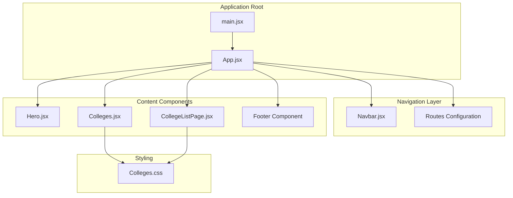
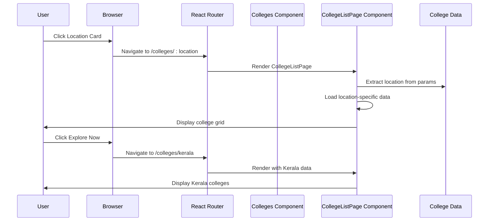
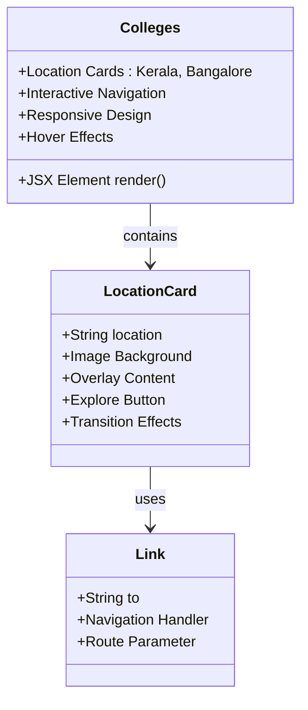
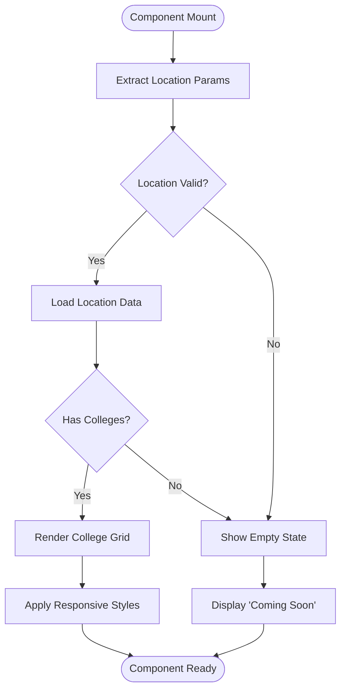
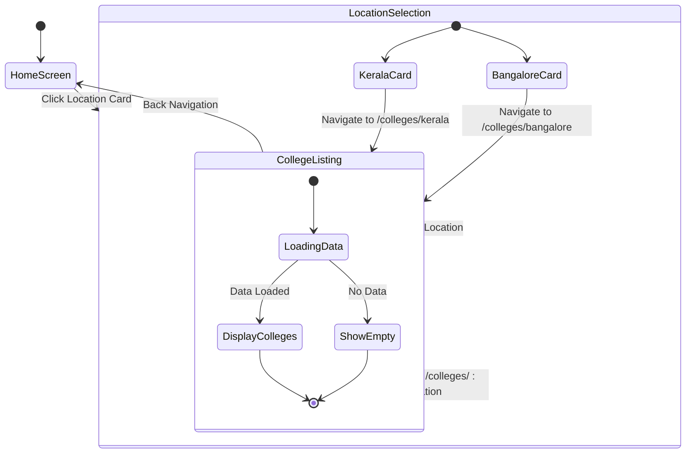
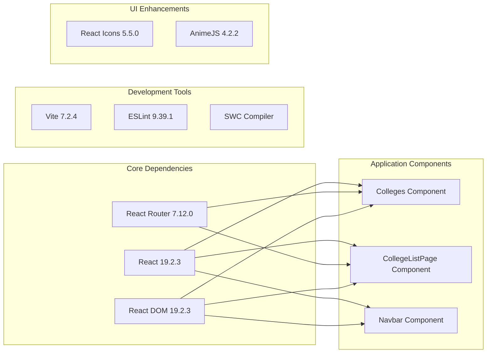

# College Exploration System

<cite>
**Referenced Files in This Document**
- [Colleges.jsx](file://src/components/Colleges.jsx)
- [CollegeListPage.jsx](file://src/components/CollegeListPage.jsx)
- [Colleges.css](file://src/components/Colleges.css)
- [App.jsx](file://src/App.jsx)
- [main.jsx](file://src/main.jsx)
- [Navbar.jsx](file://src/components/Navbar.jsx)
- [Hero.jsx](file://src/components/Hero.jsx)
- [package.json](file://package.json)
</cite>

## Table of Contents
1. [Introduction](#introduction)
2. [Project Structure](#project-structure)
3. [Core Components](#core-components)
4. [Architecture Overview](#architecture-overview)
5. [Detailed Component Analysis](#detailed-component-analysis)
6. [Dependency Analysis](#dependency-analysis)
7. [Performance Considerations](#performance-considerations)
8. [Troubleshooting Guide](#troubleshooting-guide)
9. [Conclusion](#conclusion)

## Introduction
The College Exploration System is a React-based web application designed to showcase educational institutions across different geographic locations. The system provides an intuitive interface for users to discover colleges through a location-based gateway and explore detailed listings for specific regions. Built with modern React patterns and responsive design principles, the application offers seamless navigation between location selection and detailed college information.

The system consists of two primary components: a location-based gateway that allows users to select their desired region, and a dynamic college listing page that displays institutional information based on the selected location. The implementation leverages React Router for navigation, CSS Grid for responsive layouts, and modern React hooks for state management and lifecycle events.

## Project Structure
The application follows a component-based architecture with clear separation of concerns. The college exploration functionality is encapsulated within dedicated components that handle specific aspects of the user journey.

**Diagram sources**
- [main.jsx](file://src/main.jsx#L1-L14)
- [App.jsx](file://src/App.jsx#L1-L45)
- [Colleges.jsx](file://src/components/Colleges.jsx#L1-L41)
- [CollegeListPage.jsx](file://src/components/CollegeListPage.jsx#L1-L83)

**Section sources**
- [main.jsx](file://src/main.jsx#L1-L14)
- [App.jsx](file://src/App.jsx#L1-L45)

## Core Components
The college exploration system comprises several interconnected components that work together to provide a seamless user experience. Each component serves a specific purpose in the overall architecture while maintaining consistency in design and functionality.

### Location Gateway Component
The Colleges component acts as the primary entry point for college exploration, featuring a visually appealing location selection interface with interactive cards for different regions. The component utilizes React Router's Link component for seamless navigation and includes custom styling for hover effects and transitions.

### Dynamic Listing Component
The CollegeListPage component handles the display of college information based on the selected location. It implements route parameter extraction, dynamic content loading, and responsive grid layouts for optimal viewing across different device sizes.

### Routing Infrastructure
The application's routing system manages navigation between the home page with integrated sections and the location-specific college listing pages. The routing configuration supports dynamic URL parameters for location-based content delivery.

**Section sources**
- [Colleges.jsx](file://src/components/Colleges.jsx#L1-L41)
- [CollegeListPage.jsx](file://src/components/CollegeListPage.jsx#L1-L83)
- [App.jsx](file://src/App.jsx#L30-L42)

## Architecture Overview
The college exploration system follows a client-side routing architecture that enables smooth navigation without server round-trips. The application leverages React Router for declarative routing, enabling users to navigate between different views while maintaining application state and performance.

**Diagram sources**
- [Colleges.jsx](file://src/components/Colleges.jsx#L14-L34)
- [CollegeListPage.jsx](file://src/components/CollegeListPage.jsx#L8-L38)
- [App.jsx](file://src/App.jsx#L35-L38)

The architecture ensures that navigation between components is instantaneous and maintains the application's responsiveness. The system handles route parameters dynamically, allowing for easy expansion to additional locations without modifying the core routing logic.

**Section sources**
- [App.jsx](file://src/App.jsx#L30-L42)
- [Colleges.jsx](file://src/components/Colleges.jsx#L1-L41)
- [CollegeListPage.jsx](file://src/components/CollegeListPage.jsx#L1-L83)

## Detailed Component Analysis

### Colleges Component Analysis
The Colleges component serves as the primary interface for location selection, featuring an interactive gateway with animated cards for different regions. The component implements sophisticated hover effects and transitions to enhance user engagement.

**Diagram sources**
- [Colleges.jsx](file://src/components/Colleges.jsx#L5-L38)

The component utilizes CSS Grid for responsive layout management, automatically adjusting card arrangements based on screen size. Each location card features a unique background image and overlay content, creating visual distinction between different regions.

**Section sources**
- [Colleges.jsx](file://src/components/Colleges.jsx#L1-L41)
- [Colleges.css](file://src/components/Colleges.css#L6-L12)

### CollegeListPage Component Analysis
The CollegeListPage component implements dynamic content loading based on URL parameters, providing location-specific college information through a responsive grid layout.

**Diagram sources**
- [CollegeListPage.jsx](file://src/components/CollegeListPage.jsx#L8-L38)

The component implements intelligent fallback mechanisms for missing images and empty locations, ensuring a consistent user experience across all scenarios. The responsive design adapts to different screen sizes while maintaining visual appeal and usability.

**Section sources**
- [CollegeListPage.jsx](file://src/components/CollegeListPage.jsx#L1-L83)
- [Colleges.css](file://src/components/Colleges.css#L113-L118)

### State Management and Navigation Logic
The system implements a clean separation between state management and UI rendering. The Colleges component focuses solely on presentation, while the CollegeListPage component handles data extraction and display logic.

**Diagram sources**
- [Colleges.jsx](file://src/components/Colleges.jsx#L14-L34)
- [CollegeListPage.jsx](file://src/components/CollegeListPage.jsx#L8-L38)

**Section sources**
- [Colleges.jsx](file://src/components/Colleges.jsx#L1-L41)
- [CollegeListPage.jsx](file://src/components/CollegeListPage.jsx#L1-L83)

## Dependency Analysis
The college exploration system relies on several key dependencies that enable its functionality and performance characteristics.

**Diagram sources**
- [package.json](file://package.json#L12-L28)

The dependency structure supports modern React development practices, including fast refresh capabilities and efficient bundling. The routing library provides robust navigation features essential for the location-based exploration workflow.

**Section sources**
- [package.json](file://package.json#L1-L31)

## Performance Considerations
The college exploration system implements several performance optimization strategies to ensure smooth user experiences across different devices and network conditions.

### Responsive Design Implementation
The CSS Grid-based layout system automatically adapts to various screen sizes, optimizing the number of college cards displayed per row based on available space. Media queries ensure optimal readability and interaction targets across mobile, tablet, and desktop devices.

### Lazy Loading and Image Optimization
The system employs conditional image loading, displaying placeholder patterns when college images are not available. This approach reduces initial load times while maintaining visual consistency across the interface.

### State Management Efficiency
React's component-based architecture minimizes unnecessary re-renders through proper state management and lifecycle optimization. The use of React Router enables efficient navigation without full page reloads.

## Troubleshooting Guide
Common issues and their solutions for the college exploration system:

### Navigation Issues
**Problem**: Location cards not responding to clicks
**Solution**: Verify React Router installation and ensure proper Link component usage

### Data Loading Problems
**Problem**: Empty college lists for certain locations
**Solution**: Check the college data structure and ensure all locations are properly defined in the data object

### Styling Issues
**Problem**: Layout problems on mobile devices
**Solution**: Review media query breakpoints and ensure CSS Grid properties are correctly configured

### Asset Loading Failures
**Problem**: Missing location images or logos
**Solution**: Verify asset paths and ensure all required images are present in the public directory

**Section sources**
- [Colleges.jsx](file://src/components/Colleges.jsx#L1-L41)
- [CollegeListPage.jsx](file://src/components/CollegeListPage.jsx#L1-L83)
- [Colleges.css](file://src/components/Colleges.css#L213-L257)

## Conclusion
The College Exploration System demonstrates a well-architected React application that effectively combines modern web development practices with user-centric design principles. The system successfully implements location-based navigation, dynamic content loading, and responsive design patterns to deliver an engaging user experience.

Key strengths of the implementation include:
- Clean separation of concerns between presentation and data logic
- Robust routing infrastructure supporting dynamic location parameters
- Responsive design patterns ensuring cross-device compatibility
- Efficient state management and component lifecycle optimization
- Extensible architecture supporting future enhancements

The system provides a solid foundation for expanding college exploration capabilities, with clear pathways for adding new locations, integrating external data sources, and enhancing user interaction features. The modular component structure facilitates maintenance and future development while maintaining excellent performance characteristics.