# Component Documentation

<cite>
**Referenced Files in This Document**
- [App.jsx](file://src/App.jsx)
- [main.jsx](file://src/main.jsx)
- [Navbar.jsx](file://src/components/Navbar.jsx)
- [CustomCursor.jsx](file://src/components/CustomCursor.jsx)
- [Hero.jsx](file://src/components/Hero.jsx)
- [About.jsx](file://src/components/About.jsx)
- [Services.jsx](file://src/components/Services.jsx)
- [Courses.jsx](file://src/components/Courses.jsx)
- [Partners.jsx](file://src/components/Partners.jsx)
- [Colleges.jsx](file://src/components/Colleges.jsx)
- [CollegeListPage.jsx](file://src/components/CollegeListPage.jsx)
- [Contact.jsx](file://src/components/Contact.jsx)
- [Footer.jsx](file://src/components/Footer.jsx)
- [Navbar.css](file://src/components/Navbar.css)
- [CustomCursor.css](file://src/components/CustomCursor.css)
- [Hero.css](file://src/components/Hero.css)
- [About.css](file://src/components/About.css)
- [Services.css](file://src/components/Services.css)
</cite>

## Table of Contents
1. [Introduction](#introduction)
2. [Project Structure](#project-structure)
3. [Core Components](#core-components)
4. [Architecture Overview](#architecture-overview)
5. [Detailed Component Analysis](#detailed-component-analysis)
6. [Dependency Analysis](#dependency-analysis)
7. [Performance Considerations](#performance-considerations)
8. [Troubleshooting Guide](#troubleshooting-guide)
9. [Conclusion](#conclusion)
10. [Appendices](#appendices)

## Introduction
This document provides comprehensive component documentation for the Vertex Education website’s React component library. It covers the Navbar, CustomCursor, Hero, About, Services, Courses, Partners, Colleges, CollegeListPage, Contact, and Footer components. For each component, you will find its purpose, props interface, internal state management, event handlers, integration with other components, implementation details, styling approaches, responsive design considerations, accessibility features, lifecycle methods, performance optimizations, and reusability patterns. Usage examples, code snippet paths, and integration guidelines are included, along with component composition patterns, prop drilling scenarios, and state management strategies.

## Project Structure
The application is structured around a single-page application built with React and React Router. The main entry point wraps the app in a browser router and renders the App component. The App component defines routes and composes page sections. Several shared components are used across pages, including Navbar, CustomCursor, and Footer.

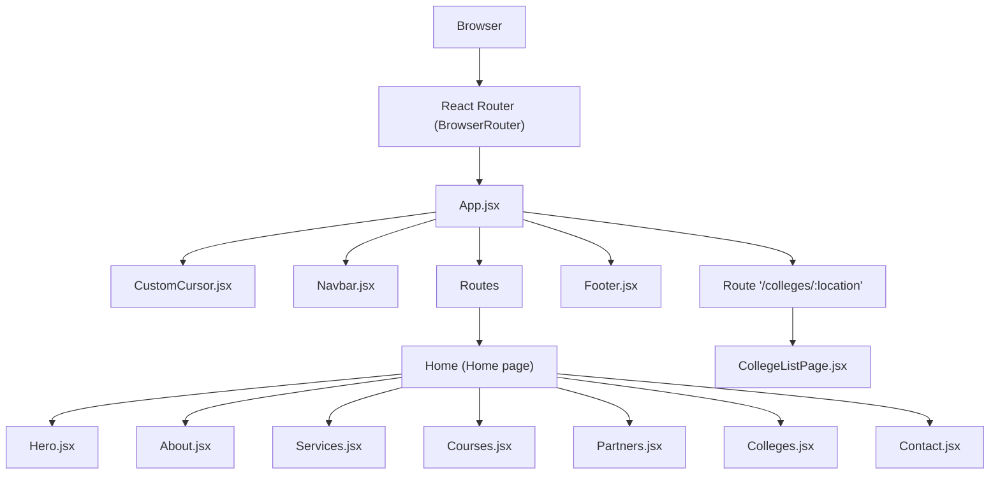

**Diagram sources**
- [main.jsx](file://src/main.jsx#L1-L14)
- [App.jsx](file://src/App.jsx#L1-L45)

**Section sources**
- [main.jsx](file://src/main.jsx#L1-L14)
- [App.jsx](file://src/App.jsx#L1-L45)

## Core Components
This section outlines the primary components and their roles in the application.

- Navbar: Fixed navigation bar with scroll-aware styling, mobile menu toggle, and smooth scrolling to page sections. Integrates with routing to support cross-page navigation and in-page anchor navigation.
- CustomCursor: Global mouse-following cursor with a main dot and a trailing follower using requestAnimationFrame for smooth motion and hover state activation.
- Hero: Fullscreen hero section with animated entrance, gradient background, and floating abstract shapes.
- About: Section highlighting mission, reach, and scope with animated cards.
- Services: Grid of service offerings with icons and hover effects.
- Courses: Course categories and tags displayed in a responsive grid.
- Partners: Marquee-style partner lists for domestic and international institutions.
- Colleges: Location gateway cards linking to college listing pages.
- CollegeListPage: Dynamic listing page for colleges filtered by location with fallback messaging.
- Contact: Contact information and a contact form layout.
- Footer: Simple footer with copyright notice.

**Section sources**
- [Navbar.jsx](file://src/components/Navbar.jsx#L1-L82)
- [CustomCursor.jsx](file://src/components/CustomCursor.jsx#L1-L87)
- [Hero.jsx](file://src/components/Hero.jsx#L1-L36)
- [About.jsx](file://src/components/About.jsx#L1-L48)
- [Services.jsx](file://src/components/Services.jsx#L1-L53)
- [Courses.jsx](file://src/components/Courses.jsx#L1-L54)
- [Partners.jsx](file://src/components/Partners.jsx#L1-L51)
- [Colleges.jsx](file://src/components/Colleges.jsx#L1-L41)
- [CollegeListPage.jsx](file://src/components/CollegeListPage.jsx#L1-L83)
- [Contact.jsx](file://src/components/Contact.jsx#L1-L70)
- [Footer.jsx](file://src/components/Footer.jsx#L1-L20)

## Architecture Overview
The application follows a route-driven architecture:
- The root component mounts the global cursor and navigation.
- The main route renders the home page, which is composed of multiple sections.
- A dedicated route renders the college listing page based on URL parameters.
- Navigation links trigger either in-page smooth scrolling or cross-route navigation depending on the current path.

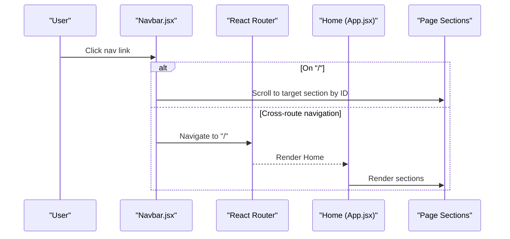

**Diagram sources**
- [Navbar.jsx](file://src/components/Navbar.jsx#L29-L54)
- [App.jsx](file://src/App.jsx#L16-L28)

## Detailed Component Analysis

### Navbar
- Purpose: Fixed navigation with scroll-aware styling, mobile hamburger menu, and smooth scrolling to page anchors. Integrates with routing to support navigation to the home page with a target scroll position.
- Props: None.
- Internal state:
  - scrolled: Boolean derived from scroll position.
  - mobileMenuOpen: Boolean toggled by the hamburger menu.
- Event handlers:
  - handleScroll: Updates scrolled based on window scrollY.
  - toggleMobileMenu: Toggles mobile menu visibility.
  - handleNavClick: Prevents default, closes mobile menu, and either scrolls to an anchor on the current page or navigates to the home page with a scroll target.
- Lifecycle:
  - Adds scroll listener on mount and removes it on unmount.
  - Adds a location state watcher to perform initial scroll-to on home page load.
- Integration:
  - Used in App.jsx as a persistent header.
  - Coordinates with Hero, About, Services, Courses, Partners, Colleges, and Contact sections via anchor IDs.
- Accessibility:
  - Uses semantic anchor tags and keyboard-accessible focus states.
  - Mobile menu toggle uses visible icons.
- Responsive design:
  - Hides desktop links on small screens and reveals a slide-in mobile menu with overlay.
- Performance:
  - Minimal re-renders; scroll handler is attached once.
- Reusability:
  - Stateless aside from local UI state; suitable for reuse with minor customization.

**Section sources**
- [Navbar.jsx](file://src/components/Navbar.jsx#L1-L82)
- [Navbar.css](file://src/components/Navbar.css#L1-L166)
- [App.jsx](file://src/App.jsx#L30-L42)

#### Navbar Class Diagram
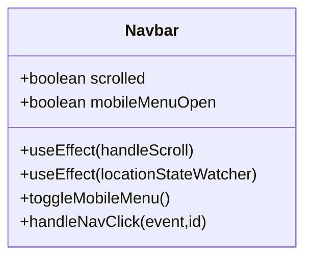

**Diagram sources**
- [Navbar.jsx](file://src/components/Navbar.jsx#L6-L54)

### CustomCursor
- Purpose: Provides a custom mouse-following cursor with a main dot and a trailing follower that smoothly follows the pointer using requestAnimationFrame.
- Props: None.
- Internal state:
  - Refs for main and follower cursors.
- Event handlers:
  - Mouse move updates positions of both cursors.
  - Mouse over detects interactive elements to activate the follower glow state.
- Lifecycle:
  - Adds event listeners on mount and cleans up on unmount.
  - Runs a continuous animation loop for the follower.
- Integration:
  - Mounted globally in App.jsx to wrap the entire application.
- Styling:
  - CSS defines cursor appearance, sizes, transitions, and active glow state.
- Accessibility:
  - Cursor is non-essential; does not replace native pointer indicators.
- Performance:
  - Uses requestAnimationFrame for smoothness; avoids heavy DOM writes.
- Reusability:
  - Pure functional component; can be reused in other projects with minimal changes.

**Section sources**
- [CustomCursor.jsx](file://src/components/CustomCursor.jsx#L1-L87)
- [CustomCursor.css](file://src/components/CustomCursor.css#L1-L34)
- [App.jsx](file://src/App.jsx#L33-L33)

#### CustomCursor Class Diagram
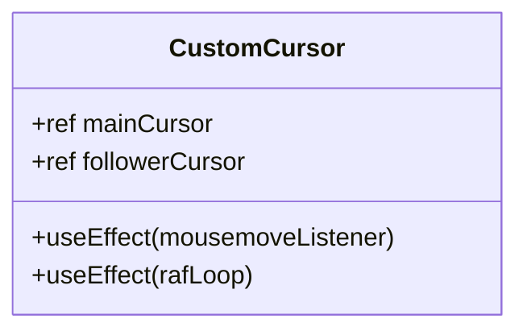

**Diagram sources**
- [CustomCursor.jsx](file://src/components/CustomCursor.jsx#L4-L76)

### Hero
- Purpose: Fullscreen hero section introducing the brand with animated entrance and background shapes.
- Props: None.
- Internal state:
  - loaded: Boolean controlling animation classes after mount.
- Lifecycle:
  - Sets a short timeout to enable animations after mounting.
- Styling:
  - CSS defines gradients, floating shapes, and staggered fade-in animations.
- Responsive design:
  - Adapts height and typography for tablets and phones.
- Accessibility:
  - Text is readable; ensure sufficient contrast against gradients.
- Performance:
  - Lightweight; relies on CSS animations and transitions.
- Reusability:
  - Standalone hero component; can be adapted for other landing pages.

**Section sources**
- [Hero.jsx](file://src/components/Hero.jsx#L1-L36)
- [Hero.css](file://src/components/Hero.css#L1-L147)

#### Hero Class Diagram
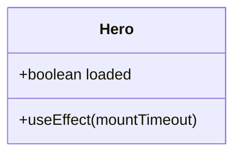

**Diagram sources**
- [Hero.jsx](file://src/components/Hero.jsx#L4-L10)

### About
- Purpose: Presents the “About Us” content with statistics and mission statements in a responsive card grid.
- Props: None.
- Implementation:
  - Renders a section with a title and a grid of three cards.
  - Cards include a stat number, title, and description.
- Styling:
  - CSS defines card layouts, hover effects, borders, and gradients.
- Responsive design:
  - Grid adapts to screen size with minimum card widths.
- Accessibility:
  - Semantic headings and readable text; ensure focus styles for interactive elements.
- Performance:
  - Static content; no dynamic state.
- Reusability:
  - Can be reused with different content by externalizing data.

**Section sources**
- [About.jsx](file://src/components/About.jsx#L1-L48)
- [About.css](file://src/components/About.css#L1-L75)

#### About Class Diagram
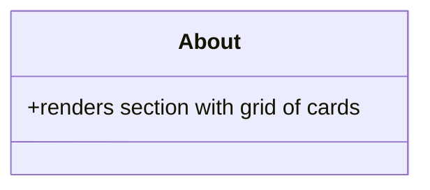

**Diagram sources**
- [About.jsx](file://src/components/About.jsx#L4-L44)

### Services
- Purpose: Displays a grid of services with icons, titles, and descriptions.
- Props: None.
- Implementation:
  - Defines a static array of service objects with icon, title, and description.
  - Maps over the array to render cards.
- Styling:
  - CSS defines card layout, hover transforms, and icon animations.
- Responsive design:
  - Responsive grid with automatic column sizing.
- Accessibility:
  - Icons are decorative; ensure meaningful text alongside icons.
- Performance:
  - Static data rendering; minimal overhead.
- Reusability:
  - Data-driven; can be externalized for CMS or configuration.

**Section sources**
- [Services.jsx](file://src/components/Services.jsx#L1-L53)
- [Services.css](file://src/components/Services.css#L1-L51)

#### Services Class Diagram
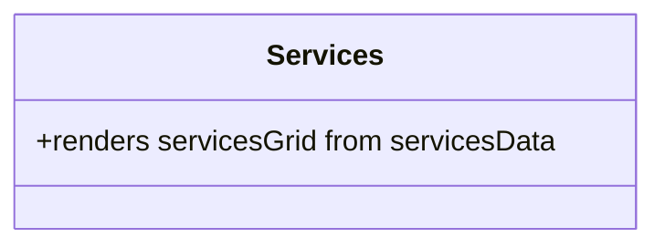

**Diagram sources**
- [Services.jsx](file://src/components/Services.jsx#L5-L49)

### Courses
- Purpose: Displays course categories and tags in a responsive grid.
- Props: None.
- Implementation:
  - Defines a static array of course categories with items.
  - Renders category cards with tag spans.
- Styling:
  - CSS defines category cards and tag styles.
- Responsive design:
  - Grid layout adapts to available space.
- Accessibility:
  - Tags are presentational; ensure semantic structure.
- Performance:
  - Static data rendering.
- Reusability:
  - Externalize categories for dynamic content.

**Section sources**
- [Courses.jsx](file://src/components/Courses.jsx#L1-L54)

#### Courses Class Diagram
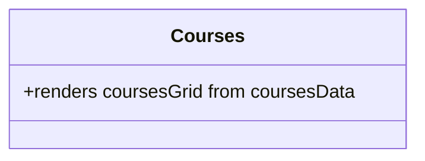

**Diagram sources**
- [Courses.jsx](file://src/components/Courses.jsx#L31-L50)

### Partners
- Purpose: Shows marquee-style scrolling lists of domestic and international partners.
- Props: None.
- Implementation:
  - Two arrays define partner names.
  - Renders two categories with duplicated content for seamless looping.
- Styling:
  - CSS defines marquee container and content layout.
- Responsive design:
  - Content adapts to screen width.
- Accessibility:
  - Static marquee; ensure long descriptions are available elsewhere.
- Performance:
  - Simple duplication technique for seamless loop.
- Reusability:
  - Externalize partner lists for dynamic updates.

**Section sources**
- [Partners.jsx](file://src/components/Partners.jsx#L1-L51)

#### Partners Class Diagram
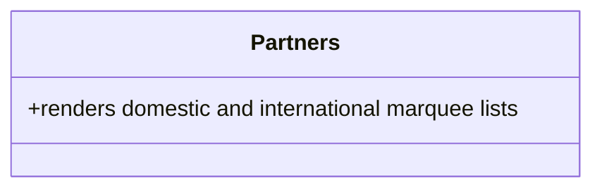

**Diagram sources**
- [Partners.jsx](file://src/components/Partners.jsx#L19-L47)

### Colleges
- Purpose: Provides location-based gateway cards linking to college listing pages.
- Props: None.
- Implementation:
  - Renders two location cards with overlays and images.
  - Links use React Router to navigate to the college list route with a location parameter.
- Styling:
  - CSS defines card layouts, overlays, and hover effects.
- Responsive design:
  - Grid layout adjusts to screen size.
- Accessibility:
  - Links are keyboard accessible; ensure focus visibility.
- Performance:
  - Static content; lightweight.
- Reusability:
  - Extendable with additional locations.

**Section sources**
- [Colleges.jsx](file://src/components/Colleges.jsx#L1-L41)

#### Colleges Class Diagram
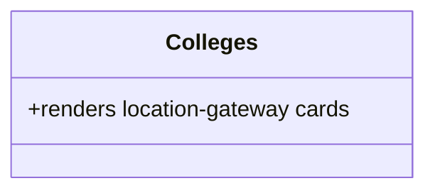

**Diagram sources**
- [Colleges.jsx](file://src/components/Colleges.jsx#L5-L37)

### CollegeListPage
- Purpose: Renders a dynamic list of colleges based on the location parameter in the URL.
- Props: None.
- Internal state:
  - None; uses route parameters and navigation.
- Event handlers:
  - Back button uses history navigation.
- Lifecycle:
  - Scrolls to top on mount.
- Implementation:
  - Defines a data map keyed by location.
  - Renders a grid of college cards with optional images.
  - Shows a “Coming Soon” message when no data exists for the selected location.
- Styling:
  - CSS defines page layout, back button, and card grid.
- Responsive design:
  - Grid layout adapts to screen size.
- Accessibility:
  - Form elements are presentational; ensure labels and placeholders are descriptive.
- Performance:
  - Efficient rendering of mapped items; minimal state.
- Reusability:
  - Parameterized by location; can be extended to support filters and pagination.

**Section sources**
- [CollegeListPage.jsx](file://src/components/CollegeListPage.jsx#L1-L83)

#### CollegeListPage Class Diagram
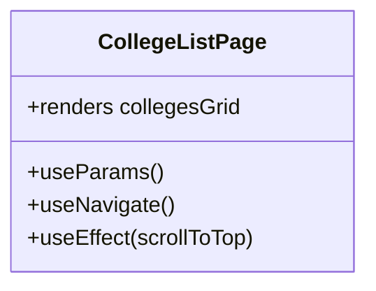

**Diagram sources**
- [CollegeListPage.jsx](file://src/components/CollegeListPage.jsx#L8-L79)

### Contact
- Purpose: Displays contact information and a contact form.
- Props: None.
- Implementation:
  - Renders contact info items with icons and values.
  - Includes a form with name, email, and message fields.
- Styling:
  - CSS defines container layout, info items, and form groups.
- Responsive design:
  - Layout stacks on smaller screens.
- Accessibility:
  - Form controls have labels; ensure proper focus management.
- Performance:
  - Static content; form is uncontrolled.
- Reusability:
  - Externalize form fields and validation for production use.

**Section sources**
- [Contact.jsx](file://src/components/Contact.jsx#L1-L70)

#### Contact Class Diagram
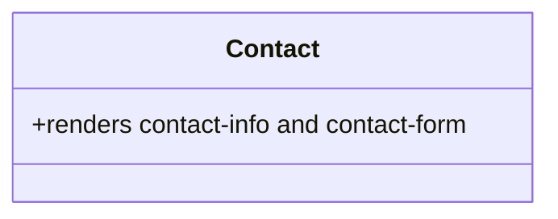

**Diagram sources**
- [Contact.jsx](file://src/components/Contact.jsx#L5-L66)

### Footer
- Purpose: Displays the copyright notice at the bottom of the page.
- Props: None.
- Styling:
  - Inline styles define padding, border, color, and background.
- Accessibility:
  - Static text; ensure readability and contrast.
- Performance:
  - Stateless component.
- Reusability:
  - Can be extended with links or social media icons.

**Section sources**
- [Footer.jsx](file://src/components/Footer.jsx#L1-L20)

#### Footer Class Diagram
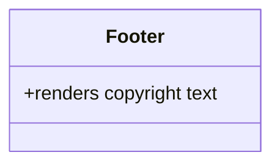

**Diagram sources**
- [Footer.jsx](file://src/components/Footer.jsx#L3-L16)

## Dependency Analysis
The components are organized with clear boundaries:
- App.jsx orchestrates routing and composes page sections.
- Navbar depends on routing utilities and interacts with page anchors.
- CustomCursor is mounted globally and does not depend on other components.
- Page sections are self-contained and primarily depend on their own CSS.
- CollegeListPage depends on route parameters and navigation.

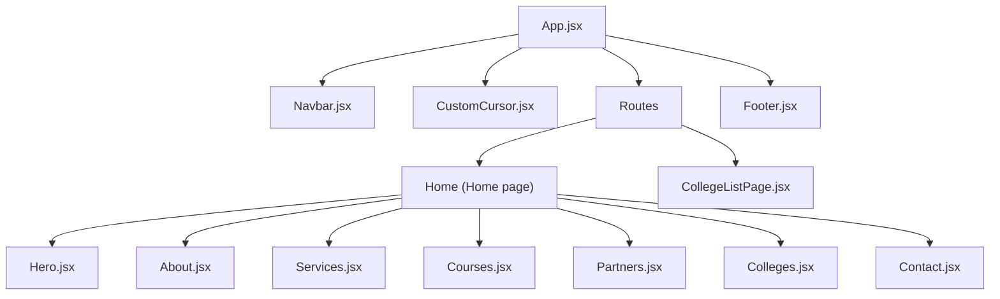

**Diagram sources**
- [App.jsx](file://src/App.jsx#L1-L45)
- [Navbar.jsx](file://src/components/Navbar.jsx#L1-L82)
- [CustomCursor.jsx](file://src/components/CustomCursor.jsx#L1-L87)
- [Hero.jsx](file://src/components/Hero.jsx#L1-L36)
- [About.jsx](file://src/components/About.jsx#L1-L48)
- [Services.jsx](file://src/components/Services.jsx#L1-L53)
- [Courses.jsx](file://src/components/Courses.jsx#L1-L54)
- [Partners.jsx](file://src/components/Partners.jsx#L1-L51)
- [Colleges.jsx](file://src/components/Colleges.jsx#L1-L41)
- [CollegeListPage.jsx](file://src/components/CollegeListPage.jsx#L1-L83)
- [Contact.jsx](file://src/components/Contact.jsx#L1-L70)
- [Footer.jsx](file://src/components/Footer.jsx#L1-L20)

**Section sources**
- [App.jsx](file://src/App.jsx#L1-L45)

## Performance Considerations
- Event listeners:
  - Navbar scroll listener is attached and detached in effects to prevent leaks.
  - CustomCursor adds and removes mousemove and mouseover listeners.
- Animation:
  - CustomCursor uses requestAnimationFrame for smooth follower movement.
  - Hero uses CSS transitions and animations for lightweight rendering.
- Rendering:
  - Components render static content or small datasets; avoid unnecessary re-renders.
- Routing:
  - In-page navigation uses smooth scroll; cross-route navigation leverages React Router.
- Image handling:
  - Placeholder logic in CollegeListPage prevents broken image states.

[No sources needed since this section provides general guidance]

## Troubleshooting Guide
- Navbar does not scroll to section:
  - Verify target IDs match anchor links and that elements exist in the DOM.
  - Confirm that the home route state is cleared after initial scroll.
- Mobile menu not closing:
  - Ensure the mobile menu open state is reset on navigation.
- CustomCursor not following:
  - Check that event listeners are attached and not removed prematurely.
  - Verify cursor refs are properly initialized.
- Hero animations not triggering:
  - Confirm the loaded state is set after mount and that CSS classes are applied.
- College list empty:
  - Ensure the location parameter matches keys in the data map.
  - Confirm the back button navigates correctly using history.

**Section sources**
- [Navbar.jsx](file://src/components/Navbar.jsx#L29-L54)
- [CustomCursor.jsx](file://src/components/CustomCursor.jsx#L39-L76)
- [Hero.jsx](file://src/components/Hero.jsx#L7-L10)
- [CollegeListPage.jsx](file://src/components/CollegeListPage.jsx#L37-L79)

## Conclusion
The Vertex Education component library is structured around a clean, route-driven architecture with reusable, accessible, and responsive components. Navbar and CustomCursor provide cohesive UX enhancements, while page sections deliver clear content organization. The design emphasizes performance, maintainability, and scalability, enabling easy extension and customization.

[No sources needed since this section summarizes without analyzing specific files]

## Appendices
- Integration guidelines:
  - Mount CustomCursor globally in App.jsx to ensure full coverage.
  - Keep Navbar fixed and ensure anchor IDs align with navigation targets.
  - Use route parameters for dynamic pages like CollegeListPage.
- Prop drilling:
  - Components are intentionally shallow; avoid deep prop chains by keeping state local or encapsulated.
- State management:
  - Prefer local component state for UI concerns (e.g., mobile menu, scroll awareness).
  - Use React Router state sparingly for cross-route navigation needs.

[No sources needed since this section provides general guidance]