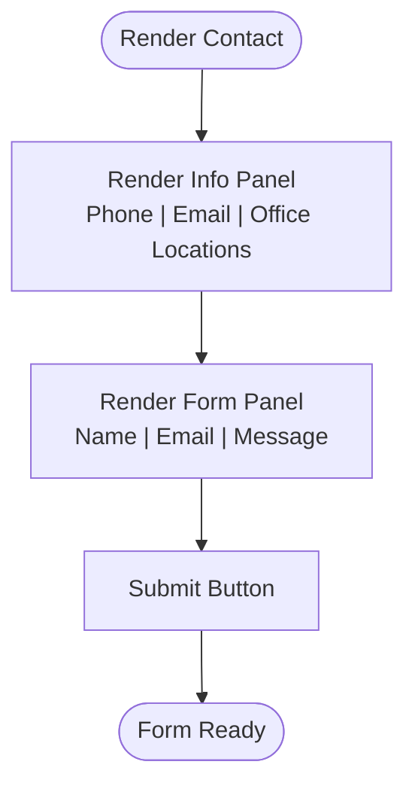

# Contact Management

<cite>
**Referenced Files in This Document**
- [Contact.jsx](file://src/components/Contact.jsx)
- [Contact.css](file://src/components/Contact.css)
- [App.jsx](file://src/App.jsx)
- [main.jsx](file://src/main.jsx)
- [index.css](file://src/index.css)
- [CustomCursor.jsx](file://src/components/CustomCursor.jsx)
- [CustomCursor.css](file://src/components/CustomCursor.css)
- [package.json](file://package.json)
</cite>

## Table of Contents
1. [Introduction](#introduction)
2. [Project Structure](#project-structure)
3. [Core Components](#core-components)
4. [Architecture Overview](#architecture-overview)
5. [Detailed Component Analysis](#detailed-component-analysis)
6. [Dependency Analysis](#dependency-analysis)
7. [Performance Considerations](#performance-considerations)
8. [Troubleshooting Guide](#troubleshooting-guide)
9. [Conclusion](#conclusion)
10. [Appendices](#appendices)

## Introduction
This document describes the contact management system implemented in the React application. It focuses on the Contact component’s information display and contact form, the multi-state office location presentation, and the responsive layout. It also outlines how to extend the system with form handling, validation, submission, and integration with external contact systems. The documentation is designed for both developers and non-technical stakeholders to understand how contact information is organized, presented, and how to customize and expand the contact features.

## Project Structure
The contact management system is part of a larger React application bootstrapped with Vite. The Contact component is integrated into the main application route and rendered within the home page. The styling leverages CSS custom properties for theme consistency and responsive design.

**Diagram sources**
- [main.jsx](file://src/main.jsx#L1-L14)
- [App.jsx](file://src/App.jsx#L1-L45)
- [Contact.jsx](file://src/components/Contact.jsx#L1-L70)
- [index.css](file://src/index.css#L1-L101)
- [CustomCursor.jsx](file://src/components/CustomCursor.jsx#L1-L87)

**Section sources**
- [main.jsx](file://src/main.jsx#L1-L14)
- [App.jsx](file://src/App.jsx#L1-L45)
- [index.css](file://src/index.css#L1-L101)

## Core Components
- Contact component: Displays contact information and a message form. It renders phone, email, and multi-state office locations, and provides a form with name, email, and message fields.
- Styling: Uses CSS custom properties for theme colors, spacing, and typography. The layout is responsive with flexible containers and minimum widths to ensure readability on small screens.
- Routing: The Contact component is included within the home page route and is rendered when the user navigates to the root path.

Key responsibilities:
- Present contact information in an accessible, visually distinct layout.
- Provide a functional form for users to send messages.
- Maintain responsive design across devices.

**Section sources**
- [Contact.jsx](file://src/components/Contact.jsx#L1-L70)
- [Contact.css](file://src/components/Contact.css#L1-L112)
- [App.jsx](file://src/App.jsx#L1-L45)

## Architecture Overview
The Contact component is a presentational component that depends on shared styles and icons. It is integrated into the application via routing and rendered alongside other page sections on the home page.

**Diagram sources**
- [App.jsx](file://src/App.jsx#L1-L45)
- [Contact.jsx](file://src/components/Contact.jsx#L1-L70)
- [Contact.css](file://src/components/Contact.css#L1-L112)
- [index.css](file://src/index.css#L1-L101)
- [CustomCursor.jsx](file://src/components/CustomCursor.jsx#L1-L87)

## Detailed Component Analysis

### Contact Component: Information Display and Form
The Contact component organizes contact information and a message form into a responsive layout. It includes:
- Contact information panel: Phone, email, and multi-state office locations.
- Contact form: Name, email, and message fields with a submit button.

Implementation highlights:
- Information items are structured with an icon and labeled value for clarity.
- The form uses semantic labels and placeholders to guide user input.
- The layout uses flexbox with wrapping to adapt to different screen sizes.

**Diagram sources**
- [Contact.jsx](file://src/components/Contact.jsx#L1-L70)

**Section sources**
- [Contact.jsx](file://src/components/Contact.jsx#L1-L70)

### Multi-State Office Location Presentation
The component displays office locations across multiple states (Kerala, Karnataka, Tamil Nadu) in a single info item. This approach:
- Consolidates related information for quick scanning.
- Uses a separator to distinguish between states while keeping the presentation compact.

Best practices:
- Keep state names concise and consistent.
- Consider adding links or anchors to location-specific pages if the site expands to include regional pages.

**Section sources**
- [Contact.jsx](file://src/components/Contact.jsx#L35-L41)

### Contact Information Organization
The contact information is organized into labeled items with icons:
- Phone: Displays a phone icon and formatted phone number.
- Email: Displays an envelope icon and email address.
- Office: Displays a map marker icon and multi-state location string.

Design considerations:
- Icons provide immediate visual recognition.
- Labels and values are separated to improve readability.
- The layout maintains consistent spacing and typography.

**Section sources**
- [Contact.jsx](file://src/components/Contact.jsx#L19-L41)
- [Contact.css](file://src/components/Contact.css#L31-L51)

### Contact Form Implementation
The form includes:
- Name field: Text input with placeholder guidance.
- Email field: Email input with placeholder guidance.
- Message field: Textarea with placeholder guidance.
- Submit button: Full-width button styled consistently with the rest of the site.

Current state:
- The form does not currently bind to state or handle submission.
- There is no built-in validation.

Future enhancements:
- Add state hooks to capture form values.
- Implement validation for required fields and email format.
- Add submission handling (e.g., API call or email service integration).
- Provide user feedback on success or error.

**Diagram sources**
- [Contact.jsx](file://src/components/Contact.jsx#L44-L61)

**Section sources**
- [Contact.jsx](file://src/components/Contact.jsx#L44-L61)

### Responsive Design for Contact Forms and Information Layouts
The layout is responsive and adapts to smaller screens:
- Flex container wraps items to prevent horizontal overflow.
- Minimum widths ensure readability on mobile devices.
- Form groups and inputs scale to full width for optimal touch interaction.

Styling references:
- Container uses flex with wrap and gap for spacing.
- Panels have minimum widths to maintain usability.
- Inputs and textareas are full-width with padding and focus styling.

**Section sources**
- [Contact.css](file://src/components/Contact.css#L6-L11)
- [Contact.css](file://src/components/Contact.css#L13-L16)
- [Contact.css](file://src/components/Contact.css#L53-L60)
- [Contact.css](file://src/components/Contact.css#L73-L84)

### Integration with External Contact Systems
The current Contact component does not integrate with external systems. To integrate:
- Add state hooks to manage form values and submission status.
- Implement validation for required fields and email format.
- Connect to an email service or backend API endpoint.
- Provide user feedback (success/error messages) after submission.

Recommended steps:
- Introduce state for name, email, and message.
- Add validation logic and error state.
- On successful validation, submit data to a configured endpoint.
- Reset form and show success message upon completion.

**Section sources**
- [Contact.jsx](file://src/components/Contact.jsx#L44-L61)

## Dependency Analysis
The Contact component relies on:
- React for component rendering.
- React Icons for visual cues.
- Shared CSS variables for consistent theming.

**Diagram sources**
- [Contact.jsx](file://src/components/Contact.jsx#L1-L3)
- [Contact.css](file://src/components/Contact.css#L1-L4)
- [index.css](file://src/index.css#L1-L23)
- [App.jsx](file://src/App.jsx#L1-L14)
- [main.jsx](file://src/main.jsx#L1-L5)

**Section sources**
- [Contact.jsx](file://src/components/Contact.jsx#L1-L3)
- [package.json](file://package.json#L12-L17)

## Performance Considerations
- The Contact component is lightweight and does not introduce heavy computations.
- Using CSS custom properties ensures efficient theming updates.
- Minimal DOM nodes reduce reflow and repaint costs.
- Consider lazy loading icons if bundle size becomes a concern.

## Troubleshooting Guide
Common issues and resolutions:
- Form not submitting: The form currently has no submit handler. Add state hooks and a submit handler to process the form.
- Styling inconsistencies: Verify that CSS custom properties are defined in the global stylesheet and that Contact.css imports them correctly.
- Responsive layout problems: Ensure the container and panels have appropriate minimum widths and that flex wrap is functioning as expected.

**Section sources**
- [Contact.jsx](file://src/components/Contact.jsx#L44-L61)
- [Contact.css](file://src/components/Contact.css#L1-L112)
- [index.css](file://src/index.css#L1-L23)

## Conclusion
The Contact component provides a clean, responsive layout for displaying contact information and collecting user messages. While the current implementation focuses on presentation, it offers a clear foundation for adding form state handling, validation, and integration with external contact systems. The modular structure and shared theming make customization straightforward for future enhancements.

## Appendices

### Customizing Contact Information
To modify contact details:
- Edit the phone number, email address, and office locations within the component’s information blocks.
- Adjust the multi-state office list to reflect new regions or remove existing ones.

**Section sources**
- [Contact.jsx](file://src/components/Contact.jsx#L23-L39)

### Adding New Office Locations
To add new office locations:
- Update the office info value to include the new state or city.
- Ensure the separator remains consistent for readability.

**Section sources**
- [Contact.jsx](file://src/components/Contact.jsx#L35-L41)

### Implementing Additional Contact Features
Recommended enhancements:
- Add state hooks to capture form values and manage submission state.
- Implement validation for required fields and email format.
- Integrate with an external contact system (e.g., email service or CRM).
- Provide user feedback on success or error.

**Section sources**
- [Contact.jsx](file://src/components/Contact.jsx#L44-L61)