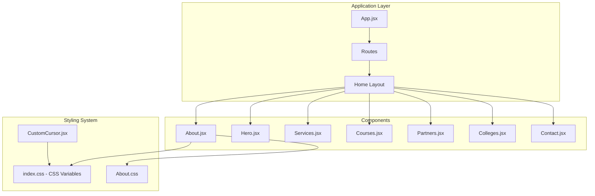
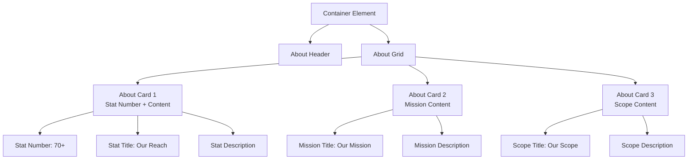
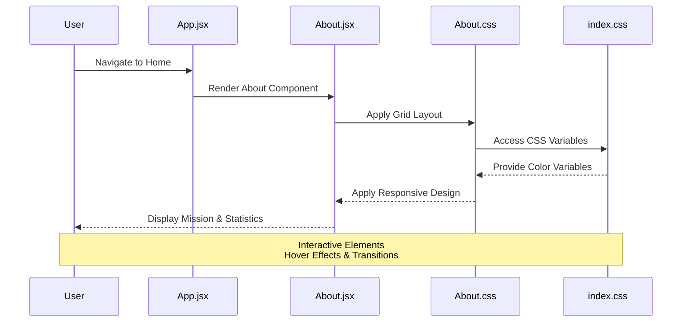
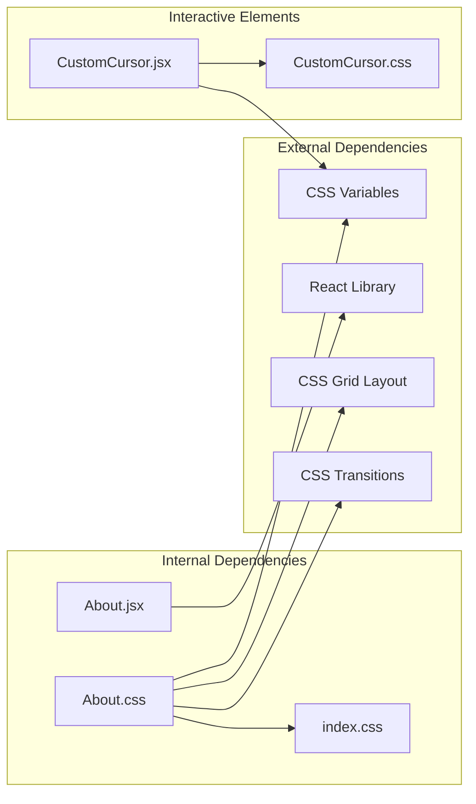

# About Section

<cite>
**Referenced Files in This Document**
- [About.jsx](file://src/components/About.jsx)
- [About.css](file://src/components/About.css)
- [index.css](file://src/index.css)
- [App.jsx](file://src/App.jsx)
- [CustomCursor.jsx](file://src/components/CustomCursor.jsx)
- [CustomCursor.css](file://src/components/CustomCursor.css)
</cite>

## Table of Contents
1. [Introduction](#introduction)
2. [Project Structure](#project-structure)
3. [Core Components](#core-components)
4. [Architecture Overview](#architecture-overview)
5. [Detailed Component Analysis](#detailed-component-analysis)
6. [Dependency Analysis](#dependency-analysis)
7. [Performance Considerations](#performance-considerations)
8. [Troubleshooting Guide](#troubleshooting-guide)
9. [Conclusion](#conclusion)

## Introduction
The About section component serves as a cornerstone for establishing brand credibility and trust through strategic presentation of mission, reach, and scope. This component employs a grid-based content organization with responsive design patterns, leveraging CSS variables and custom properties for consistent theming. The implementation balances visual hierarchy and typography to communicate the company's values and achievements effectively.

## Project Structure
The About component integrates seamlessly within the application's routing system and shares styling foundations with the broader design system.

**Diagram sources**
- [App.jsx](file://src/App.jsx#L16-L28)
- [About.jsx](file://src/components/About.jsx#L4-L45)
- [index.css](file://src/index.css#L3-L23)

**Section sources**
- [App.jsx](file://src/App.jsx#L1-L45)
- [About.jsx](file://src/components/About.jsx#L1-L48)

## Core Components
The About component consists of three primary elements: a mission presentation header, a statistics display grid, and interactive cards with hover effects.

### Content Structure
The component follows a hierarchical content organization:
- **Section Header**: Mission statement presentation
- **Statistics Grid**: Three interconnected cards displaying key metrics
- **Visual Enhancements**: Hover animations and gradient accents

### Grid-Based Organization
The statistics display utilizes a responsive grid system with automatic column sizing:

**Diagram sources**
- [About.jsx](file://src/components/About.jsx#L16-L41)

**Section sources**
- [About.jsx](file://src/components/About.jsx#L1-L48)

## Architecture Overview
The About component participates in the application's modular architecture while maintaining design system consistency.

**Diagram sources**
- [App.jsx](file://src/App.jsx#L16-L28)
- [About.jsx](file://src/components/About.jsx#L4-L45)
- [About.css](file://src/components/About.css#L1-L75)
- [index.css](file://src/index.css#L3-L23)

## Detailed Component Analysis

### Mission Presentation Layout
The mission presentation establishes the foundation for brand communication through carefully crafted typography and spacing.

#### Typography Hierarchy
The component employs a clear typographic scale:
- **Section Title**: Large gradient text with premium font treatment
- **Header Paragraph**: Medium-sized body text with optimal line height
- **Card Headers**: Consistent heading treatment within grid cells
- **Card Content**: Subtle paragraph styling for readability

#### Visual Composition
The layout emphasizes centered alignment with strategic whitespace distribution:
- Maximum content width constraint for optimal readability
- Generous bottom margin for visual separation
- Consistent padding throughout card elements

### Statistics Display Implementation
The statistics system centers around a prominent numerical display designed to communicate quantifiable achievements.

#### Statistical Visualization
The implementation features:
- **Large Numerical Display**: Prominent 3rem font size for immediate impact
- **Color Coding**: Primary brand color for statistical emphasis
- **Hierarchical Weight**: Bold 700 font weight for numerical prominence
- **Strategic Placement**: Positioned above descriptive content

#### Grid Responsiveness
The CSS Grid implementation ensures optimal content distribution across devices:
- **Minimum Column Width**: 300px for content legibility
- **Flexible Columns**: Automatic adjustment based on available space
- **Consistent Gaps**: 30px spacing between grid items
- **Fluid Layout**: Responsive adaptation to screen size changes

### Interactive Elements and Hover Effects
The component incorporates subtle animations to enhance user engagement while maintaining professional appearance.

#### Card Enhancement System
Each card features sophisticated hover interactions:
- **Vertical Lift Effect**: 10px upward movement for depth perception
- **Shadow Enhancement**: Soft glow effect using secondary brand color
- **Accent Animation**: Left-to-right gradient bar reveal
- **Smooth Transitions**: 0.3-second duration for natural feel

#### Gradient Accent System
The component utilizes gradient backgrounds strategically:
- **Top Border Accents**: Subtle 4px height indicators
- **Primary Gradient**: Blue-based gradient for professional appearance
- **Secondary Glow**: Green-based glow for supportive elements
- **Consistent Application**: Across all interactive elements

### Styling Approach Using CSS Variables
The component leverages a comprehensive CSS variable system for consistent theming and easy customization.

#### Variable Architecture
The styling system organizes variables by category:
- **Color Variables**: Primary, secondary, and accent colors
- **Gradient Variables**: Predefined gradient definitions
- **Spacing Variables**: Consistent padding and margin values
- **Typography Variables**: Font families and sizing scales

#### Theming Flexibility
CSS variables enable dynamic theming:
- **Brand Color Updates**: Single point of change for color schemes
- **Responsive Adjustments**: Flexible spacing and sizing variables
- **Accessibility Compliance**: Consistent contrast ratios across themes
- **Component Isolation**: Scoped styling prevents global conflicts

**Section sources**
- [About.jsx](file://src/components/About.jsx#L1-L48)
- [About.css](file://src/components/About.css#L1-L75)
- [index.css](file://src/index.css#L3-L23)

## Dependency Analysis
The About component maintains loose coupling with external systems while leveraging shared resources.

**Diagram sources**
- [About.jsx](file://src/components/About.jsx#L1-L2)
- [About.css](file://src/components/About.css#L1-L5)
- [index.css](file://src/index.css#L3-L23)
- [CustomCursor.jsx](file://src/components/CustomCursor.jsx#L1-L2)
- [CustomCursor.css](file://src/components/CustomCursor.css#L1-L34)

### Component Relationships
The About component interacts with several system elements:

**Styling Dependencies**:
- Inherits base typography from global stylesheet
- Utilizes CSS variables for consistent theming
- Implements responsive grid layout for content organization

**Interactive Dependencies**:
- Leverages custom cursor system for enhanced UX
- Maintains hover state consistency with global transitions
- Integrates with navigation system through routing

**Content Dependencies**:
- Mission content reflects organizational values
- Statistics represent measurable achievements
- Scope description communicates service capabilities

**Section sources**
- [About.jsx](file://src/components/About.jsx#L1-L48)
- [About.css](file://src/components/About.css#L1-L75)
- [index.css](file://src/index.css#L3-L23)
- [CustomCursor.jsx](file://src/components/CustomCursor.jsx#L1-L87)
- [CustomCursor.css](file://src/components/CustomCursor.css#L1-L34)

## Performance Considerations
The component implementation prioritizes performance through efficient rendering and optimized styling.

### Rendering Optimization
- **Minimal DOM Nodes**: Efficient component structure with focused elements
- **Static Content**: Mission statements and statistics remain constant
- **CSS-Driven Animations**: Hardware-accelerated transitions for smooth performance
- **Lazy Loading**: Content renders only when section becomes visible

### Styling Efficiency
- **CSS Variables**: Single point of change for theme updates
- **Optimized Transitions**: 0.3-second duration for perceptible feedback
- **Hardware Acceleration**: Transform and opacity for GPU acceleration
- **Reduced Paint Cycles**: Strategic use of gradients and shadows

### Responsive Performance
- **Mobile-First Design**: Optimized for smaller screen experiences
- **Flexible Grid**: Automatic column adjustment reduces layout thrashing
- **Efficient Media Queries**: Minimal breakpoint usage for performance
- **Touch-Friendly Targets**: Adequate spacing for mobile interaction

## Troubleshooting Guide

### Common Issues and Solutions

**Grid Layout Problems**:
- **Issue**: Cards not aligning properly on small screens
- **Solution**: Verify `minmax(300px, 1fr)` values and ensure container has sufficient width

**Color Theme Conflicts**:
- **Issue**: Inconsistent color application across components
- **Solution**: Check CSS variable definitions in `index.css` and ensure proper fallbacks

**Hover Effect Performance**:
- **Issue**: Stuttering animations on lower-end devices
- **Solution**: Consider reducing transition duration or simplifying shadow effects

**Typography Readability**:
- **Issue**: Text appears too small or cramped
- **Solution**: Adjust font sizes and line heights in the global stylesheet

### Debugging Strategies
- **Inspect Element**: Use browser dev tools to verify CSS variable application
- **Console Logging**: Monitor component lifecycle for rendering issues
- **Performance Profiling**: Analyze animation performance using browser tools
- **Cross-Browser Testing**: Verify compatibility across supported browsers

**Section sources**
- [About.css](file://src/components/About.css#L19-L23)
- [index.css](file://src/index.css#L3-L23)
- [CustomCursor.jsx](file://src/components/CustomCursor.jsx#L8-L43)

## Conclusion
The About section component exemplifies effective web development practices through its strategic use of grid-based layouts, CSS variables, and thoughtful typography. The implementation successfully establishes brand credibility by presenting mission, reach, and scope information in an organized, visually appealing manner. The responsive design ensures accessibility across devices, while the interactive elements enhance user engagement without compromising professional appearance.

The component's modular architecture allows for easy maintenance and future enhancements, while the CSS variable system enables consistent theming across the entire application. This foundation provides a robust platform for communicating organizational values and achievements effectively.