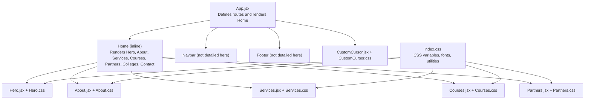
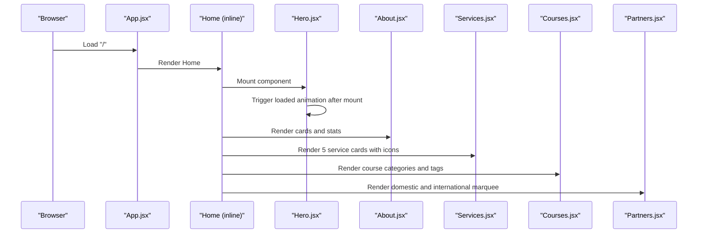
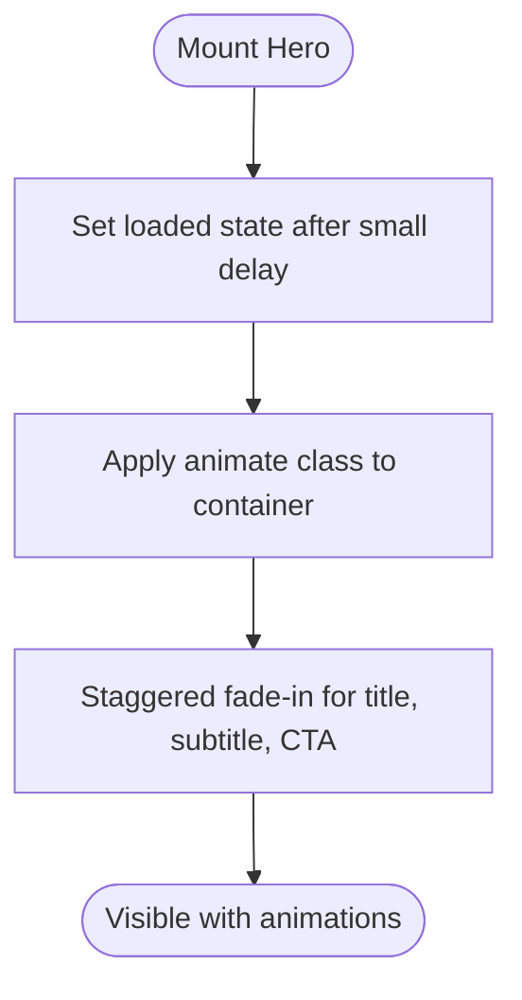
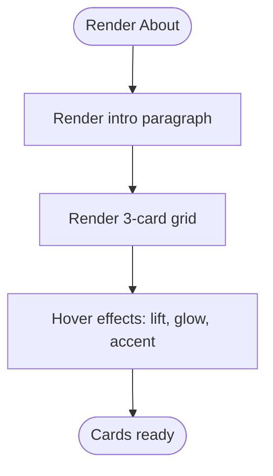
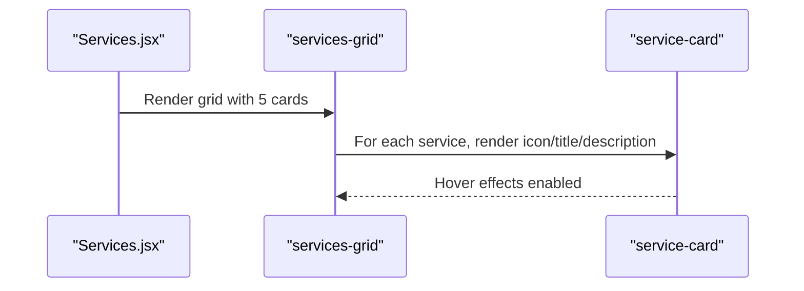
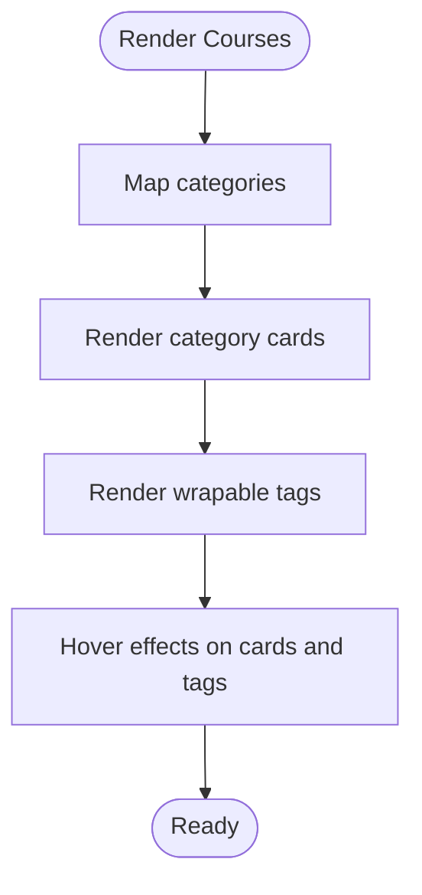
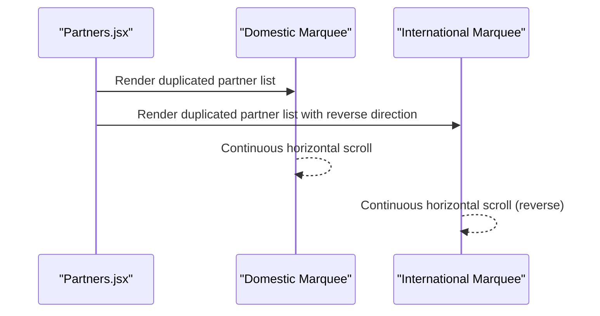
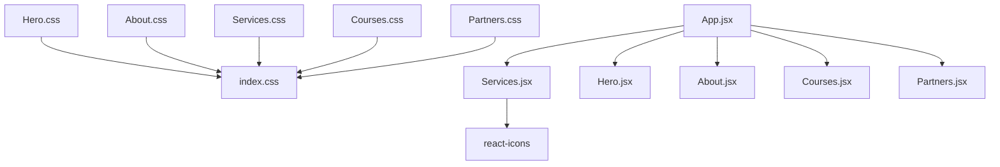

# Content Sections

<cite>
**Referenced Files in This Document**
- [Hero.jsx](file://src/components/Hero.jsx)
- [Hero.css](file://src/components/Hero.css)
- [About.jsx](file://src/components/About.jsx)
- [About.css](file://src/components/About.css)
- [Services.jsx](file://src/components/Services.jsx)
- [Services.css](file://src/components/Services.css)
- [Courses.jsx](file://src/components/Courses.jsx)
- [Courses.css](file://src/components/Courses.css)
- [Partners.jsx](file://src/components/Partners.jsx)
- [Partners.css](file://src/components/Partners.css)
- [App.jsx](file://src/App.jsx)
- [index.css](file://src/index.css)
- [CustomCursor.jsx](file://src/components/CustomCursor.jsx)
- [CustomCursor.css](file://src/components/CustomCursor.css)
</cite>

## Table of Contents
1. [Introduction](#introduction)
2. [Project Structure](#project-structure)
3. [Core Components](#core-components)
4. [Architecture Overview](#architecture-overview)
5. [Detailed Component Analysis](#detailed-component-analysis)
6. [Dependency Analysis](#dependency-analysis)
7. [Performance Considerations](#performance-considerations)
8. [Accessibility Considerations](#accessibility-considerations)
9. [Troubleshooting Guide](#troubleshooting-guide)
10. [Conclusion](#conclusion)

## Introduction
This document explains the main content sections of the educational consultancy website, focusing on the Hero, About, Services, Courses, and Partners sections. It covers component structure, responsive design, animation effects, content management patterns, styling approaches, accessibility considerations, and customization options. The site integrates modern UI patterns with subtle animations, a cohesive color scheme, and interactive elements to enhance engagement.

## Project Structure
The website is a React application structured around reusable, themed components. Each content section is implemented as a standalone component with its own JSX and CSS files. Global theming and typography are centralized in the main CSS file. The App component composes the homepage layout by rendering the hero, about, services, courses, partners, colleges, and contact sections.

**Diagram sources**
- [App.jsx](file://src/App.jsx#L16-L28)
- [Hero.jsx](file://src/components/Hero.jsx#L1-L36)
- [About.jsx](file://src/components/About.jsx#L1-L48)
- [Services.jsx](file://src/components/Services.jsx#L1-L53)
- [Courses.jsx](file://src/components/Courses.jsx#L1-L54)
- [Partners.jsx](file://src/components/Partners.jsx#L1-L51)
- [index.css](file://src/index.css#L3-L23)

**Section sources**
- [App.jsx](file://src/App.jsx#L16-L28)
- [index.css](file://src/index.css#L3-L23)

## Core Components
This section outlines the primary content sections and their responsibilities:

- Hero: Establishes brand presence with animated headline, subtitle, and a prominent call-to-action link. Uses a staggered fade-in animation triggered after initial mount.
- About: Presents mission, reach, and scope using a responsive card grid with hover enhancements.
- Services: Displays five service offerings with icons, titles, and descriptions in a responsive grid.
- Courses: Showcases academic programs organized by categories with tag-based lists and a two-column masonry-like layout on larger screens.
- Partners: Highlights institutional partnerships with animated marquees for domestic and international associates.

Each component leverages shared CSS variables and utilities for consistent theming and spacing.

**Section sources**
- [Hero.jsx](file://src/components/Hero.jsx#L1-L36)
- [Hero.css](file://src/components/Hero.css#L1-L147)
- [About.jsx](file://src/components/About.jsx#L1-L48)
- [About.css](file://src/components/About.css#L1-L75)
- [Services.jsx](file://src/components/Services.jsx#L1-L53)
- [Services.css](file://src/components/Services.css#L1-L51)
- [Courses.jsx](file://src/components/Courses.jsx#L1-L54)
- [Courses.css](file://src/components/Courses.css#L1-L60)
- [Partners.jsx](file://src/components/Partners.jsx#L1-L51)
- [Partners.css](file://src/components/Partners.css#L1-L67)

## Architecture Overview
The homepage composes the five content sections in order, ensuring a clear visual and semantic flow. Global styles define typography, colors, gradients, and spacing. Interactive elements like the custom cursor enhance user experience without overwhelming content.

**Diagram sources**
- [App.jsx](file://src/App.jsx#L16-L28)
- [Hero.jsx](file://src/components/Hero.jsx#L7-L10)
- [About.jsx](file://src/components/About.jsx#L16-L41)
- [Services.jsx](file://src/components/Services.jsx#L34-L49)
- [Courses.jsx](file://src/components/Courses.jsx#L31-L50)
- [Partners.jsx](file://src/components/Partners.jsx#L19-L47)

## Detailed Component Analysis

### Hero Section
- Purpose: Deliver a strong first impression with animated headline, subtitle, and a prominent CTA.
- Component structure:
  - Uses a mounted state to trigger animations after initial render.
  - Renders two floating abstract background shapes with subtle blur and rotation animations.
  - Staggered transitions for title, subtitle, and CTA wrapper.
- Responsive design:
  - Maintains a full viewport height with reduced heights on smaller screens.
  - Font sizes scale down progressively for mobile.
- Animation effects:
  - Floating background shapes with opposing directions and timing.
  - Staggered fade-in and slide-up for text and CTA.
- Content management:
  - Text content is embedded directly in JSX for simplicity; externalizing to CMS or i18n would require minimal refactoring.
- Styling approach:
  - Uses CSS variables for colors and gradients.
  - Centered content with constrained max-width and padding.
- Accessibility:
  - Ensure sufficient color contrast for text against gradient backgrounds.
  - Provide skip-link to main content for keyboard navigation.
- Customization options:
  - Adjust animation delays and durations.
  - Modify gradient stops and blur radius for background shapes.
  - Swap out the CTA anchor target or add aria-label for screen readers.

**Diagram sources**
- [Hero.jsx](file://src/components/Hero.jsx#L7-L10)
- [Hero.css](file://src/components/Hero.css#L57-L72)

**Section sources**
- [Hero.jsx](file://src/components/Hero.jsx#L1-L36)
- [Hero.css](file://src/components/Hero.css#L1-L147)
- [index.css](file://src/index.css#L3-L23)

### About Section
- Purpose: Communicate mission, reach, and scope with a visually distinct card grid.
- Component structure:
  - Single introductory paragraph centered under the section title.
  - Three responsive cards: a statistics card with a large number, a mission card, and a scope card.
- Responsive design:
  - Grid adapts columns based on available width with a minimum card width.
- Animation effects:
  - Subtle hover lift and border accent with a top highlight bar.
- Content management:
  - Static content per card; easy to replace with props or CMS-managed fields.
- Styling approach:
  - Cards use a soft border and shadow; hover transforms elevate content.
  - Stat number emphasizes numerical impact.
- Accessibility:
  - Ensure focus outlines for interactive cards if expanded with links.
  - Use semantic headings and concise paragraph text.
- Customization options:
  - Replace stat number and descriptions with dynamic data.
  - Add icons or images to cards for richer visuals.

**Diagram sources**
- [About.jsx](file://src/components/About.jsx#L16-L41)
- [About.css](file://src/components/About.css#L19-L55)

**Section sources**
- [About.jsx](file://src/components/About.jsx#L1-L48)
- [About.css](file://src/components/About.css#L1-L75)
- [index.css](file://src/index.css#L3-L23)

### Services Section
- Purpose: Present five core services with icons and short descriptions.
- Component structure:
  - Defines a data array of services with icon, title, and description.
  - Maps over the array to render cards in a responsive grid.
- Responsive design:
  - Grid columns adjust based on available space with a minimum width.
- Animation effects:
  - Cards lift on hover with a border and background change.
  - Icon scales and rotates slightly for emphasis.
- Content management:
  - Data-driven approach allows easy updates to titles and descriptions.
- Styling approach:
  - Clean white cards with soft borders and hover feedback.
  - Icons sized consistently for visual rhythm.
- Accessibility:
  - Ensure alt text for icons if rendered as images; here icons are semantic SVGs.
  - Provide focus-visible styles for keyboard navigation.
- Customization options:
  - Add new services by extending the data array.
  - Swap icons or localize descriptions.

**Diagram sources**
- [Services.jsx](file://src/components/Services.jsx#L34-L49)
- [Services.css](file://src/components/Services.css#L13-L38)

**Section sources**
- [Services.jsx](file://src/components/Services.jsx#L1-L53)
- [Services.css](file://src/components/Services.css#L1-L51)
- [index.css](file://src/index.css#L3-L23)

### Courses Section
- Purpose: Showcase educational programs grouped by discipline with tag-based listings.
- Component structure:
  - Predefined course data with category and items arrays.
  - Renders category cards with titles and wrapable tags.
- Responsive design:
  - Two-column layout on larger screens; single column on small screens.
- Animation effects:
  - Category cards lift on hover with border accent.
  - Tags change background on hover for interactivity.
- Content management:
  - Course data is static; externalizing to JSON or CMS would enable dynamic updates.
- Styling approach:
  - Category cards use soft borders and subtle shadows.
  - Tags styled as pill-shaped buttons with hover feedback.
- Accessibility:
  - Ensure readable contrast for tags against colored backgrounds.
  - Provide keyboard navigation for tag lists if extended.
- Customization options:
  - Add or remove categories and items.
  - Localize category names and item labels.

**Diagram sources**
- [Courses.jsx](file://src/components/Courses.jsx#L31-L50)
- [Courses.css](file://src/components/Courses.css#L6-L54)

**Section sources**
- [Courses.jsx](file://src/components/Courses.jsx#L1-L54)
- [Courses.css](file://src/components/Courses.css#L1-L60)
- [index.css](file://src/index.css#L3-L23)

### Partners Section
- Purpose: Display institutional partnerships with animated marquees for domestic and international associates.
- Component structure:
  - Two arrays of partner names: domestic and international.
  - Marquee containers with duplicated content for seamless looping.
  - Reverse animation direction for the international marquee.
- Responsive design:
  - Marquees adapt to container width; content remains readable.
- Animation effects:
  - Horizontal scrolling animation runs continuously with linear timing.
  - Cards invert colors on hover with glow.
- Content management:
  - Partner lists are static; swapping lists enables quick updates.
- Styling approach:
  - Rounded cards with soft borders and hover transformations.
  - Marquee uses flexbox and min-width to ensure continuous loop.
- Accessibility:
  - Long-running animations can be disabled for motion sensitivity; consider prefers-reduced-motion.
  - Ensure readable text and sufficient contrast.
- Customization options:
  - Add or remove partner entries.
  - Adjust animation duration or direction.

**Diagram sources**
- [Partners.jsx](file://src/components/Partners.jsx#L19-L47)
- [Partners.css](file://src/components/Partners.css#L21-L49)

**Section sources**
- [Partners.jsx](file://src/components/Partners.jsx#L1-L51)
- [Partners.css](file://src/components/Partners.css#L1-L67)
- [index.css](file://src/index.css#L3-L23)

## Dependency Analysis
- Component coupling:
  - Each section is self-contained with its own CSS, minimizing cross-dependencies.
  - Shared theming and utilities come from the global CSS variables and utilities.
- External dependencies:
  - Services uses react-icons for icons.
  - No third-party animation libraries are used; animations rely on CSS keyframes and transitions.
- Integration points:
  - App.jsx composes the homepage and injects global styles.
  - Custom cursor enhances interactivity across sections.

**Diagram sources**
- [Hero.css](file://src/components/Hero.css#L1-L147)
- [About.css](file://src/components/About.css#L1-L75)
- [Services.css](file://src/components/Services.css#L1-L51)
- [Courses.css](file://src/components/Courses.css#L1-L60)
- [Partners.css](file://src/components/Partners.css#L1-L67)
- [Services.jsx](file://src/components/Services.jsx#L2)
- [App.jsx](file://src/App.jsx#L16-L28)
- [index.css](file://src/index.css#L3-L23)

**Section sources**
- [Services.jsx](file://src/components/Services.jsx#L2)
- [App.jsx](file://src/App.jsx#L16-L28)
- [index.css](file://src/index.css#L3-L23)

## Performance Considerations
- Animations:
  - CSS keyframes and transitions are GPU-friendly; keep durations moderate to avoid jank.
  - Marquee animation uses transform; ensure hardware acceleration is effective.
- Rendering:
  - Data-driven sections (Services, Courses) render static arrays; consider memoization if data becomes dynamic.
  - Avoid unnecessary re-renders by keeping component state minimal.
- Accessibility:
  - Respect prefers-reduced-motion by conditionally disabling animations.
- Bundle size:
  - react-icons is tree-shaken by bundlers; only used icons are included.
- Images:
  - Background shapes are vector-based; no image assets required.

[No sources needed since this section provides general guidance]

## Accessibility Considerations
- Color and contrast:
  - Verify text contrasts against gradient backgrounds in Hero and section titles.
  - Ensure hover states maintain sufficient contrast for Partners and Courses tags.
- Motion:
  - Provide reduced-motion alternatives for marquees and fade-in animations.
- Focus and navigation:
  - Ensure keyboard focus is visible on interactive elements (buttons, links).
  - Add skip links to improve navigation for assistive technologies.
- Semantic structure:
  - Use proper headings and landmarks; section titles are styled but not semantically altered.
- Custom cursor:
  - Keep the custom cursor optional; disable if it causes disorientation.

[No sources needed since this section provides general guidance]

## Troubleshooting Guide
- Hero animations not triggering:
  - Confirm the component mounts and the loaded state is set after initial render.
  - Check that the animate class is applied to the container.
- Marquee not scrolling:
  - Verify duplicated content ensures seamless looping.
  - Ensure min-width equals container width and animation-duration matches length.
- Hover effects not appearing:
  - Confirm CSS selectors match and pseudo-elements are not overridden.
  - Check for conflicting global styles.
- Typography and spacing:
  - Ensure CSS variables are defined and section-title styles are applied.
- Custom cursor:
  - Verify mousemove listeners are attached and RAF loop is running.
  - Ensure hover detection targets clickable elements.

**Section sources**
- [Hero.jsx](file://src/components/Hero.jsx#L7-L10)
- [Hero.css](file://src/components/Hero.css#L57-L72)
- [Partners.jsx](file://src/components/Partners.jsx#L27-L43)
- [Partners.css](file://src/components/Partners.css#L28-L49)
- [CustomCursor.jsx](file://src/components/CustomCursor.jsx#L8-L43)
- [CustomCursor.jsx](file://src/components/CustomCursor.jsx#L45-L76)

## Conclusion
The content sections are implemented with clean, modular components that emphasize clarity, responsiveness, and subtle animations. The shared theming system ensures visual consistency, while data-driven sections facilitate easy content updates. With minor enhancements for accessibility and potential dynamic content integration, the sections provide a solid foundation for an engaging educational consultancy website.

[No sources needed since this section summarizes without analyzing specific files]