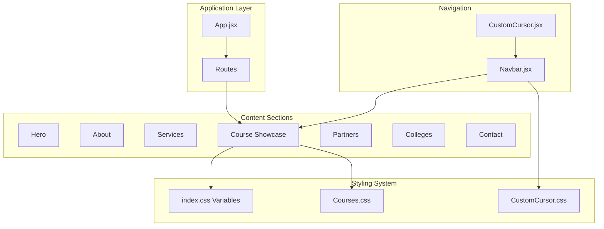
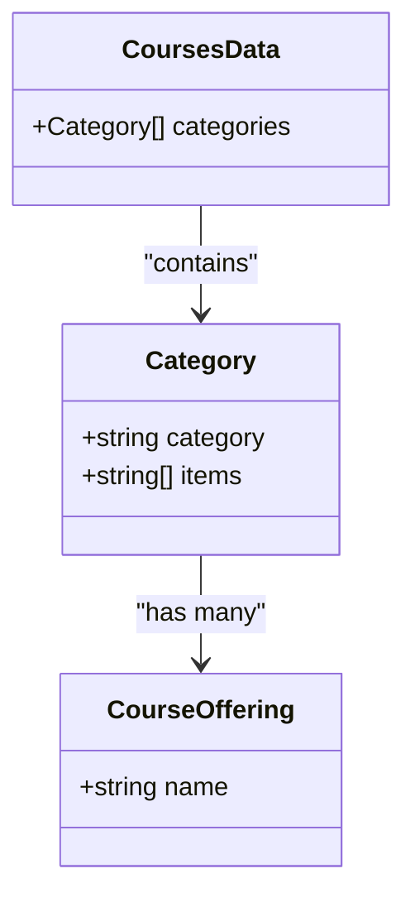
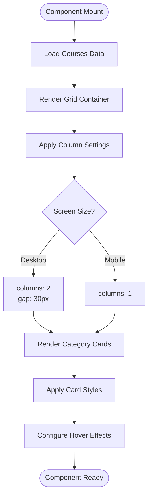
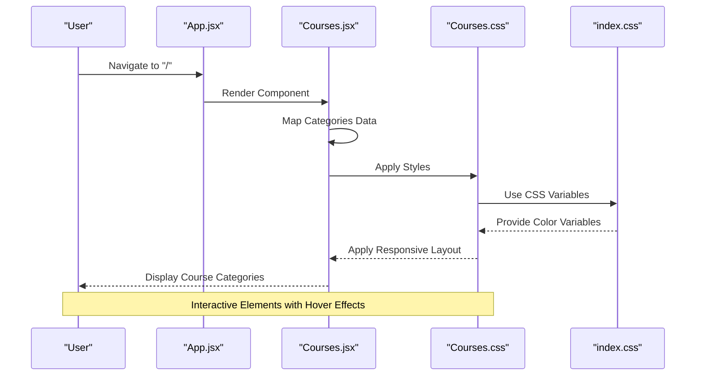
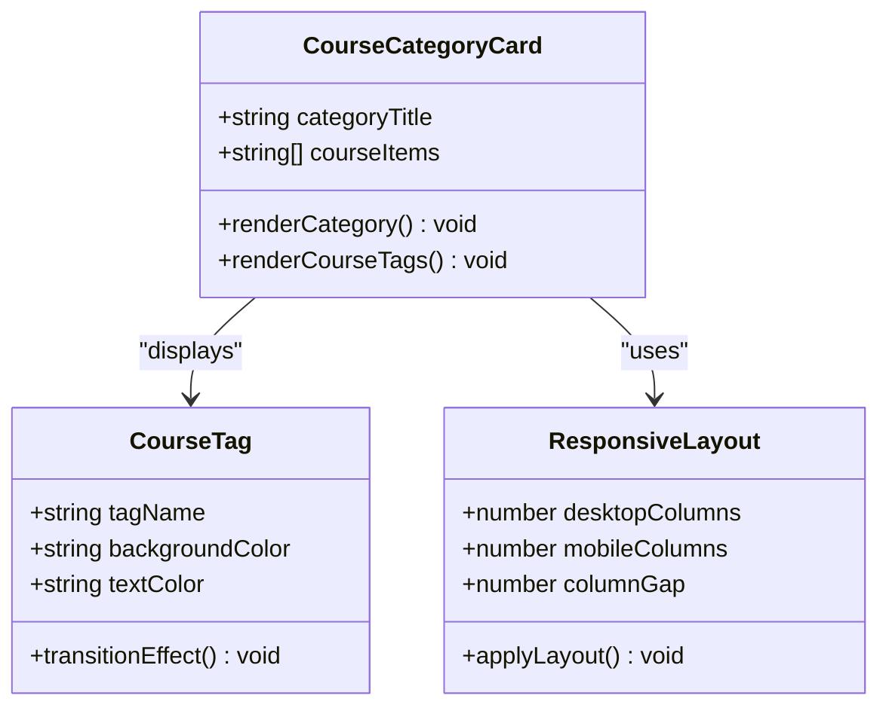
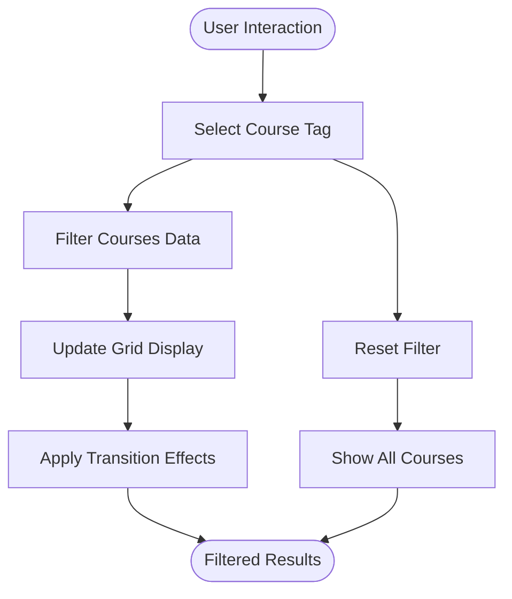
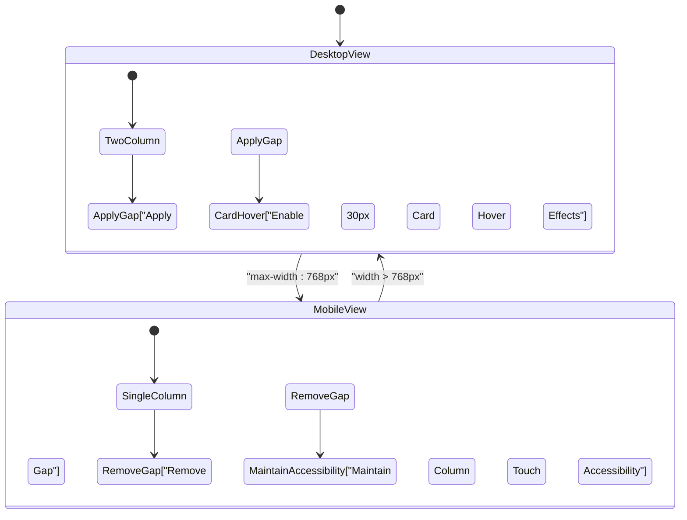
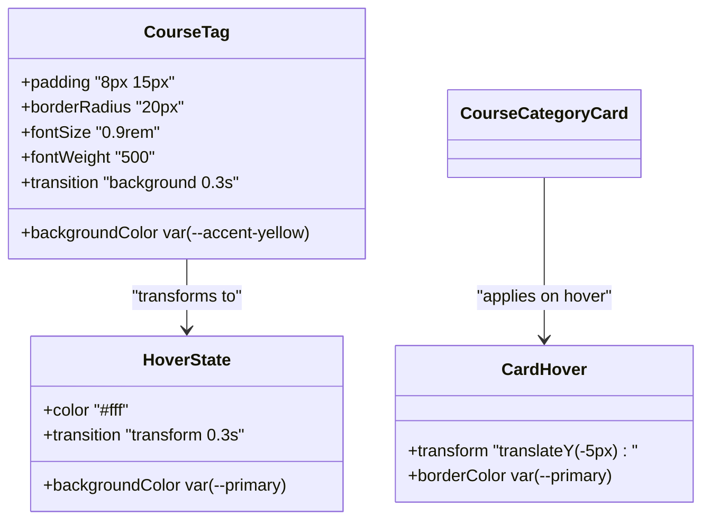
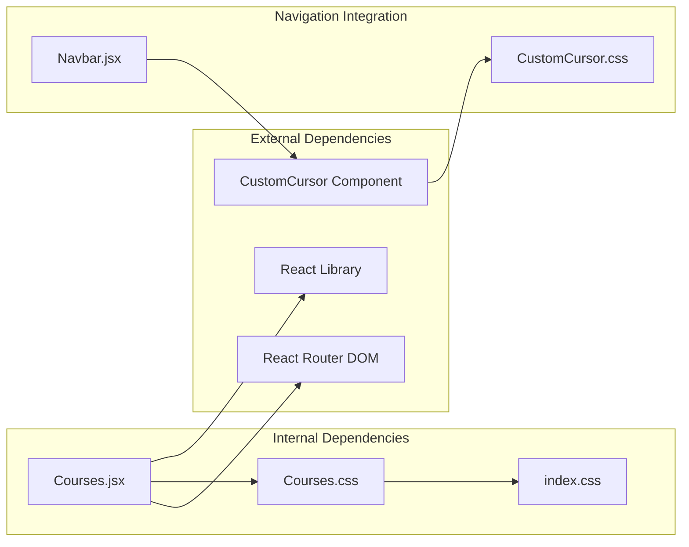

# Courses Section

<cite>
**Referenced Files in This Document**
- [Courses.jsx](file://src/components/Courses.jsx)
- [Courses.css](file://src/components/Courses.css)
- [App.jsx](file://src/App.jsx)
- [index.css](file://src/index.css)
- [CustomCursor.jsx](file://src/components/CustomCursor.jsx)
- [CustomCursor.css](file://src/components/CustomCursor.css)
- [Navbar.jsx](file://src/components/Navbar.jsx)
</cite>

## Table of Contents
1. [Introduction](#introduction)
2. [Project Structure](#project-structure)
3. [Core Components](#core-components)
4. [Architecture Overview](#architecture-overview)
5. [Detailed Component Analysis](#detailed-component-analysis)
6. [Dependency Analysis](#dependency-analysis)
7. [Performance Considerations](#performance-considerations)
8. [Troubleshooting Guide](#troubleshooting-guide)
9. [Conclusion](#conclusion)

## Introduction
The Courses section component serves as an educational program showcase that presents academic offerings organized by discipline categories. It demonstrates a clean, responsive design pattern for displaying course specializations across different screen sizes while maintaining visual consistency with the broader application theme.

## Project Structure
The Courses component integrates seamlessly within the application's routing system and follows a modular architecture pattern:

**Diagram sources**
- [App.jsx](file://src/App.jsx#L1-L45)
- [Courses.jsx](file://src/components/Courses.jsx#L1-L54)
- [index.css](file://src/index.css#L1-L100)

**Section sources**
- [App.jsx](file://src/App.jsx#L1-L45)
- [index.css](file://src/index.css#L1-L100)

## Core Components
The Courses component consists of two primary elements: the data structure containing educational categories and their offerings, and the presentation layer implementing responsive design patterns.

### Data Organization Structure
The component utilizes a hierarchical data model where each category contains multiple course offerings:

**Diagram sources**
- [Courses.jsx](file://src/components/Courses.jsx#L4-L29)

### Responsive Grid Layout
The component implements a CSS Grid system with automatic column adjustment based on screen size:

**Diagram sources**
- [Courses.jsx](file://src/components/Courses.jsx#L36-L47)
- [Courses.css](file://src/components/Courses.css#L6-L9)

**Section sources**
- [Courses.jsx](file://src/components/Courses.jsx#L1-L54)
- [Courses.css](file://src/components/Courses.css#L1-L60)

## Architecture Overview
The Courses component follows a unidirectional data flow pattern with clear separation between data management and presentation concerns:

**Diagram sources**
- [App.jsx](file://src/App.jsx#L16-L28)
- [Courses.jsx](file://src/components/Courses.jsx#L31-L51)
- [Courses.css](file://src/components/Courses.css#L1-L60)
- [index.css](file://src/index.css#L3-L23)

## Detailed Component Analysis

### Educational Program Showcase Implementation
The component presents academic offerings through a structured card-based interface that emphasizes visual hierarchy and accessibility:

#### Category Organization Pattern
Each course category follows a consistent structure with clear typography and spacing:

**Diagram sources**
- [Courses.jsx](file://src/components/Courses.jsx#L37-L46)
- [Courses.css](file://src/components/Courses.css#L11-L54)

#### Content Categorization Approach
The component organizes educational offerings into specialized categories representing distinct academic disciplines:

| Category | Academic Focus | Typical Offerings |
|----------|----------------|-------------------|
| Medical & Health Sciences | Clinical and healthcare education | MBBS, BDS, Nursing programs |
| Allied Health Science | Diagnostic and therapeutic support | Medical laboratory technology, radiography |
| Engineering & Architecture | Technical and design education | Computer science, mechanical engineering |
| Management & Commerce | Business and administration | MBA, hotel management, finance |
| Science, Arts & Law | Liberal arts and legal studies | Psychology, law degrees, fine arts |
| Add-On & Professional Certifications | Specialized skill development | Cybersecurity, digital marketing |

**Section sources**
- [Courses.jsx](file://src/components/Courses.jsx#L4-L29)

### Tag-Based Filtering System
While the current implementation displays all course offerings without interactive filtering, the component structure supports future enhancement with a tag-based filtering mechanism:

**Diagram sources**
- [Courses.jsx](file://src/components/Courses.jsx#L40-L43)

### Responsive Layout Implementation
The component employs a sophisticated responsive design system that adapts to various screen sizes:

**Diagram sources**
- [Courses.css](file://src/components/Courses.css#L56-L59)

**Section sources**
- [Courses.css](file://src/components/Courses.css#L1-L60)

### Styling Patterns and Visual Design
The component leverages a comprehensive styling system built on CSS custom properties and modern layout techniques:

#### Color Scheme and Theming
The component utilizes the application's established color palette with consistent variable usage:

| Variable | Usage | Purpose |
|----------|-------|---------|
| `--primary` | Blue (#1a56a6) | Primary branding color |
| `--secondary-glow` | Green glow (#39b54a) | Secondary accents |
| `--accent-yellow` | Light mint (#e8f5e9) | Course tag backgrounds |
| `--bg-card` | White (#ffffff) | Card backgrounds |

#### Interactive Element Design
Course tags implement a hover-based interaction pattern that enhances user engagement:

**Diagram sources**
- [Courses.css](file://src/components/Courses.css#L41-L54)
- [Courses.css](file://src/components/Courses.css#L22-L25)

**Section sources**
- [Courses.css](file://src/components/Courses.css#L1-L60)
- [index.css](file://src/index.css#L3-L23)

## Dependency Analysis
The Courses component maintains loose coupling with external dependencies while leveraging the application's shared styling infrastructure:

**Diagram sources**
- [Courses.jsx](file://src/components/Courses.jsx#L1-L2)
- [App.jsx](file://src/App.jsx#L1-L14)
- [Navbar.jsx](file://src/components/Navbar.jsx#L1-L4)

**Section sources**
- [Courses.jsx](file://src/components/Courses.jsx#L1-L54)
- [App.jsx](file://src/App.jsx#L1-L45)

## Performance Considerations
The component implementation prioritizes performance through several optimization strategies:

### Rendering Efficiency
- **Static Data Structure**: Course data is defined statically, eliminating unnecessary re-renders
- **Efficient Mapping**: Category items are rendered using simple map operations
- **CSS Transitions**: Hardware-accelerated transforms for smooth hover effects

### Memory Management
- **Minimal State**: No internal component state requires memory allocation
- **Event Listeners**: Clean removal of event listeners in lifecycle methods
- **Optimized Layout**: CSS Grid provides efficient layout calculations

### Accessibility Features
- **Keyboard Navigation**: Semantic HTML structure supports keyboard interaction
- **Screen Reader Compatibility**: Proper heading hierarchy and ARIA attributes
- **Touch-Friendly Design**: Appropriate sizing for mobile device interaction

## Troubleshooting Guide

### Common Issues and Solutions

#### Layout Problems
**Issue**: Course cards not displaying correctly on mobile devices
**Solution**: Verify media query breakpoints and ensure proper viewport meta tag configuration

#### Styling Issues
**Issue**: Course tags not inheriting theme colors
**Solution**: Confirm CSS variable definitions in the global stylesheet are properly loaded

#### Performance Issues
**Issue**: Slow rendering on initial page load
**Solution**: Consider lazy loading for large datasets or implementing virtual scrolling for extensive course catalogs

#### Navigation Problems
**Issue**: Smooth scrolling not working when navigating to courses section
**Solution**: Ensure the navigation component properly handles scroll-to-element functionality

**Section sources**
- [Courses.jsx](file://src/components/Courses.jsx#L31-L51)
- [Navbar.jsx](file://src/components/Navbar.jsx#L29-L54)

## Conclusion
The Courses section component exemplifies modern React development practices through its clean data structure, responsive design implementation, and integration with the application's theming system. The component successfully balances visual appeal with functional requirements while providing a foundation for future enhancements such as interactive filtering capabilities.

The implementation demonstrates best practices in component architecture, styling organization, and user experience design, making it a valuable asset for showcasing educational programs and specializations across diverse audiences and devices.