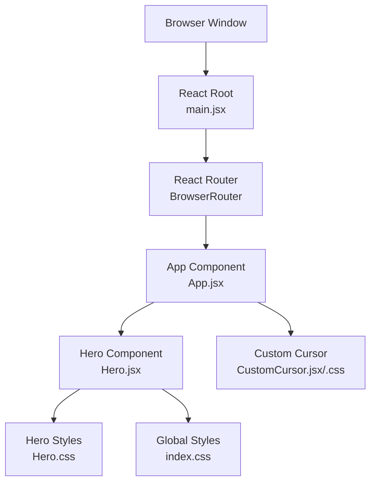
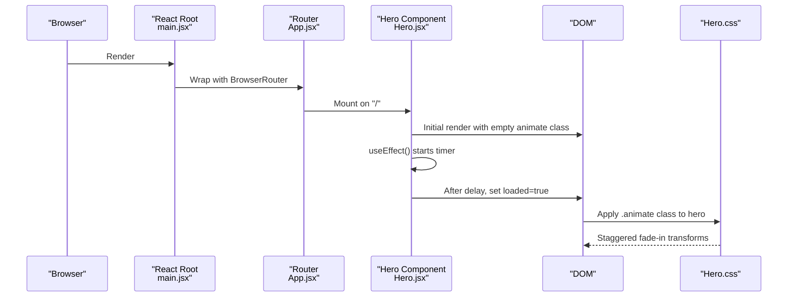
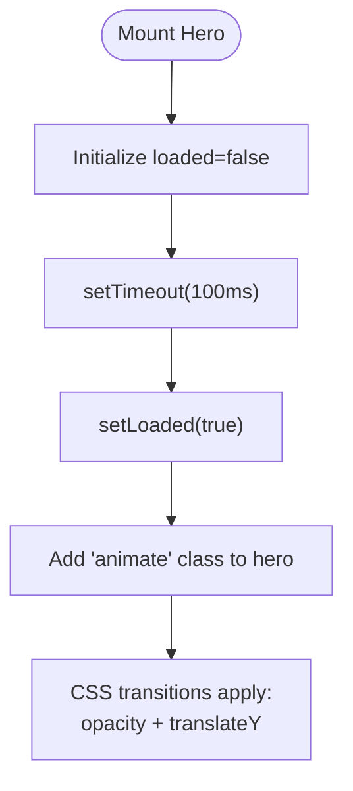
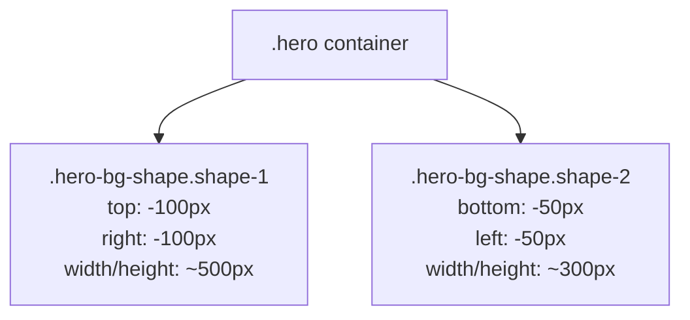
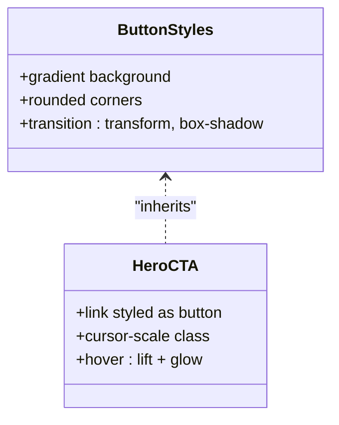
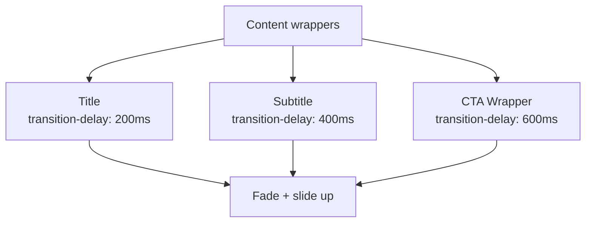
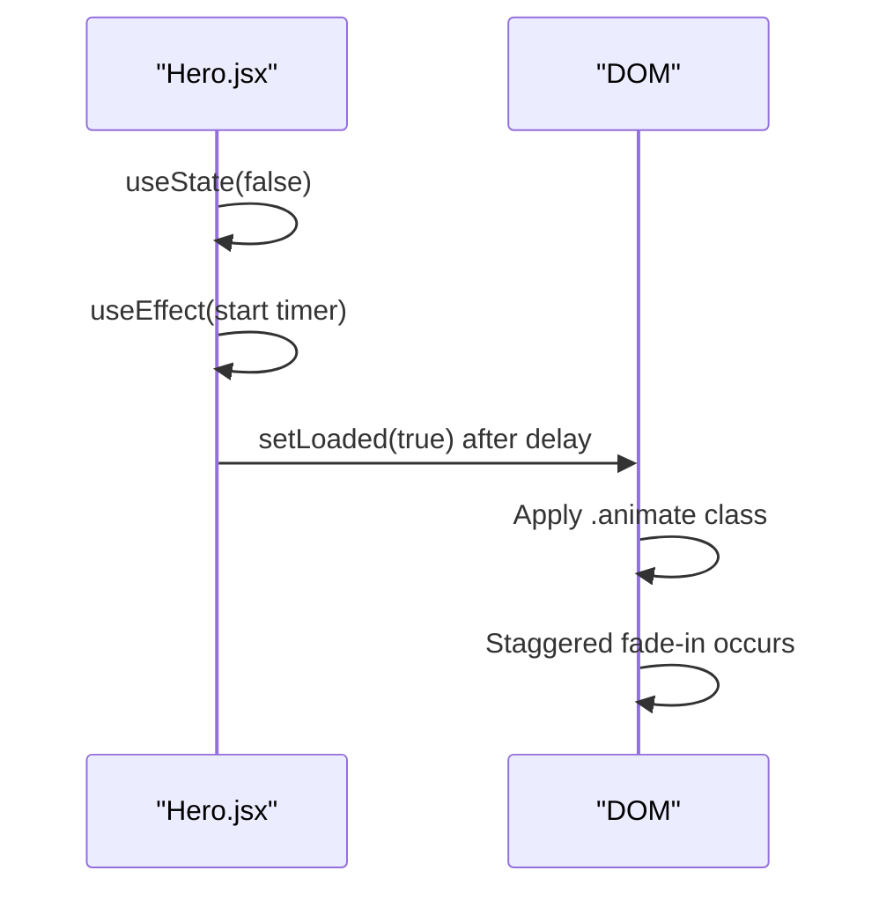
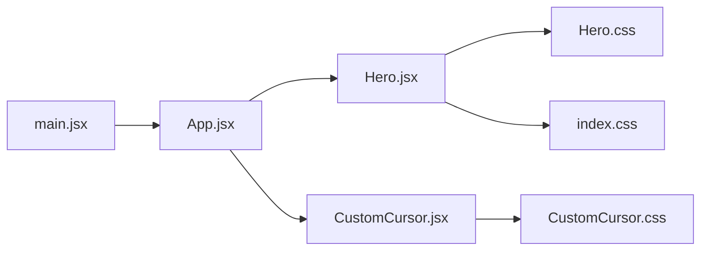

# Hero Section

<cite>
**Referenced Files in This Document**
- [Hero.jsx](file://src/components/Hero.jsx)
- [Hero.css](file://src/components/Hero.css)
- [App.jsx](file://src/App.jsx)
- [main.jsx](file://src/main.jsx)
- [index.css](file://src/index.css)
- [CustomCursor.jsx](file://src/components/CustomCursor.jsx)
- [CustomCursor.css](file://src/components/CustomCursor.css)
</cite>

## Table of Contents
1. [Introduction](#introduction)
2. [Project Structure](#project-structure)
3. [Core Components](#core-components)
4. [Architecture Overview](#architecture-overview)
5. [Detailed Component Analysis](#detailed-component-analysis)
6. [Dependency Analysis](#dependency-analysis)
7. [Performance Considerations](#performance-considerations)
8. [Troubleshooting Guide](#troubleshooting-guide)
9. [Conclusion](#conclusion)
10. [Appendices](#appendices)

## Introduction
This document explains the Hero section component that creates an animated hero layout with staggered fade-in effects. It covers the React state and useEffect hook mechanism that triggers animations, the background shape elements and their positioning, the call-to-action button implementation with hover scaling effects, responsive design patterns and CSS transition delays, the loaded state mechanism for animation triggering, customization and styling examples, and accessibility considerations for the hero content and navigation integration.

## Project Structure
The Hero component is a self-contained unit that renders a full-viewport hero area with animated content and floating background shapes. It integrates with the global app routing and custom cursor system.

**Diagram sources**
- [main.jsx](file://src/main.jsx#L7-L13)
- [App.jsx](file://src/App.jsx#L30-L42)
- [Hero.jsx](file://src/components/Hero.jsx#L1-L36)
- [Hero.css](file://src/components/Hero.css#L1-L147)
- [index.css](file://src/index.css#L1-L101)
- [CustomCursor.jsx](file://src/components/CustomCursor.jsx#L1-L86)

**Section sources**
- [main.jsx](file://src/main.jsx#L7-L13)
- [App.jsx](file://src/App.jsx#L16-L28)

## Core Components
- Hero component: Renders the hero layout, manages the loaded state, and applies animation classes conditionally.
- Hero styles: Define the hero container, background shapes, content animations, and responsive breakpoints.
- Global styles: Provide shared utilities and button hover effects used by the CTA.
- Custom cursor: Integrates with interactive elements to enhance hover feedback.

Key implementation highlights:
- Loaded state and useEffect trigger animation after initial mount.
- Staggered transitions via inline transition-delay on content elements.
- Floating background shapes with keyframe animations.
- Button hover scaling via CSS transitions.

**Section sources**
- [Hero.jsx](file://src/components/Hero.jsx#L4-L36)
- [Hero.css](file://src/components/Hero.css#L1-L147)
- [index.css](file://src/index.css#L82-L98)
- [CustomCursor.jsx](file://src/components/CustomCursor.jsx#L29-L36)

## Architecture Overview
The Hero component participates in the page rendering pipeline through the App component, which mounts the Hero section as part of the home route. The animation lifecycle is controlled by a small state hook and a short timeout after mounting.

**Diagram sources**
- [main.jsx](file://src/main.jsx#L7-L13)
- [App.jsx](file://src/App.jsx#L35-L37)
- [Hero.jsx](file://src/components/Hero.jsx#L7-L10)
- [Hero.css](file://src/components/Hero.css#L57-L72)

## Detailed Component Analysis

### Hero Component Implementation
The Hero component uses React state and useEffect to orchestrate the entrance animation. On mount, it sets a small timeout and flips the loaded flag, which toggles the animate class on the hero container. This triggers CSS transitions for the title, subtitle, and CTA wrapper.

**Diagram sources**
- [Hero.jsx](file://src/components/Hero.jsx#L5-L10)
- [Hero.css](file://src/components/Hero.css#L57-L72)

**Section sources**
- [Hero.jsx](file://src/components/Hero.jsx#L4-L36)

### Background Shape Elements and Positioning
Two large blurred gradient circles act as decorative background shapes. They are positioned absolutely and animated independently with floating keyframes.

- Shape 1: Positioned near the top-right, larger size, slower float cycle.
- Shape 2: Positioned near the bottom-left, smaller size, faster float cycle in reverse direction.
- Both shapes use blur and low opacity for a soft, immersive background.

**Diagram sources**
- [Hero.css](file://src/components/Hero.css#L13-L36)

**Section sources**
- [Hero.css](file://src/components/Hero.css#L13-L36)

### Call-to-Action Button and Hover Scaling Effects
The CTA is a link styled as a button with a hover scaling effect. The button inherits shared styles from the global stylesheet, including a gradient background and a transition for transform and shadow. The Hero component adds a cursor-scale class to integrate with the custom cursor system.

- Button styles: Gradient background, rounded corners, transition for transform and shadow.
- Hover effect: Subtle lift and glow via transform and box-shadow.
- Cursor integration: The cursor-scale class is applied to interactive elements across the site for consistent hover feedback.

**Diagram sources**
- [index.css](file://src/index.css#L82-L98)
- [Hero.jsx](file://src/components/Hero.jsx#L25-L29)

**Section sources**
- [Hero.jsx](file://src/components/Hero.jsx#L25-L29)
- [index.css](file://src/index.css#L82-L98)
- [CustomCursor.jsx](file://src/components/CustomCursor.jsx#L29-L36)

### Responsive Design Patterns and Transition Delays
The hero adapts to smaller screens with reduced heights and font sizes. Transition delays are applied per content element to create a staggered entrance effect.

- Staggered delays: Title uses a delay, subtitle uses a later delay, and the CTA wrapper uses the latest delay.
- Breakpoints: Adjust hero height, title size, and shape sizes for tablets and phones.

**Diagram sources**
- [Hero.jsx](file://src/components/Hero.jsx#L18-L29)
- [Hero.css](file://src/components/Hero.css#L57-L72)
- [Hero.css](file://src/components/Hero.css#L113-L147)

**Section sources**
- [Hero.jsx](file://src/components/Hero.jsx#L18-L29)
- [Hero.css](file://src/components/Hero.css#L57-L72)
- [Hero.css](file://src/components/Hero.css#L113-L147)

### Loaded State Mechanism for Animation Triggering
The loaded state ensures animations run reliably after the component mounts. The timeout introduces a minimal delay to allow the DOM to settle before applying the animate class.

**Diagram sources**
- [Hero.jsx](file://src/components/Hero.jsx#L5-L10)
- [Hero.css](file://src/components/Hero.css#L57-L72)

**Section sources**
- [Hero.jsx](file://src/components/Hero.jsx#L5-L10)

### Content Customization and Styling Modifications
To customize the hero content and appearance:

- Headings and paragraphs: Modify the title and subtitle text and styles in the Hero component JSX and Hero.css.
- CTA link: Change the href and text inside the anchor element.
- Colors and gradients: Update CSS variables in the global stylesheet to change theme colors.
- Shapes: Adjust shape sizes, positions, and animation timing in Hero.css.
- Transitions: Modify transition duration and easing in the hero animation rules.
- Responsiveness: Adjust media queries for breakpoints and typography scales.

Examples of customization locations:
- Content text and delays: [Hero.jsx](file://src/components/Hero.jsx#L18-L29)
- Animation rules and delays: [Hero.css](file://src/components/Hero.css#L57-L72)
- Shape styles and animations: [Hero.css](file://src/components/Hero.css#L13-L48)
- Button styles and hover: [index.css](file://src/index.css#L82-L98)
- Theme variables: [index.css](file://src/index.css#L3-L23)

**Section sources**
- [Hero.jsx](file://src/components/Hero.jsx#L18-L29)
- [Hero.css](file://src/components/Hero.css#L57-L72)
- [Hero.css](file://src/components/Hero.css#L13-L48)
- [index.css](file://src/index.css#L3-L23)
- [index.css](file://src/index.css#L82-L98)

### Accessibility Considerations and Navigation Integration
Accessibility and navigation integration points:

- Focus and keyboard navigation: Ensure the CTA link is reachable via Tab order and visually indicated on focus.
- Screen reader support: Keep the heading hierarchy semantic; avoid decorative images without alt text if used elsewhere.
- Skip links: Provide a skip-to-content link near the top of the page for keyboard users.
- Contrast and readability: Verify sufficient contrast between text and background, especially for the hero title and subtitle.
- Navigation integration: The CTA scrolls to the contact section; ensure the target section is properly labeled and reachable.

Navigation integration:
- The CTA link targets a section ID on the same page, enabling smooth scrolling to the contact section.

**Section sources**
- [Hero.jsx](file://src/components/Hero.jsx#L25-L29)
- [App.jsx](file://src/App.jsx#L16-L28)

## Dependency Analysis
The Hero component depends on:
- Local styles for layout, animations, and responsive behavior.
- Global styles for shared utilities and button styling.
- App routing to mount the component on the home route.
- Custom cursor integration for hover feedback across interactive elements.

**Diagram sources**
- [Hero.jsx](file://src/components/Hero.jsx#L1-L36)
- [Hero.css](file://src/components/Hero.css#L1-L147)
- [index.css](file://src/index.css#L1-L101)
- [App.jsx](file://src/App.jsx#L1-L45)
- [main.jsx](file://src/main.jsx#L1-L14)
- [CustomCursor.jsx](file://src/components/CustomCursor.jsx#L1-L86)
- [CustomCursor.css](file://src/components/CustomCursor.css#L1-L34)

**Section sources**
- [Hero.jsx](file://src/components/Hero.jsx#L1-L36)
- [Hero.css](file://src/components/Hero.css#L1-L147)
- [index.css](file://src/index.css#L1-L101)
- [App.jsx](file://src/App.jsx#L1-L45)
- [main.jsx](file://src/main.jsx#L1-L14)
- [CustomCursor.jsx](file://src/components/CustomCursor.jsx#L1-L86)
- [CustomCursor.css](file://src/components/CustomCursor.css#L1-L34)

## Performance Considerations
- Use transform and opacity for animations to leverage GPU acceleration.
- Keep animation durations reasonable to avoid perceived sluggishness.
- Limit the number of animated elements on the hero for large screens.
- Prefer CSS transitions over JavaScript-driven animations for simple effects.
- Avoid heavy filters on many elements; blur and opacity are used moderately here.

## Troubleshooting Guide
- Animations not triggering: Verify the loaded state is set after mount and that the animate class is applied to the hero container.
- Staggered delays not visible: Confirm transition-delay values are present on the title, subtitle, and CTA wrapper.
- Shape animation not playing: Ensure the keyframes and animation properties are defined and not overridden by other styles.
- Button hover effect missing: Check that the button styles and hover rules are included and not overridden by local styles.
- Cursor hover feedback inconsistent: Confirm the cursor-scale class is applied to interactive elements and the custom cursor logic is active.

**Section sources**
- [Hero.jsx](file://src/components/Hero.jsx#L5-L10)
- [Hero.jsx](file://src/components/Hero.jsx#L18-L29)
- [Hero.css](file://src/components/Hero.css#L38-L48)
- [index.css](file://src/index.css#L82-L98)
- [CustomCursor.jsx](file://src/components/CustomCursor.jsx#L29-L36)

## Conclusion
The Hero section component delivers a polished, accessible hero layout with smooth, staggered entrance animations, floating background shapes, and a responsive design. Its implementation leverages React state and CSS transitions to achieve a performant and maintainable animation experience. Customization is straightforward through content updates and CSS variable adjustments, while integration with the global button styles and custom cursor system ensures cohesive user interaction.

## Appendices
- Example customization steps:
  - Update text content in the Hero component JSX.
  - Adjust typography and spacing in Hero.css.
  - Modify shape sizes and positions in Hero.css.
  - Change theme colors by editing CSS variables in index.css.
  - Fine-tune transition delays and durations in Hero.css.