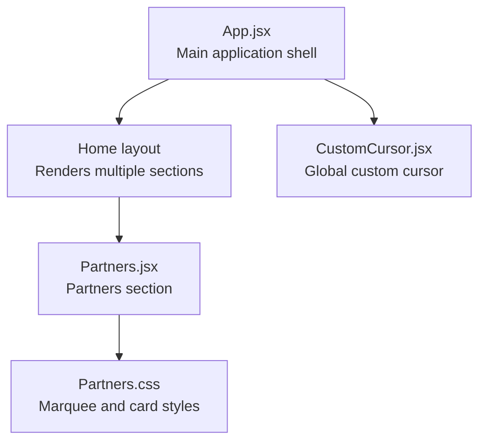
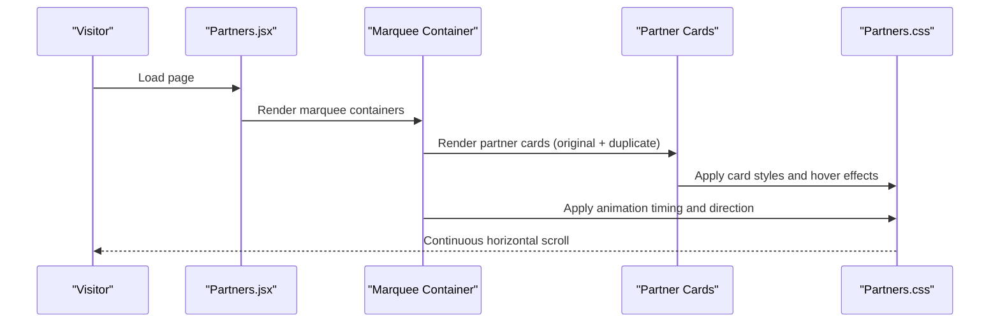
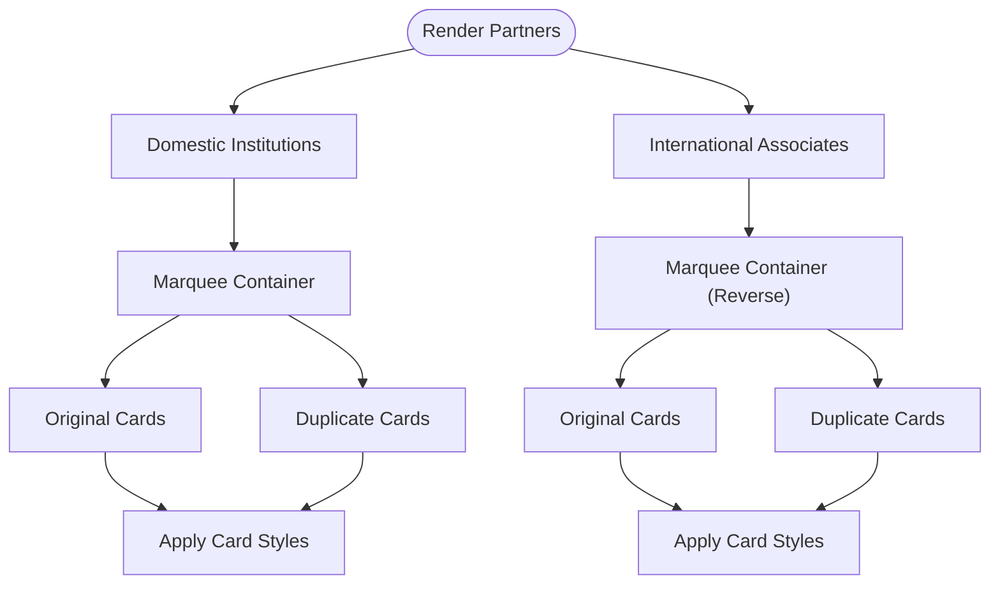
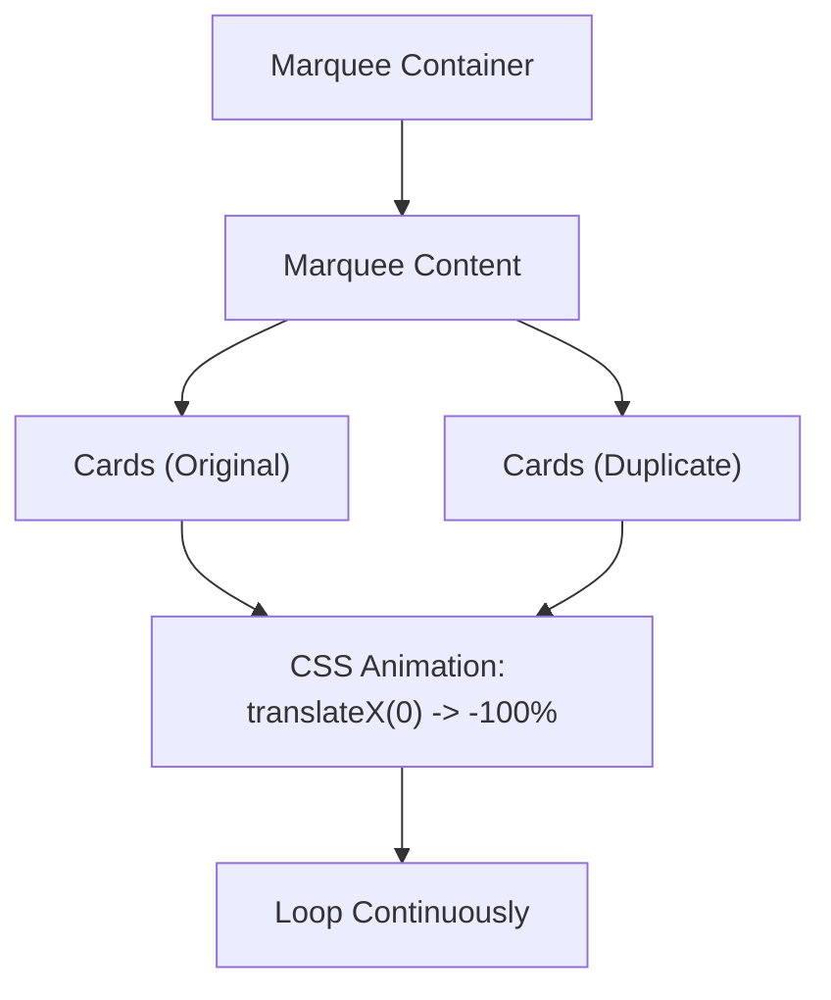
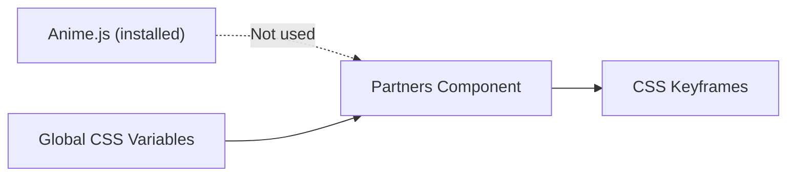

# Partners Section

<cite>
**Referenced Files in This Document**
- [Partners.jsx](file://src/components/Partners.jsx)
- [Partners.css](file://src/components/Partners.css)
- [App.jsx](file://src/App.jsx)
- [package.json](file://package.json)
- [index.css](file://src/index.css)
</cite>

## Table of Contents
1. [Introduction](#introduction)
2. [Project Structure](#project-structure)
3. [Core Components](#core-components)
4. [Architecture Overview](#architecture-overview)
5. [Detailed Component Analysis](#detailed-component-analysis)
6. [Dependency Analysis](#dependency-analysis)
7. [Performance Considerations](#performance-considerations)
8. [Troubleshooting Guide](#troubleshooting-guide)
9. [Conclusion](#conclusion)
10. [Appendices](#appendices)

## Introduction
This document explains the Partners section component that showcases institutional partnerships using a continuous horizontal marquee animation. It covers the implementation approach, CSS-based animation technique, responsive design considerations, and how the marquee contributes to establishing credibility through institutional associations. While the project includes Anime.js as a dependency, the current Partners component uses native CSS animations for the marquee effect.

## Project Structure
The Partners section is implemented as a standalone React component with dedicated styles. It is integrated into the main application layout and rendered on the home page.

**Diagram sources**
- [App.jsx](file://src/App.jsx#L16-L28)
- [Partners.jsx](file://src/components/Partners.jsx#L19-L48)
- [Partners.css](file://src/components/Partners.css#L1-L67)

**Section sources**
- [App.jsx](file://src/App.jsx#L16-L28)
- [Partners.jsx](file://src/components/Partners.jsx#L19-L48)

## Core Components
- Partners component: Renders two categories of institutions (domestic and international) inside a marquee container. Each category duplicates the content to achieve seamless looping.
- Partners styles: Define the marquee behavior, animation timing, direction control, and card presentation.

Key implementation highlights:
- Two arrays define partner names for domestic and international institutions.
- Each category wraps partner items in a marquee container with duplicated content for continuous scrolling.
- CSS keyframe animation moves content from right to left, with a reverse direction for international content.
- Cards are styled as rounded rectangles with hover effects and transitions.

**Section sources**
- [Partners.jsx](file://src/components/Partners.jsx#L4-L17)
- [Partners.jsx](file://src/components/Partners.jsx#L25-L44)
- [Partners.css](file://src/components/Partners.css#L21-L49)
- [Partners.css](file://src/components/Partners.css#L51-L67)

## Architecture Overview
The Partners section relies on CSS animations for marquee scrolling and does not require external JavaScript libraries for animation. The component is self-contained and integrates with the global theme via CSS variables.

**Diagram sources**
- [Partners.jsx](file://src/components/Partners.jsx#L25-L44)
- [Partners.css](file://src/components/Partners.css#L28-L39)
- [Partners.css](file://src/components/Partners.css#L41-L49)

## Detailed Component Analysis

### Partners Component Implementation
- Data arrays: domestic and international lists of partner institution names.
- Rendering: Two marquee sections, each containing original and duplicated partner entries to ensure seamless looping.
- Direction control: International section applies a reverse animation class to scroll in the opposite direction.

**Diagram sources**
- [Partners.jsx](file://src/components/Partners.jsx#L25-L44)
- [Partners.css](file://src/components/Partners.css#L28-L39)
- [Partners.css](file://src/components/Partners.css#L51-L67)

**Section sources**
- [Partners.jsx](file://src/components/Partners.jsx#L4-L17)
- [Partners.jsx](file://src/components/Partners.jsx#L25-L44)

### Marquee Animation Mechanics
- Container: Flexbox with overflow hidden to clip the moving content.
- Content: Flexbox with min-width set to 100% and gap spacing between cards.
- Animation: Keyframes move the content from 0 to -100% horizontally for seamless looping.
- Direction: Reverse class flips the animation direction for the international section.

**Diagram sources**
- [Partners.css](file://src/components/Partners.css#L21-L39)
- [Partners.css](file://src/components/Partners.css#L41-L49)

**Section sources**
- [Partners.css](file://src/components/Partners.css#L21-L39)
- [Partners.css](file://src/components/Partners.css#L41-L49)

### Partner Card Presentation
- Visual style: Rounded rectangular cards with padding, borders, and hover effects.
- Interaction: Hover triggers color and glow transitions, enhancing user engagement.
- Typography: Non-wrapping text ensures consistent alignment during animation.

**Section sources**
- [Partners.css](file://src/components/Partners.css#L51-L67)

### Responsive Design Considerations
- Container: Uses a max-width utility class to constrain content width.
- Marquee: Flexbox layout adapts to viewport width; gaps remain constant for readability.
- Cards: Padding and typography scale with viewport constraints; no explicit media queries are present for this component.

**Section sources**
- [index.css](file://src/index.css#L67-L71)
- [Partners.css](file://src/components/Partners.css#L21-L39)
- [Partners.css](file://src/components/Partners.css#L51-L67)

### Adding New Partners
To add new partners:
- Append or remove entries in the domestic or international arrays.
- Ensure keys are unique for React rendering stability.
- Maintain consistent card styling via shared CSS classes.

Implementation pointers:
- Domestic list: [Partners.jsx](file://src/components/Partners.jsx#L4-L9)
- International list: [Partners.jsx](file://src/components/Partners.jsx#L11-L17)

**Section sources**
- [Partners.jsx](file://src/components/Partners.jsx#L4-L17)

### Customizing Animation Parameters
Animation timing and direction are controlled via CSS:
- Duration: Adjust the animation duration on the marquee content element.
- Direction: Toggle the reverse class to change scroll direction.
- Speed: Increase or decrease duration to alter perceived speed.

Implementation pointers:
- Timing: [Partners.css](file://src/components/Partners.css#L34)
- Direction: [Partners.css](file://src/components/Partners.css#L37-L39)
- Keyframes: [Partners.css](file://src/components/Partners.css#L41-L49)

**Section sources**
- [Partners.css](file://src/components/Partners.css#L34-L39)
- [Partners.css](file://src/components/Partners.css#L41-L49)

### Visual Impact and Credibility
- Institutional associations: Displaying recognized institutions enhances trust and perceived quality.
- Continuous motion: The marquee conveys activity and ongoing collaboration.
- Consistent branding: Cards align with the site’s color scheme and hover effects.

[No sources needed since this section provides general guidance]

## Dependency Analysis
- Anime.js is included as a project dependency but is not used in the Partners component. The marquee effect is implemented purely with CSS animations.
- Global theme variables: The component consumes CSS variables defined in the global stylesheet for colors and spacing.

**Diagram sources**
- [package.json](file://package.json#L12-L18)
- [Partners.jsx](file://src/components/Partners.jsx#L1-L2)
- [Partners.css](file://src/components/Partners.css#L41-L49)
- [index.css](file://src/index.css#L3-L23)

**Section sources**
- [package.json](file://package.json#L12-L18)
- [index.css](file://src/index.css#L3-L23)

## Performance Considerations
- CSS animation: The marquee uses GPU-accelerated transforms, minimizing layout thrashing and maintaining smooth performance.
- Duplication strategy: Duplicate content eliminates visible seams at loop boundaries.
- Minimal JavaScript: No external animation libraries are required, reducing bundle size and potential runtime overhead.
- Recommendations:
  - Keep card count balanced between sections to avoid uneven scroll speeds.
  - Avoid excessive content density to prevent layout shifts on smaller screens.
  - Monitor animation performance on low-end devices; adjust duration if needed.

[No sources needed since this section provides general guidance]

## Troubleshooting Guide
Common issues and resolutions:
- Seams at loop boundaries: Ensure duplicate content is present and identical to original content.
- Uneven speeds: Verify both sections use the same animation duration and direction settings.
- Hover effects not visible: Confirm card styles and hover states are applied consistently.
- Layout shifts on small screens: Check container constraints and ensure consistent padding/gap values.

**Section sources**
- [Partners.jsx](file://src/components/Partners.jsx#L29-L32)
- [Partners.jsx](file://src/components/Partners.jsx#L40-L42)
- [Partners.css](file://src/components/Partners.css#L28-L39)
- [Partners.css](file://src/components/Partners.css#L51-L67)

## Conclusion
The Partners section leverages a clean, CSS-driven marquee animation to present institutional associations effectively. Its design emphasizes readability, visual consistency, and performance while contributing to the site’s professional image. The component is easy to extend and customize without introducing external dependencies for animation.

[No sources needed since this section summarizes without analyzing specific files]

## Appendices

### Appendix A: Integration Points
- The component is rendered within the Home layout and thus appears on the primary page.
- Global custom cursor is enabled at the app level and does not interfere with the marquee.

**Section sources**
- [App.jsx](file://src/App.jsx#L16-L28)