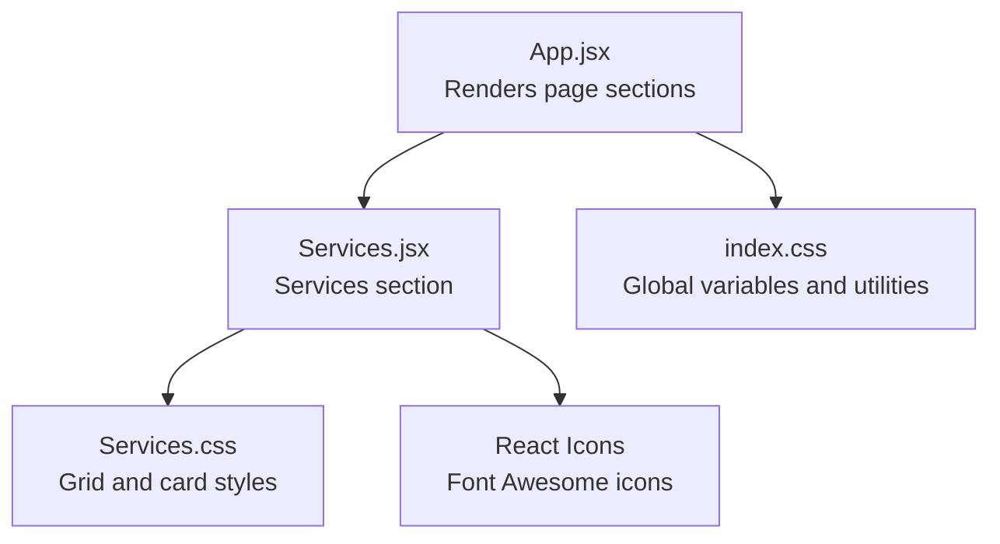
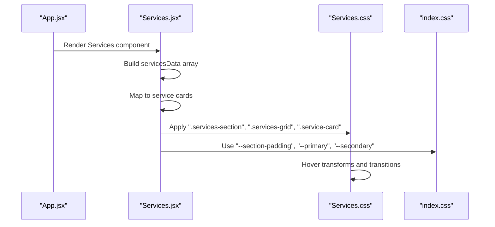
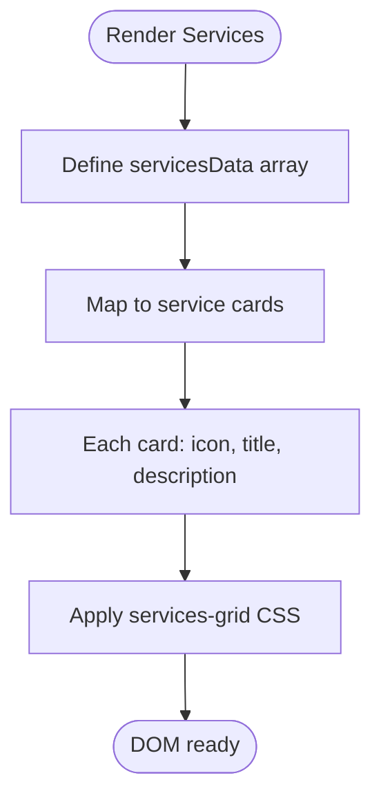
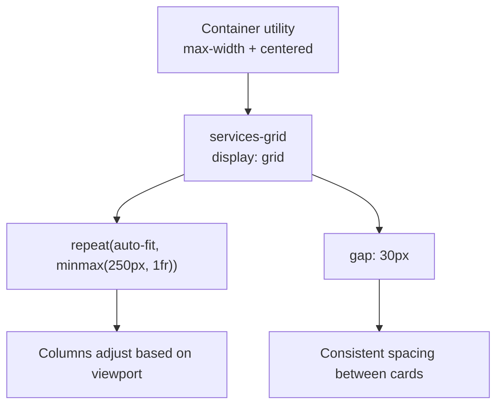
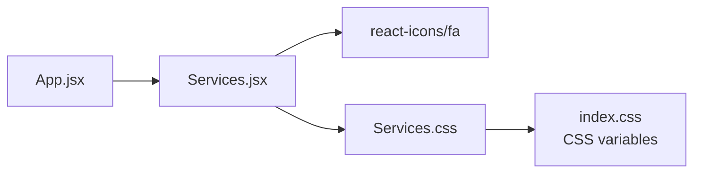

# Services Section

<cite>
**Referenced Files in This Document**
- [Services.jsx](file://src/components/Services.jsx)
- [Services.css](file://src/components/Services.css)
- [App.jsx](file://src/App.jsx)
- [index.css](file://src/index.css)
</cite>

## Table of Contents
1. [Introduction](#introduction)
2. [Project Structure](#project-structure)
3. [Core Components](#core-components)
4. [Architecture Overview](#architecture-overview)
5. [Detailed Component Analysis](#detailed-component-analysis)
6. [Dependency Analysis](#dependency-analysis)
7. [Performance Considerations](#performance-considerations)
8. [Troubleshooting Guide](#troubleshooting-guide)
9. [Conclusion](#conclusion)

## Introduction
This document explains the Services section component that renders a five-point service grid. It covers the React component structure, icon integration using React Icons, service description formatting, responsive grid layout and mobile adaptation, the service data structure and content management patterns, examples for adding new services and customizing cards, and the visual design elements including spacing, typography, and interactive hover states.

## Project Structure
The Services section is implemented as a standalone React component with its own stylesheet and is integrated into the main application page composition.

**Diagram sources**
- [App.jsx](file://src/App.jsx#L16-L28)
- [Services.jsx](file://src/components/Services.jsx#L1-L53)
- [Services.css](file://src/components/Services.css#L1-L51)
- [index.css](file://src/index.css#L3-L23)

**Section sources**
- [App.jsx](file://src/App.jsx#L16-L28)
- [Services.jsx](file://src/components/Services.jsx#L1-L53)
- [Services.css](file://src/components/Services.css#L1-L51)
- [index.css](file://src/index.css#L3-L23)

## Core Components
- Services component: Renders a section with a title and a responsive grid of five service cards. Each card displays an icon, title, and description. The component imports Font Awesome icons from react-icons and applies local styles.
- Services stylesheet: Defines the grid layout, card appearance, hover effects, and typography for service items.
- Global styles: Provides CSS custom properties for colors, spacing, fonts, and shared utilities like container width and section title styling.

Key implementation highlights:
- Data-driven rendering: The service list is defined as an array of objects with icon, title, and description fields.
- Responsive grid: Uses CSS Grid with auto-fit and minmax to adapt to screen sizes.
- Interactive states: Cards lift and change background on hover; icons scale and rotate slightly.
- Typography: Section title uses gradient text; card headings and paragraphs follow consistent sizing and line heights.

**Section sources**
- [Services.jsx](file://src/components/Services.jsx#L5-L32)
- [Services.css](file://src/components/Services.css#L7-L11)
- [Services.css](file://src/components/Services.css#L22-L26)
- [Services.css](file://src/components/Services.css#L28-L38)
- [Services.css](file://src/components/Services.css#L40-L51)
- [index.css](file://src/index.css#L73-L80)

## Architecture Overview
The Services section participates in the main page composition and relies on global design tokens for consistent visuals.

**Diagram sources**
- [App.jsx](file://src/App.jsx#L16-L28)
- [Services.jsx](file://src/components/Services.jsx#L5-L50)
- [Services.css](file://src/components/Services.css#L1-L51)
- [index.css](file://src/index.css#L3-L23)

## Detailed Component Analysis

### Services Component Structure
The component defines a constant array of service objects and renders them into a grid of cards. Each card includes:
- An icon rendered from react-icons
- A title
- A description paragraph

Rendering pattern:
- The component wraps the grid in a section with an ID and a container class.
- The grid uses a CSS class to apply responsive layout.
- Each card receives a key based on index and a class for hover scaling.

**Diagram sources**
- [Services.jsx](file://src/components/Services.jsx#L5-L50)

**Section sources**
- [Services.jsx](file://src/components/Services.jsx#L5-L50)

### Icon Integration with React Icons
- The component imports Font Awesome icon components from react-icons/fa.
- Each service object stores an icon element in its icon property.
- The icon is rendered inside a dedicated container with its own hover effect.

Visual integration:
- Icon container has a fixed font size and color tied to primary theme.
- On card hover, the icon scales up and rotates slightly, and its color shifts to secondary.

**Section sources**
- [Services.jsx](file://src/components/Services.jsx#L2-L8)
- [Services.css](file://src/components/Services.css#L28-L38)

### Service Description Formatting
- Titles are rendered as headings with consistent font size and weight.
- Descriptions are rendered as paragraphs with a muted color, specific font size, and line height for readability.
- The section title uses a gradient text technique for visual emphasis.

**Section sources**
- [Services.jsx](file://src/components/Services.jsx#L37-L44)
- [Services.css](file://src/components/Services.css#L40-L51)
- [index.css](file://src/index.css#L73-L80)

### Responsive Grid Layout and Mobile Adaptation
- The grid uses CSS Grid with auto-fit and minmax to create responsive columns.
- The template specifies a minimum width per column and distributes remaining space across columns.
- Gap spacing is defined to ensure adequate breathing room between cards.
- The container utility constrains maximum width and centers content.

**Diagram sources**
- [Services.css](file://src/components/Services.css#L7-L11)
- [index.css](file://src/index.css#L67-L71)

**Section sources**
- [Services.css](file://src/components/Services.css#L7-L11)
- [index.css](file://src/index.css#L67-L71)

### Service Data Structure and Content Management
- Data model: Each service item is an object containing icon, title, and desc fields.
- Centralized content: All service entries are maintained in a single array within the component.
- Scalability: Adding or removing services requires updating this array.

Content management patterns:
- Keep icon imports and data in sync.
- Maintain consistent title and description length for visual balance.
- Consider extracting data to a separate JSON module for larger datasets.

**Section sources**
- [Services.jsx](file://src/components/Services.jsx#L6-L32)

### Examples: Adding New Services and Customizing Cards
- To add a new service:
  - Import the desired icon component from react-icons/fa.
  - Append a new object to the servicesData array with icon, title, and desc fields.
- To customize a card:
  - Adjust padding, border radius, and background in the service-card selector.
  - Modify hover behavior by editing the hover rules for service-card and service-icon.
  - Change typography by adjusting font sizes and weights in the card heading and paragraph selectors.

**Section sources**
- [Services.jsx](file://src/components/Services.jsx#L2-L32)
- [Services.css](file://src/components/Services.css#L13-L26)
- [Services.css](file://src/components/Services.css#L28-L38)

### Visual Design Elements: Spacing, Typography, and Interactions
- Spacing:
  - Section padding uses a CSS variable for consistent vertical rhythm.
  - Card padding and grid gap define internal and external spacing.
- Typography:
  - Section title uses a large font size with gradient text.
  - Card headings use a medium-large size and bold weight.
  - Paragraphs use a readable size and line height.
- Interactions:
  - Cards lift on hover with a transform and subtle shadow.
  - Background color lightens on hover.
  - Icons scale and rotate with a color shift for emphasis.

**Section sources**
- [Services.css](file://src/components/Services.css#L1-L5)
- [Services.css](file://src/components/Services.css#L13-L26)
- [Services.css](file://src/components/Services.css#L28-L38)
- [Services.css](file://src/components/Services.css#L40-L51)
- [index.css](file://src/index.css#L73-L80)

## Dependency Analysis
The Services component depends on:
- React Icons for icon rendering.
- Local CSS for layout and styling.
- Global CSS variables for consistent theming.

**Diagram sources**
- [Services.jsx](file://src/components/Services.jsx#L1-L3)
- [Services.css](file://src/components/Services.css#L1-L51)
- [index.css](file://src/index.css#L3-L23)
- [App.jsx](file://src/App.jsx#L6)

**Section sources**
- [Services.jsx](file://src/components/Services.jsx#L1-L3)
- [Services.css](file://src/components/Services.css#L1-L51)
- [index.css](file://src/index.css#L3-L23)
- [App.jsx](file://src/App.jsx#L6)

## Performance Considerations
- Rendering cost: The grid renders a fixed number of cards; performance impact is minimal.
- CSS animations: Transitions are lightweight; ensure no heavy JavaScript is attached to hover handlers.
- Bundle size: Using react-icons keeps the bundle small by importing only used icons.

## Troubleshooting Guide
- Icons not displaying:
  - Verify the correct icon component is imported from react-icons/fa.
  - Ensure the icon is placed inside the service-icon container.
- Layout issues:
  - Confirm the services-grid class is applied to the grid container.
  - Check that the container utility is present to constrain width.
- Hover effects not working:
  - Ensure the service-card and service-icon hover selectors are intact.
  - Verify CSS custom properties are defined in index.css.

**Section sources**
- [Services.jsx](file://src/components/Services.jsx#L2-L44)
- [Services.css](file://src/components/Services.css#L7-L11)
- [Services.css](file://src/components/Services.css#L22-L38)
- [index.css](file://src/index.css#L3-L23)

## Conclusion
The Services section component provides a clean, scalable, and visually appealing presentation of five services. Its data-driven structure, responsive grid, and interactive hover states deliver a polished user experience while maintaining simplicity and easy customization.