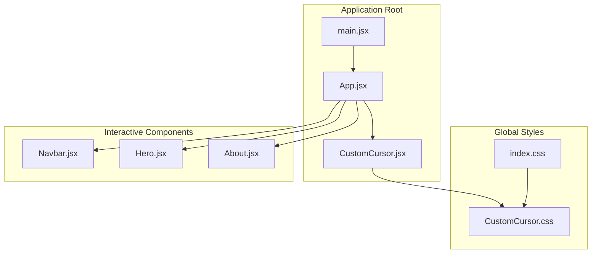
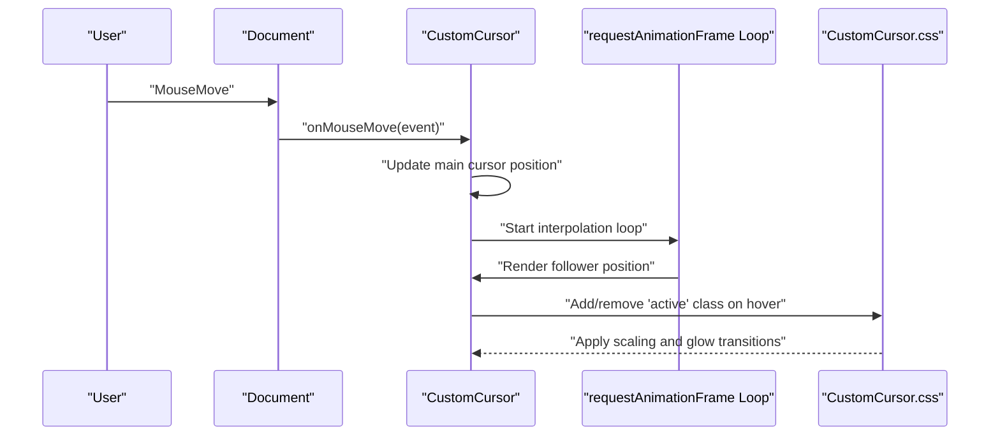
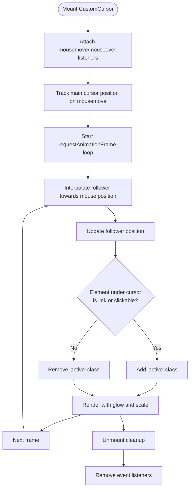
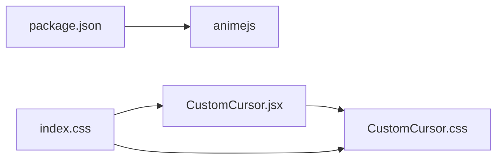

# Interactive Elements

<cite>
**Referenced Files in This Document**
- [CustomCursor.jsx](file://src/components/CustomCursor.jsx)
- [CustomCursor.css](file://src/components/CustomCursor.css)
- [App.jsx](file://src/App.jsx)
- [main.jsx](file://src/main.jsx)
- [index.css](file://src/index.css)
- [package.json](file://src/package.json)
- [Navbar.jsx](file://src/components/Navbar.jsx)
- [Hero.jsx](file://src/components/Hero.jsx)
- [About.jsx](file://src/components/About.jsx)
</cite>

## Table of Contents
1. [Introduction](#introduction)
2. [Project Structure](#project-structure)
3. [Core Components](#core-components)
4. [Architecture Overview](#architecture-overview)
5. [Detailed Component Analysis](#detailed-component-analysis)
6. [Dependency Analysis](#dependency-analysis)
7. [Performance Considerations](#performance-considerations)
8. [Troubleshooting Guide](#troubleshooting-guide)
9. [Conclusion](#conclusion)
10. [Appendices](#appendices)

## Introduction
This document focuses on the interactive elements of the project, with a primary emphasis on the custom cursor implementation. The custom cursor consists of two overlapping elements: a small main cursor and a larger follower trail. The implementation tracks mouse movement, applies a smooth trailing effect using a requestAnimationFrame loop, and toggles a hover state that scales up the follower and adds a glow effect. The project integrates Anime.js as a declared dependency but does not currently use it for cursor animations. Instead, the follower uses a lightweight JavaScript-based interpolation technique for performance. Additional interactive enhancements include a global custom cursor class applied to buttons and navigation links, ensuring consistent cursor behavior across interactive elements.

## Project Structure
The interactive elements are primarily implemented in the CustomCursor component and its associated styles. The component is mounted at the application root so it overlays all pages. Global styles hide the default OS cursor and define the custom cursor variables. Several components apply a shared cursor-scale class to interactive elements to enhance the user experience during hover states.

**Diagram sources**
- [main.jsx](file://src/main.jsx#L1-L14)
- [App.jsx](file://src/App.jsx#L1-L45)
- [CustomCursor.jsx](file://src/components/CustomCursor.jsx#L1-L87)
- [index.css](file://src/index.css#L1-L101)
- [CustomCursor.css](file://src/components/CustomCursor.css#L1-L34)
- [Navbar.jsx](file://src/components/Navbar.jsx#L1-L82)
- [Hero.jsx](file://src/components/Hero.jsx#L1-L36)
- [About.jsx](file://src/components/About.jsx#L1-L48)

**Section sources**
- [main.jsx](file://src/main.jsx#L1-L14)
- [App.jsx](file://src/App.jsx#L1-L45)
- [index.css](file://src/index.css#L1-L101)
- [CustomCursor.jsx](file://src/components/CustomCursor.jsx#L1-L87)
- [CustomCursor.css](file://src/components/CustomCursor.css#L1-L34)

## Core Components
- CustomCursor component
  - Dual-cursor system: main cursor and follower trail
  - Mouse move tracking via a single event listener
  - Smooth follower animation using requestAnimationFrame with interpolation
  - Hover state detection for links and clickable elements
  - Cleanup of event listeners on unmount
- Global styles
  - Hides the default cursor and defines cursor color variables
  - Provides transition effects for the follower’s hover state
- Interactive components
  - Buttons and navigation links include a cursor-scale class to complement the custom cursor behavior

Key implementation references:
- Custom cursor rendering and event handling: [CustomCursor.jsx](file://src/components/CustomCursor.jsx#L8-L43)
- Follower animation loop: [CustomCursor.jsx](file://src/components/CustomCursor.jsx#L45-L76)
- Cursor styles and hover state: [CustomCursor.css](file://src/components/CustomCursor.css#L1-L34)
- Global cursor hiding and variables: [index.css](file://src/index.css#L3-L30)
- Button and link cursor behavior: [index.css](file://src/index.css#L82-L98), [Navbar.jsx](file://src/components/Navbar.jsx#L59-L74)

**Section sources**
- [CustomCursor.jsx](file://src/components/CustomCursor.jsx#L1-L87)
- [CustomCursor.css](file://src/components/CustomCursor.css#L1-L34)
- [index.css](file://src/index.css#L1-L101)
- [Navbar.jsx](file://src/components/Navbar.jsx#L1-L82)

## Architecture Overview
The custom cursor is a global overlay that responds to mouse movement and hover states. It is composed of two DOM nodes: a small main cursor and a larger follower. The main cursor follows the mouse precisely, while the follower uses interpolation to achieve a trailing motion. Hover detection updates the follower’s class to trigger CSS transitions for scaling and glow effects. The component is mounted at the application root to ensure it covers the entire viewport.

**Diagram sources**
- [CustomCursor.jsx](file://src/components/CustomCursor.jsx#L8-L43)
- [CustomCursor.jsx](file://src/components/CustomCursor.jsx#L45-L76)
- [CustomCursor.css](file://src/components/CustomCursor.css#L29-L34)

## Detailed Component Analysis

### CustomCursor Component
The CustomCursor component manages two primary responsibilities:
- Position tracking: Updates the main cursor position on every mouse move.
- Smooth follower animation: Uses a requestAnimationFrame loop with interpolation to move the follower toward the current mouse coordinates, creating a trailing effect.
- Hover state management: Adds or removes an active class on the follower when hovering over links or elements marked as clickable.

Implementation highlights:
- Event listeners for mousemove and mouseover are attached and cleaned up on unmount.
- Interpolation factor controls the smoothness of the follower trail.
- CSS transitions handle the scaling and glow effects when the follower is active.

**Diagram sources**
- [CustomCursor.jsx](file://src/components/CustomCursor.jsx#L8-L43)
- [CustomCursor.jsx](file://src/components/CustomCursor.jsx#L45-L76)
- [CustomCursor.css](file://src/components/CustomCursor.css#L29-L34)

**Section sources**
- [CustomCursor.jsx](file://src/components/CustomCursor.jsx#L1-L87)
- [CustomCursor.css](file://src/components/CustomCursor.css#L1-L34)

### CSS and Hover Effects
The follower cursor’s hover state is controlled via a CSS class that modifies size, border, and background. Transitions are defined to animate these changes smoothly. The global stylesheet hides the default cursor and ensures interactive elements maintain the custom cursor appearance.

Key references:
- Follower hover state: [CustomCursor.css](file://src/components/CustomCursor.css#L29-L34)
- Transition durations and properties: [CustomCursor.css](file://src/components/CustomCursor.css#L26)
- Global cursor hiding and button cursor behavior: [index.css](file://src/index.css#L29), [index.css](file://src/index.css#L92-L98)

**Section sources**
- [CustomCursor.css](file://src/components/CustomCursor.css#L1-L34)
- [index.css](file://src/index.css#L1-L101)

### Integration with Other Interactive Elements
Several components apply a cursor-scale class to interactive elements to reinforce the custom cursor experience. This pattern ensures that buttons and navigation items consistently use the custom cursor, improving user expectations and feedback.

Examples:
- Navigation links and CTA buttons: [Navbar.jsx](file://src/components/Navbar.jsx#L59-L74)
- Hero CTA button: [Hero.jsx](file://src/components/Hero.jsx#L26)
- About cards: [About.jsx](file://src/components/About.jsx#L17-L40)

**Section sources**
- [Navbar.jsx](file://src/components/Navbar.jsx#L1-L82)
- [Hero.jsx](file://src/components/Hero.jsx#L1-L36)
- [About.jsx](file://src/components/About.jsx#L1-L48)

## Dependency Analysis
The project declares Anime.js as a dependency, though it is not currently used for cursor animations. The custom cursor relies on requestAnimationFrame for smooth follower motion and CSS transitions for hover effects. Global styles depend on CSS variables for colors and gradients.

**Diagram sources**
- [package.json](file://src/package.json#L12-L18)
- [CustomCursor.jsx](file://src/components/CustomCursor.jsx#L1-L3)
- [CustomCursor.css](file://src/components/CustomCursor.css#L1-L34)
- [index.css](file://src/index.css#L1-L30)

**Section sources**
- [package.json](file://src/package.json#L1-L31)
- [CustomCursor.jsx](file://src/components/CustomCursor.jsx#L1-L3)
- [CustomCursor.css](file://src/components/CustomCursor.css#L1-L34)
- [index.css](file://src/index.css#L1-L30)

## Performance Considerations
- requestAnimationFrame loop: The follower animation uses a single loop with interpolation, minimizing overhead compared to per-frame Anime.js invocations.
- Event listener cleanup: Both mousemove and mouseover listeners are removed on unmount to prevent memory leaks.
- CSS transitions: Hover effects rely on CSS transitions, which are GPU-accelerated and efficient.
- Variable interpolation factor: The interpolation constant balances responsiveness and smoothness; adjust it based on performance requirements.
- Global cursor hiding: Ensures no overlap with the default cursor, avoiding redundant rendering.

Recommendations:
- Keep the interpolation factor moderate to avoid jitter on low-end devices.
- Debounce or throttle mousemove events if integrating with heavy computations elsewhere.
- Monitor frame drops in complex pages and consider reducing follower size or transition duration.

**Section sources**
- [CustomCursor.jsx](file://src/components/CustomCursor.jsx#L45-L76)
- [CustomCursor.jsx](file://src/components/CustomCursor.jsx#L8-L43)
- [CustomCursor.css](file://src/components/CustomCursor.css#L26)

## Troubleshooting Guide
Common issues and resolutions:
- Follower not moving:
  - Verify mousemove listeners are attached and not blocked by overlays.
  - Confirm the follower element exists and is rendered.
  - References: [CustomCursor.jsx](file://src/components/CustomCursor.jsx#L8-L43), [CustomCursor.jsx](file://src/components/CustomCursor.jsx#L45-L76)
- Hover state not triggering:
  - Ensure target elements are links or marked as clickable.
  - Confirm the active class is being toggled on mouseover.
  - References: [CustomCursor.jsx](file://src/components/CustomCursor.jsx#L29-L37)
- Cursor not visible:
  - Check that the default cursor is hidden globally.
  - Verify CSS variable values for colors and sizes.
  - References: [index.css](file://src/index.css#L29), [CustomCursor.css](file://src/components/CustomCursor.css#L1-L34)
- Performance degradation:
  - Reduce interpolation factor or simplify transitions.
  - Limit the number of active interactive elements during heavy animations.
  - References: [CustomCursor.jsx](file://src/components/CustomCursor.jsx#L59-L68), [CustomCursor.css](file://src/components/CustomCursor.css#L26)

**Section sources**
- [CustomCursor.jsx](file://src/components/CustomCursor.jsx#L8-L43)
- [CustomCursor.jsx](file://src/components/CustomCursor.jsx#L45-L76)
- [CustomCursor.css](file://src/components/CustomCursor.css#L1-L34)
- [index.css](file://src/index.css#L29)

## Conclusion
The custom cursor implementation delivers a polished, immersive experience through a dual-cursor system with a precise main cursor and a smooth trailing follower. Hover states enhance interactivity with scalable, glowing effects, while global styles ensure consistent behavior across interactive elements. The solution prioritizes performance by using requestAnimationFrame and CSS transitions, and it is structured to integrate cleanly with other interactive components. While Anime.js is present as a dependency, the current implementation avoids unnecessary overhead by relying on native browser APIs for cursor animations.

## Appendices
- Browser compatibility:
  - requestAnimationFrame is supported in all modern browsers.
  - CSS transitions and transforms are broadly supported; ensure vendor prefixes if targeting older environments.
  - CSS variables are widely supported; provide fallbacks if needed.
- Cursor customization examples:
  - Adjust sizes and colors via CSS variables in the global stylesheet.
  - Modify transition durations and easing in the follower’s CSS.
  - Integrate additional hover states by extending the active class logic.
- Integration patterns:
  - Apply the cursor-scale class to interactive elements to maintain consistent behavior.
  - Mount the CustomCursor component at the application root for full coverage.

[No sources needed since this section provides general guidance]