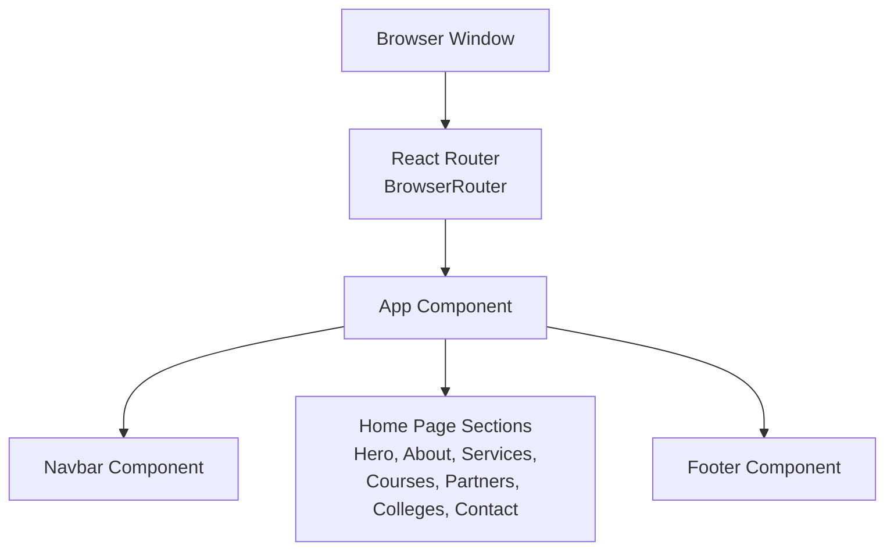
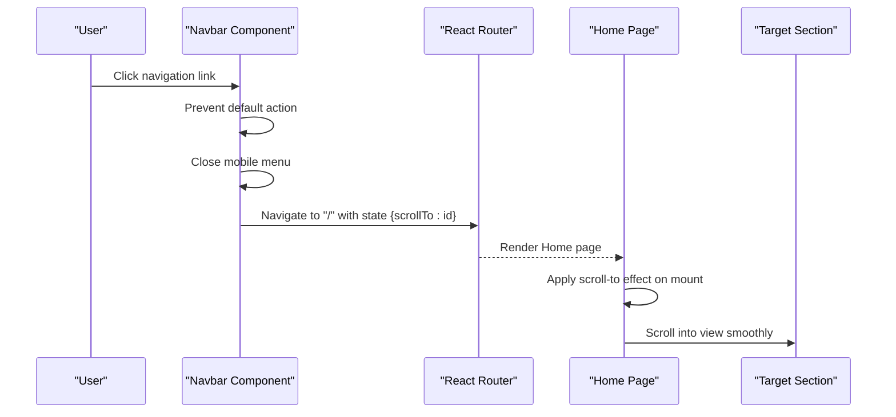
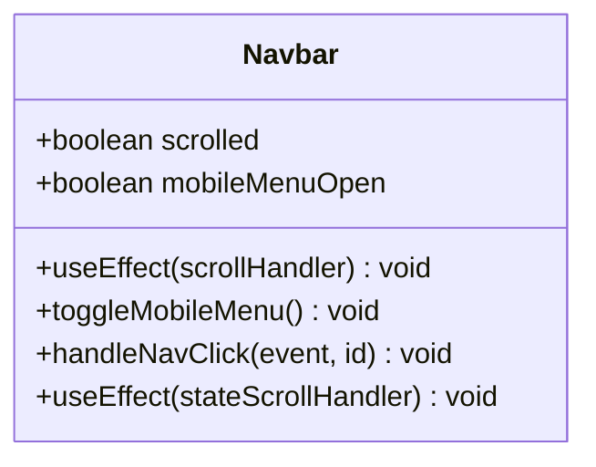
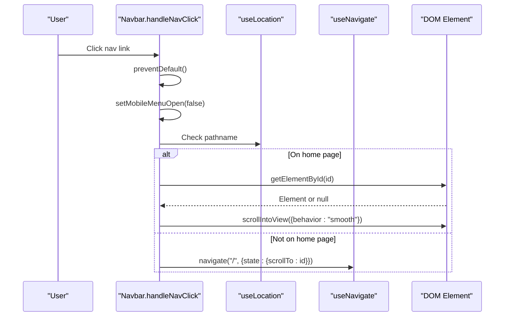
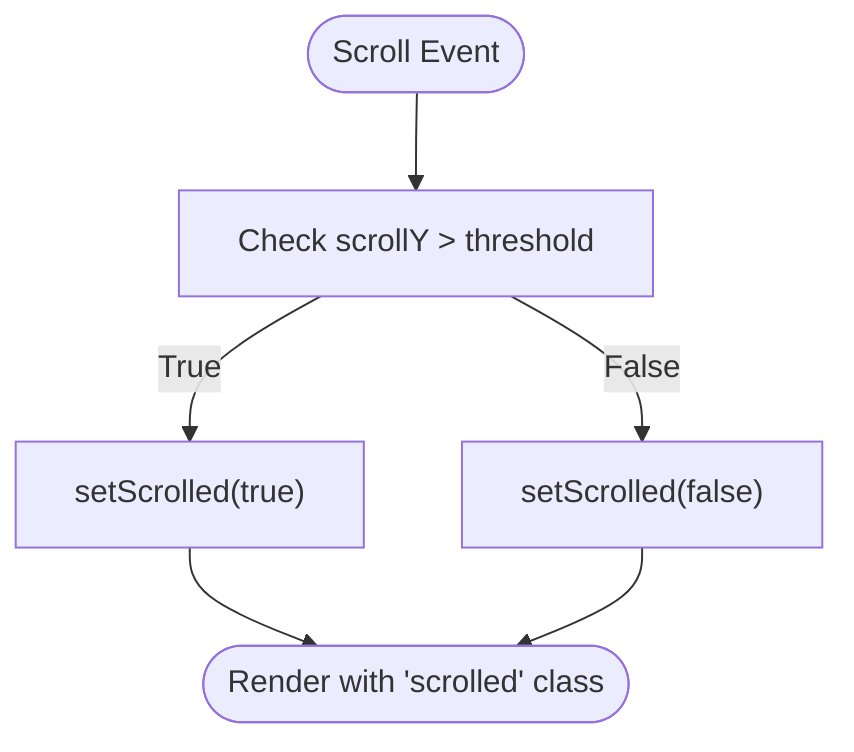
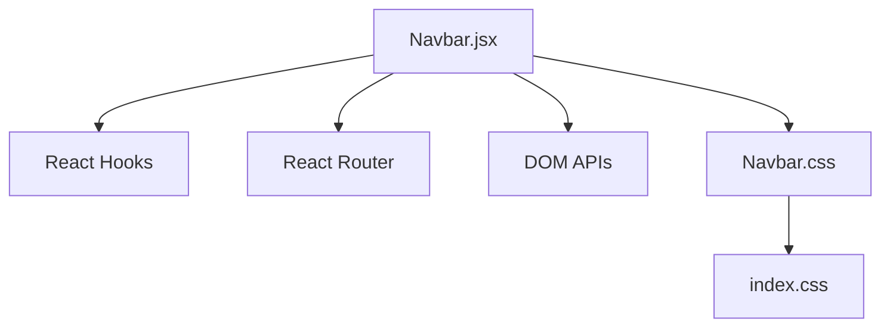

# Navigation System

<cite>
**Referenced Files in This Document**
- [Navbar.jsx](file://src/components/Navbar.jsx)
- [Navbar.css](file://src/components/Navbar.css)
- [App.jsx](file://src/App.jsx)
- [main.jsx](file://src/main.jsx)
- [Hero.jsx](file://src/components/Hero.jsx)
- [About.jsx](file://src/components/About.jsx)
- [Services.jsx](file://src/components/Services.jsx)
- [Courses.jsx](file://src/components/Courses.jsx)
- [Partners.jsx](file://src/components/Partners.jsx)
- [Colleges.jsx](file://src/components/Colleges.jsx)
- [Contact.jsx](file://src/components/Contact.jsx)
- [index.css](file://src/index.css)
- [CustomCursor.jsx](file://src/components/CustomCursor.jsx)
</cite>

## Table of Contents
1. [Introduction](#introduction)
2. [Project Structure](#project-structure)
3. [Core Components](#core-components)
4. [Architecture Overview](#architecture-overview)
5. [Detailed Component Analysis](#detailed-component-analysis)
6. [Dependency Analysis](#dependency-analysis)
7. [Performance Considerations](#performance-considerations)
8. [Troubleshooting Guide](#troubleshooting-guide)
9. [Conclusion](#conclusion)

## Introduction
This document provides comprehensive documentation for the navigation system components, focusing on the Navbar component implementation. It covers scroll effects, mobile menu functionality, smooth scrolling navigation, state management, React Router integration, anchor link scroll-into-view behavior, and responsive design patterns. The documentation also includes examples of configuration, styling customization, and best practices for maintainability and performance.

## Project Structure
The navigation system is centered around the Navbar component and integrates with several page sections that serve as anchor targets. The application is structured with React Router for in-app navigation and cross-page routing. The Navbar coordinates scroll effects, mobile responsiveness, and navigation actions while delegating deep-linking to React Router.

**Diagram sources**
- [main.jsx](file://src/main.jsx#L7-L13)
- [App.jsx](file://src/App.jsx#L30-L42)
- [Navbar.jsx](file://src/components/Navbar.jsx#L56-L78)

**Section sources**
- [main.jsx](file://src/main.jsx#L1-L14)
- [App.jsx](file://src/App.jsx#L1-L45)

## Core Components
The navigation system consists of:
- Navbar: Handles scroll effects, mobile menu toggling, and navigation actions.
- Page sections: Serve as anchor targets for smooth scrolling within the home page.
- React Router: Manages in-app navigation and cross-page routing.

Key responsibilities:
- State management for scrolled state and mobile menu visibility.
- Scroll effect application based on viewport position.
- Mobile menu toggle with backdrop overlay and slide-in animation.
- Smooth scrolling to anchor targets for both in-app and cross-page navigation.
- Integration with React Router for programmatic navigation and state passing.

**Section sources**
- [Navbar.jsx](file://src/components/Navbar.jsx#L6-L82)
- [Navbar.css](file://src/components/Navbar.css#L1-L166)
- [App.jsx](file://src/App.jsx#L16-L28)

## Architecture Overview
The Navbar component orchestrates navigation behavior and integrates with React Router for seamless transitions. The home page sections act as anchor targets, enabling smooth scrolling when navigating from the Navbar. Cross-page navigation leverages React Router routes, with the Navbar initiating navigation to the home page and passing scroll target state.

**Diagram sources**
- [Navbar.jsx](file://src/components/Navbar.jsx#L29-L54)
- [App.jsx](file://src/App.jsx#L16-L28)

## Detailed Component Analysis

### Navbar Component
The Navbar component manages two primary states:
- Scrolled: Tracked via scroll position to apply visual changes.
- Mobile menu open/closed: Controlled by a boolean flag.

State management and lifecycle:
- Scroll effect: A scroll event listener updates the scrolled state when the viewport exceeds a threshold.
- Cleanup: The scroll event listener is removed during component unmount.
- Mobile menu: Toggles the mobileMenuOpen state on hamburger click.
- Navigation click handler: Prevents default anchor behavior, closes the mobile menu, and either scrolls to the target element on the current page or navigates to the home page with scroll target state.

Smooth scrolling and anchor navigation:
- Intra-page navigation: Uses DOM APIs to locate the target element and applies smooth scrolling.
- Inter-page navigation: Navigates to the home route and passes the target identifier via router state. On home page mount, a secondary effect reads the state and performs smooth scrolling to the target.

Responsive behavior:
- Mobile menu appears below a specific breakpoint and slides in from the right.
- Backdrop overlay appears behind the mobile menu for better UX.
- Logo scaling and padding adjustments occur on scroll for visual feedback.

Styling and customization:
- CSS classes dynamically applied based on state (scrolled, mobile menu open).
- Media queries define breakpoints for tablet and mobile layouts.
- Hover and focus states for navigation links and CTA buttons.

Accessibility considerations:
- Focus management during mobile menu toggle.
- Semantic HTML structure with proper heading hierarchy in page sections.

**Section sources**
- [Navbar.jsx](file://src/components/Navbar.jsx#L6-L82)
- [Navbar.css](file://src/components/Navbar.css#L1-L166)

#### Class Diagram: Navbar State and Effects

**Diagram sources**
- [Navbar.jsx](file://src/components/Navbar.jsx#L6-L82)

#### Sequence Diagram: Navigation Click Handler

**Diagram sources**
- [Navbar.jsx](file://src/components/Navbar.jsx#L29-L54)

#### Flowchart: Scroll Effect Logic

**Diagram sources**
- [Navbar.jsx](file://src/components/Navbar.jsx#L12-L23)

### Anchor Targets and Smooth Scrolling
Each page section component defines an ID that serves as an anchor target. The Navbar uses these IDs to perform smooth scrolling. The home page composes multiple sections, enabling intra-page navigation.

Implementation details:
- Section components define unique IDs for each major section.
- Navbar click handler retrieves the target ID and either scrolls on the current page or navigates to the home page with state.
- On home page mount, a dedicated effect reads the router state and performs smooth scrolling to the target element.

Integration points:
- Navbar anchors use IDs that match section IDs.
- Router state carries the target identifier for cross-page navigation scenarios.

**Section sources**
- [Hero.jsx](file://src/components/Hero.jsx#L13)
- [About.jsx](file://src/components/About.jsx#L6)
- [Services.jsx](file://src/components/Services.jsx#L35)
- [Courses.jsx](file://src/components/Courses.jsx#L33)
- [Partners.jsx](file://src/components/Partners.jsx#L21)
- [Colleges.jsx](file://src/components/Colleges.jsx#L7)
- [Contact.jsx](file://src/components/Contact.jsx#L7)
- [Navbar.jsx](file://src/components/Navbar.jsx#L29-L54)

### Mobile Menu Functionality
The mobile menu is designed with:
- Hamburger icon that toggles the menu open/close state.
- Slide-in panel from the right with a backdrop overlay.
- Full-screen width on smaller screens with centered content.
- Smooth transitions for opening and closing.

Responsive breakpoints:
- Tablet and mobile layouts are controlled via media queries.
- Logo sizing and padding adjust for compact displays.

Accessibility:
- Focus management and keyboard navigation should be considered for enhanced accessibility.

**Section sources**
- [Navbar.css](file://src/components/Navbar.css#L57-L126)
- [Navbar.jsx](file://src/components/Navbar.jsx#L56-L78)

### React Router Integration
The navigation system integrates with React Router for:
- Intra-app navigation between pages.
- Passing state to trigger scroll-to behavior on the home page.
- Rendering the home page with composed sections.

Routing configuration:
- The home page renders multiple sections as a single route.
- Cross-page navigation uses route paths with parameters (e.g., colleges by location).

Programmatic navigation:
- The Navbar uses the navigate hook to redirect to the home page with state containing the target ID.
- The home page reads the state and triggers smooth scrolling.

**Section sources**
- [App.jsx](file://src/App.jsx#L16-L28)
- [App.jsx](file://src/App.jsx#L35-L39)
- [Navbar.jsx](file://src/components/Navbar.jsx#L37-L54)

### Styling and Responsive Behavior Patterns
The Navbar employs a layered styling approach:
- Base styles define layout and typography.
- State-specific classes modify appearance on scroll and mobile menu open.
- Media queries adapt the layout for different screen sizes.
- Custom properties define theme colors and spacing.

Patterns:
- Dynamic class application based on state for conditional styling.
- CSS transitions for smooth visual changes.
- Responsive breakpoints for mobile-first design.

**Section sources**
- [Navbar.css](file://src/components/Navbar.css#L1-L166)
- [index.css](file://src/index.css#L3-L23)

### Examples and Best Practices

#### Navigation Configuration
- Define anchor IDs in section components to match Navbar links.
- Use consistent naming conventions for IDs and link text.
- Keep the number of anchor targets reasonable to avoid excessive DOM traversal.

#### Styling Customization
- Modify CSS custom properties in the global stylesheet to change theme colors.
- Adjust media query breakpoints to fit specific device categories.
- Customize transition durations and easing for different motion preferences.

#### Responsive Behavior Patterns
- Use mobile-first CSS with progressive enhancement for larger screens.
- Ensure touch-friendly tap targets for the mobile menu and navigation links.
- Test scroll behavior across devices and browsers to maintain consistency.

#### Accessibility and Performance
- Ensure keyboard navigation support for the mobile menu.
- Debounce or throttle scroll handlers if extending functionality.
- Consider lazy loading for heavy content to improve initial load performance.

**Section sources**
- [Navbar.jsx](file://src/components/Navbar.jsx#L6-L82)
- [Navbar.css](file://src/components/Navbar.css#L1-L166)
- [index.css](file://src/index.css#L3-L23)

## Dependency Analysis
The Navbar component depends on:
- React hooks for state and side effects.
- React Router for navigation and state management.
- DOM APIs for smooth scrolling and element targeting.
- CSS modules for styling and responsive behavior.

External integrations:
- Icons library for hamburger and close icons.
- Global CSS for theme variables and base styles.

**Diagram sources**
- [Navbar.jsx](file://src/components/Navbar.jsx#L1-L4)
- [Navbar.css](file://src/components/Navbar.css#L1-L166)
- [index.css](file://src/index.css#L3-L23)

**Section sources**
- [Navbar.jsx](file://src/components/Navbar.jsx#L1-L4)
- [Navbar.css](file://src/components/Navbar.css#L1-L166)
- [index.css](file://src/index.css#L3-L23)

## Performance Considerations
- Event listener cleanup: Ensure scroll listeners are removed on unmount to prevent memory leaks.
- Smooth scrolling: Use native browser APIs for efficient scrolling; avoid heavy computations in scroll handlers.
- Mobile menu: Minimize reflows by relying on CSS transforms for slide-in animations.
- Bundle size: Keep icon libraries and CSS scoped to reduce payload.
- Accessibility: Provide keyboard navigation alternatives to enhance usability.

## Troubleshooting Guide
Common issues and resolutions:
- Navigation does not scroll to target: Verify that the target element exists and has the correct ID. Confirm that the state is passed correctly when navigating cross-page.
- Mobile menu not closing: Ensure the click handler sets the mobile menu state to false and that the toggle function is bound correctly.
- Scroll effect not applying: Check the scroll threshold and ensure the scroll event listener is attached and cleaned up properly.
- Styles not updating: Confirm that dynamic class names are applied based on state and that CSS custom properties are defined in the global stylesheet.

**Section sources**
- [Navbar.jsx](file://src/components/Navbar.jsx#L12-L23)
- [Navbar.jsx](file://src/components/Navbar.jsx#L29-L54)
- [Navbar.css](file://src/components/Navbar.css#L11-L16)

## Conclusion
The navigation system provides a robust, responsive, and accessible navigation experience. The Navbar component effectively manages scroll effects, mobile menu functionality, and smooth scrolling navigation. Its integration with React Router enables seamless in-app and cross-page navigation, while the modular design of page sections supports maintainable anchor-based navigation. By following the documented patterns and best practices, developers can extend and customize the navigation system to meet evolving requirements.