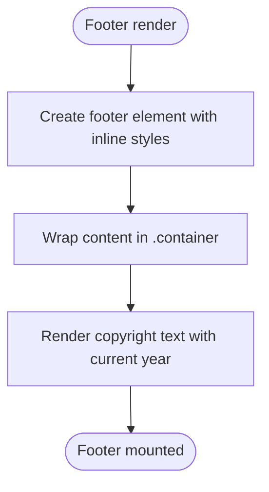

# Site Footer

<cite>
**Referenced Files in This Document**
- [Footer.jsx](file://src/components/Footer.jsx)
- [App.jsx](file://src/App.jsx)
- [index.css](file://src/index.css)
- [main.jsx](file://src/main.jsx)
- [package.json](file://package.json)
</cite>

## Table of Contents
1. [Introduction](#introduction)
2. [Project Structure](#project-structure)
3. [Core Components](#core-components)
4. [Architecture Overview](#architecture-overview)
5. [Detailed Component Analysis](#detailed-component-analysis)
6. [Dependency Analysis](#dependency-analysis)
7. [Performance Considerations](#performance-considerations)
8. [Troubleshooting Guide](#troubleshooting-guide)
9. [Conclusion](#conclusion)
10. [Appendices](#appendices)

## Introduction
This document describes the site footer component implementation, focusing on the Footer component’s structure, styling, and integration within the overall application. It explains how the footer displays copyright information, how it aligns with the global design system, and how to customize and maintain it. It also outlines responsive behavior, branding alignment, and practical steps for updating content and styling.

## Project Structure
The footer is a standalone React component integrated into the main application shell. Global design tokens and container utilities are defined in the shared stylesheet. The application bootstraps routing and mounts the footer at the page level.

**Diagram sources**
- [main.jsx](file://src/main.jsx#L1-L14)
- [App.jsx](file://src/App.jsx#L1-L45)
- [Footer.jsx](file://src/components/Footer.jsx#L1-L20)
- [index.css](file://src/index.css#L1-L101)

**Section sources**
- [main.jsx](file://src/main.jsx#L1-L14)
- [App.jsx](file://src/App.jsx#L1-L45)
- [Footer.jsx](file://src/components/Footer.jsx#L1-L20)
- [index.css](file://src/index.css#L1-L101)

## Core Components
- Footer component
  - Purpose: Render a minimal footer with centered copyright text.
  - Content: Displays current year and brand name.
  - Styling: Uses global design tokens for background, text color, and spacing.
  - Layout: Centers content inside a responsive container utility.
- Application integration
  - Footer is rendered at the bottom of the main application shell.
  - The app uses routing; the footer appears consistently below route content.

Implementation references:
- Footer JSX and inline styles: [Footer.jsx](file://src/components/Footer.jsx#L1-L20)
- Footer mounting in App: [App.jsx](file://src/App.jsx#L30-L42)
- Global design tokens and container utility: [index.css](file://src/index.css#L3-L23), [index.css](file://src/index.css#L67-L71)

**Section sources**
- [Footer.jsx](file://src/components/Footer.jsx#L1-L20)
- [App.jsx](file://src/App.jsx#L30-L42)
- [index.css](file://src/index.css#L3-L23)
- [index.css](file://src/index.css#L67-L71)

## Architecture Overview
The footer participates in the global layout via the App shell and inherits design tokens from the root stylesheet. It does not depend on any other components and is intentionally minimal to reduce coupling.

**Diagram sources**
- [App.jsx](file://src/App.jsx#L1-L45)
- [Footer.jsx](file://src/components/Footer.jsx#L1-L20)
- [index.css](file://src/index.css#L1-L101)
- [main.jsx](file://src/main.jsx#L1-L14)

## Detailed Component Analysis

### Footer Component Implementation
- Rendering model
  - Stateless functional component returning a single footer element.
  - Inline styles define padding, text alignment, border, color, and background.
  - Inner content is wrapped in a container utility class for consistent horizontal spacing.
- Content
  - Copyright notice with dynamic year and brand name.
- Styling and theming
  - Text color and background derived from CSS custom properties.
  - Container utility ensures consistent max-width and horizontal padding.

**Diagram sources**
- [Footer.jsx](file://src/components/Footer.jsx#L3-L16)

**Section sources**
- [Footer.jsx](file://src/components/Footer.jsx#L1-L20)

### Integration with Application and Routing
- Mounting
  - Footer is included in the main App component after routes, ensuring it appears below page content.
- Routing context
  - The app is wrapped with a router provider, but the footer itself does not use routing logic.

**Diagram sources**
- [main.jsx](file://src/main.jsx#L7-L12)
- [App.jsx](file://src/App.jsx#L30-L42)
- [Footer.jsx](file://src/components/Footer.jsx#L3-L16)

**Section sources**
- [main.jsx](file://src/main.jsx#L1-L14)
- [App.jsx](file://src/App.jsx#L30-L42)
- [Footer.jsx](file://src/components/Footer.jsx#L1-L20)

### Responsive Design Considerations
- Container utility
  - The .container class sets a max-width and horizontal padding, ensuring the footer content remains centered and readable across breakpoints.
- Footer padding and typography
  - Inline padding and text alignment keep the footer legible on small screens.
- Theme tokens
  - Color and background tokens adapt to light/dark themes defined globally.

References:
- Container definition: [index.css](file://src/index.css#L67-L71)
- Footer inline styles: [Footer.jsx](file://src/components/Footer.jsx#L5-L11)

**Section sources**
- [index.css](file://src/index.css#L67-L71)
- [Footer.jsx](file://src/components/Footer.jsx#L5-L11)

### Branding and Content Organization
- Brand identity
  - The footer displays the brand name and a standard copyright notice.
- Content placement
  - Centered layout with a thin top border and muted text color for subtle branding.
- Consistency
  - Uses global tokens for background and text color to match the overall design system.

References:
- Brand text and year: [Footer.jsx](file://src/components/Footer.jsx#L13)
- Tokens: [index.css](file://src/index.css#L3-L23)

**Section sources**
- [Footer.jsx](file://src/components/Footer.jsx#L13)
- [index.css](file://src/index.css#L3-L23)

### Social Links, Additional Navigation, and Promotional Content
- Current implementation
  - The footer does not include social media links, additional navigation, or promotional banners.
- Extension points
  - To add links or promotions, insert new elements inside the footer wrapper while keeping the container and tokenized styles.

[No sources needed since this section provides extension guidance]

## Dependency Analysis
- Internal dependencies
  - Footer depends on global design tokens and the container utility class.
  - Footer does not import any other components.
- External dependencies
  - No external libraries are imported by the footer component.

**Diagram sources**
- [Footer.jsx](file://src/components/Footer.jsx#L1-L20)
- [index.css](file://src/index.css#L1-L101)

**Section sources**
- [Footer.jsx](file://src/components/Footer.jsx#L1-L20)
- [package.json](file://package.json#L12-L18)

## Performance Considerations
- Lightweight rendering
  - The footer is a simple component with minimal DOM nodes and inline styles.
- CSS efficiency
  - Reliance on global tokens and a single utility class keeps styles consistent and efficient.
- Bundle impact
  - No additional dependencies are introduced by the footer.

[No sources needed since this section provides general guidance]

## Troubleshooting Guide
- Footer not visible
  - Verify the App component renders the Footer after routes.
  - Confirm the browser console has no errors.
- Incorrect colors or layout
  - Ensure global tokens are defined and the container class is applied.
- Year not updating
  - Confirm the dynamic year expression is present in the footer content.

References:
- Footer mount location: [App.jsx](file://src/App.jsx#L30-L42)
- Footer content: [Footer.jsx](file://src/components/Footer.jsx#L13)
- Tokens and container: [index.css](file://src/index.css#L3-L23), [index.css](file://src/index.css#L67-L71)

**Section sources**
- [App.jsx](file://src/App.jsx#L30-L42)
- [Footer.jsx](file://src/components/Footer.jsx#L13)
- [index.css](file://src/index.css#L3-L23)
- [index.css](file://src/index.css#L67-L71)

## Conclusion
The footer component is intentionally minimal, leveraging global design tokens and a responsive container utility. It integrates seamlessly into the App shell and provides a consistent, branded footer across the site. Extensions such as legal links, social icons, or promotional content can be added with minimal effort while preserving the existing styling and layout.

[No sources needed since this section summarizes without analyzing specific files]

## Appendices

### Customization Examples and Maintenance Procedures
- Updating copyright text
  - Modify the text within the footer wrapper while retaining the container and inline styles.
  - Reference: [Footer.jsx](file://src/components/Footer.jsx#L12-L15)
- Changing colors or background
  - Adjust the global tokens to alter the footer’s appearance site-wide.
  - References: [index.css](file://src/index.css#L3-L23)
- Adding legal links
  - Insert anchor elements inside the footer wrapper and apply global link styles if desired.
  - Keep the container class for consistent spacing.
  - Reference: [Footer.jsx](file://src/components/Footer.jsx#L12-L15)
- Adding social media icons
  - Place icon elements alongside the copyright text and ensure proper spacing.
  - Reference: [Footer.jsx](file://src/components/Footer.jsx#L12-L15)
- Maintaining responsiveness
  - Keep content within the container utility to preserve max-width and padding across devices.
  - Reference: [index.css](file://src/index.css#L67-L71)

**Section sources**
- [Footer.jsx](file://src/components/Footer.jsx#L12-L15)
- [index.css](file://src/index.css#L3-L23)
- [index.css](file://src/index.css#L67-L71)