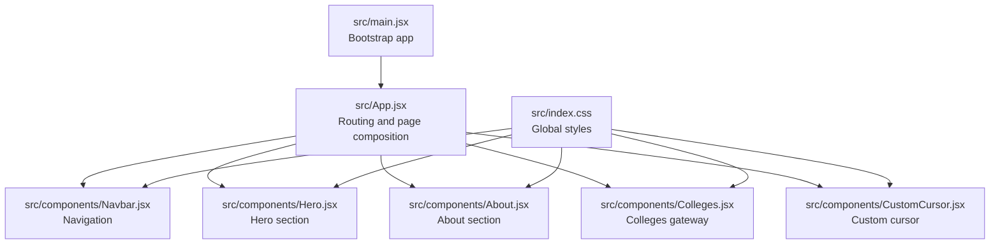
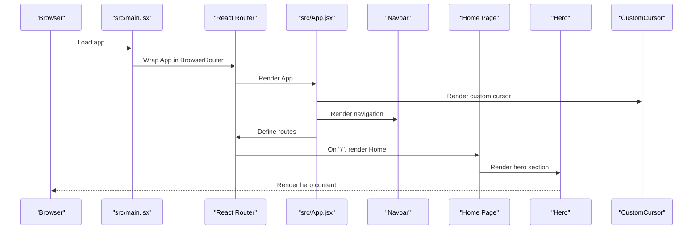
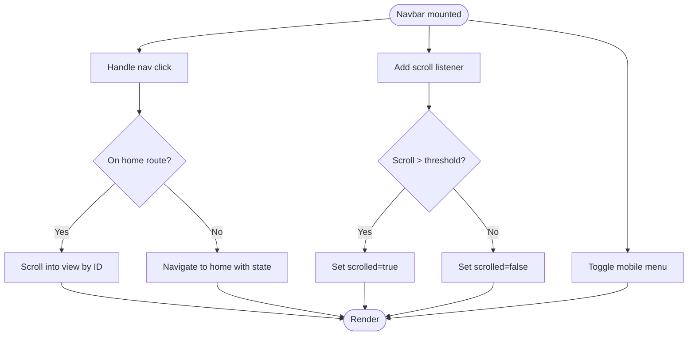
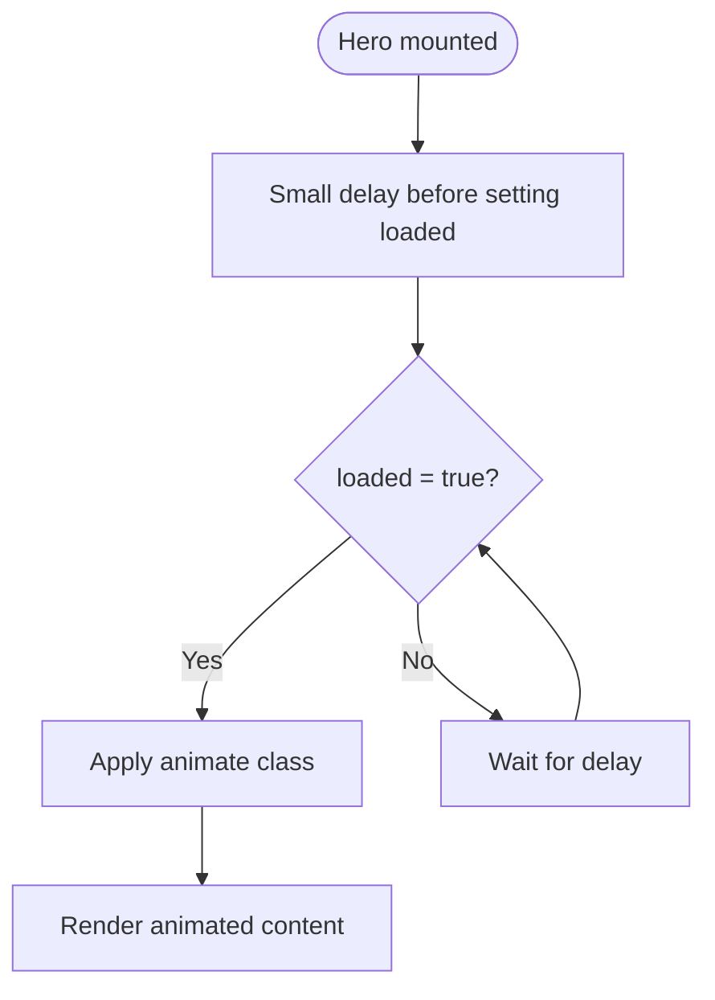
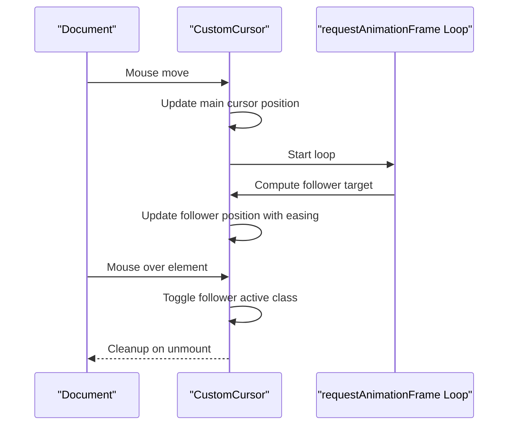
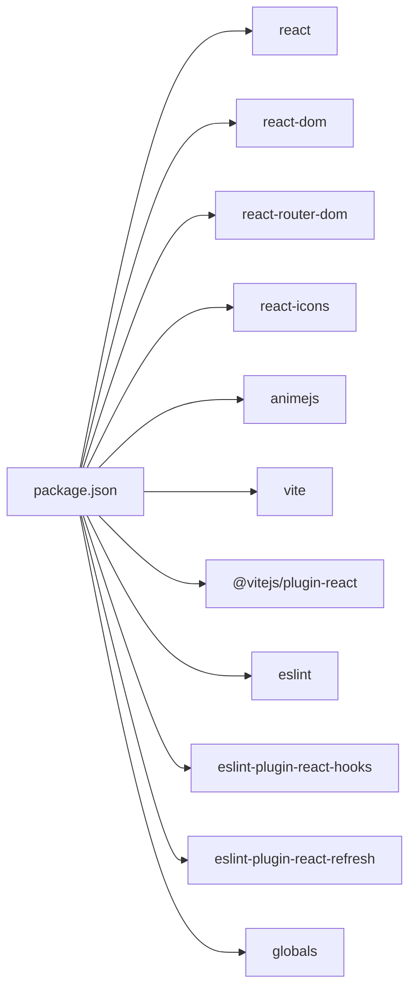

# Development Guidelines

<cite>
**Referenced Files in This Document**
- [package.json](file://package.json)
- [eslint.config.js](file://eslint.config.js)
- [vite.config.js](file://vite.config.js)
- [README.md](file://README.md)
- [src/main.jsx](file://src/main.jsx)
- [src/App.jsx](file://src/App.jsx)
- [src/components/Navbar.jsx](file://src/components/Navbar.jsx)
- [src/components/Navbar.css](file://src/components/Navbar.css)
- [src/components/Hero.jsx](file://src/components/Hero.jsx)
- [src/components/Hero.css](file://src/components/Hero.css)
- [src/components/About.jsx](file://src/components/About.jsx)
- [src/components/Colleges.jsx](file://src/components/Colleges.jsx)
- [src/components/CustomCursor.jsx](file://src/components/CustomCursor.jsx)
- [src/index.css](file://src/index.css)
</cite>

## Table of Contents
1. [Introduction](#introduction)
2. [Project Structure](#project-structure)
3. [Core Components](#core-components)
4. [Architecture Overview](#architecture-overview)
5. [Detailed Component Analysis](#detailed-component-analysis)
6. [Dependency Analysis](#dependency-analysis)
7. [Performance Considerations](#performance-considerations)
8. [Troubleshooting Guide](#troubleshooting-guide)
9. [Contribution and Workflow](#contribution-and-workflow)
10. [Accessibility and Security](#accessibility-and-security)
11. [Testing and Debugging](#testing-and-debugging)
12. [Code Review Process](#code-review-process)
13. [Examples and Patterns](#examples-and-patterns)
14. [Conclusion](#conclusion)

## Introduction
This document defines development guidelines for the Vertex Education website. It consolidates code organization principles, naming conventions, component structure standards, React best practices, tooling configurations (ESLint, Vite), formatting standards, commit conventions, branch strategies, state management patterns, performance optimization, testing and debugging approaches, accessibility and security considerations, maintainability practices, and contribution workflows. The guidelines are grounded in the current repository’s structure and configuration.

## Project Structure
The project follows a feature-based layout under src with clear separation of concerns:
- Entry point initializes React and routing.
- App composes page-level routes and page sections.
- Components are grouped per feature with dedicated JSX and CSS files.
- Global styles live in index.css; component-specific styles live alongside components.

**Diagram sources**
- [src/main.jsx](file://src/main.jsx#L1-L14)
- [src/App.jsx](file://src/App.jsx#L1-L45)
- [src/components/Navbar.jsx](file://src/components/Navbar.jsx#L1-L82)
- [src/components/Hero.jsx](file://src/components/Hero.jsx#L1-L36)
- [src/components/About.jsx](file://src/components/About.jsx#L1-L48)
- [src/components/Colleges.jsx](file://src/components/Colleges.jsx#L1-L41)
- [src/components/CustomCursor.jsx](file://src/components/CustomCursor.jsx#L1-L87)
- [src/index.css](file://src/index.css#L1-L101)

**Section sources**
- [src/main.jsx](file://src/main.jsx#L1-L14)
- [src/App.jsx](file://src/App.jsx#L1-L45)

## Core Components
- Naming conventions
  - Components: PascalCase (e.g., Navbar, Hero, CustomCursor).
  - Styles: Same base name as component with .css suffix (e.g., Navbar.css).
  - Assets: Descriptive kebab-case or noun forms (e.g., vertex-logo.png).
- File organization
  - One component per folder is optional; current structure keeps JSX and CSS adjacent for readability.
  - Prefer small, single-responsibility components.
- Composition
  - App composes pages and sections; pages compose reusable components.
- Routing
  - Uses React Router DOM; routes are declared in App and rendered inside a Routes container.

**Section sources**
- [src/App.jsx](file://src/App.jsx#L1-L45)
- [src/components/Navbar.jsx](file://src/components/Navbar.jsx#L1-L82)
- [src/components/Hero.jsx](file://src/components/Hero.jsx#L1-L36)
- [src/components/About.jsx](file://src/components/About.jsx#L1-L48)
- [src/components/Colleges.jsx](file://src/components/Colleges.jsx#L1-L41)
- [src/components/CustomCursor.jsx](file://src/components/CustomCursor.jsx#L1-L87)

## Architecture Overview
High-level runtime flow:
- Browser loads index.html and mounts React root.
- BrowserRouter wraps the app to enable routing.
- App renders Navbar, Routes, and Footer; route path "/" renders a composed Home page containing Hero, About, Services, Courses, Partners, Colleges, and Contact.
- CustomCursor is rendered globally for interactive UX.

**Diagram sources**
- [src/main.jsx](file://src/main.jsx#L1-L14)
- [src/App.jsx](file://src/App.jsx#L1-L45)
- [src/components/Navbar.jsx](file://src/components/Navbar.jsx#L1-L82)
- [src/components/Hero.jsx](file://src/components/Hero.jsx#L1-L36)
- [src/components/CustomCursor.jsx](file://src/components/CustomCursor.jsx#L1-L87)

## Detailed Component Analysis

### Navigation Component (Navbar)
Key patterns:
- Local state for scroll effect and mobile menu toggling.
- Side effects for scroll listener and initial scroll-to-id handling on home route.
- Uses react-router-dom for navigation and smooth scroll into view.
- CSS handles responsive hamburger menu and hover states.

**Diagram sources**
- [src/components/Navbar.jsx](file://src/components/Navbar.jsx#L1-L82)

**Section sources**
- [src/components/Navbar.jsx](file://src/components/Navbar.jsx#L1-L82)
- [src/components/Navbar.css](file://src/components/Navbar.css#L1-L166)

### Hero Component
Patterns:
- Mount-time animation trigger via state update after initial render.
- CSS-driven animations for fade-in and slide-up effects.
- Responsive typography and background shapes.

**Diagram sources**
- [src/components/Hero.jsx](file://src/components/Hero.jsx#L1-L36)
- [src/components/Hero.css](file://src/components/Hero.css#L1-L147)

**Section sources**
- [src/components/Hero.jsx](file://src/components/Hero.jsx#L1-L36)
- [src/components/Hero.css](file://src/components/Hero.css#L1-L147)

### Colleges Gateway Component
Patterns:
- Stateless functional component rendering a grid of location cards.
- Uses react-router-dom Link to navigate to college listings by location.

**Section sources**
- [src/components/Colleges.jsx](file://src/components/Colleges.jsx#L1-L41)

### Custom Cursor Component
Patterns:
- Two-cursor model: main cursor tracks mouse; follower lags behind using requestAnimationFrame with easing.
- Event listeners for mousemove and mouseover to adjust follower activation.
- Cleanup of event listeners and animation frames on unmount.

**Diagram sources**
- [src/components/CustomCursor.jsx](file://src/components/CustomCursor.jsx#L1-L87)

**Section sources**
- [src/components/CustomCursor.jsx](file://src/components/CustomCursor.jsx#L1-L87)

## Dependency Analysis
Tooling and runtime dependencies:
- Runtime: React, React DOM, React Router DOM, React Icons, animejs.
- Build and dev: Vite, @vitejs/plugin-react.
- Linting: ESLint, eslint-plugin-react-hooks, eslint-plugin-react-refresh, globals.

**Diagram sources**
- [package.json](file://package.json#L1-L31)

**Section sources**
- [package.json](file://package.json#L1-L31)

## Performance Considerations
- Rendering
  - Keep components small and pure where possible; hoist heavy computations out of render.
  - Avoid unnecessary re-renders by using stable callbacks and memoization where appropriate.
- Animations
  - Use CSS transitions/animations for UI micro-interactions; reserve JavaScript-driven animations for complex cases.
  - For custom cursors, prefer requestAnimationFrame loops with light damping to avoid jank.
- Routing
  - Lazy-load route-level code splits if the app grows; current flat route structure is fine for small sites.
- Images and assets
  - Preload critical images and use modern formats; lazy load non-critical assets.
- Tooling
  - Vite provides fast refresh; keep plugins minimal to reduce dev overhead.
- State
  - Prefer local component state for UI flags; externalize only when shared across many components.

[No sources needed since this section provides general guidance]

## Troubleshooting Guide
- Lint errors
  - Run the lint script to catch unused variables and recommended rules.
  - Adjust rules locally if needed, but keep team-wide consistency.
- Build and preview
  - Use dev and preview scripts to test builds locally.
- Routing issues
  - Verify BrowserRouter wrapping and route paths.
- Cursor behavior
  - Ensure event listeners are cleaned up; check RAF loop cancellation on unmount.

**Section sources**
- [package.json](file://package.json#L6-L11)
- [src/main.jsx](file://src/main.jsx#L1-L14)
- [src/components/CustomCursor.jsx](file://src/components/CustomCursor.jsx#L1-L87)

## Contribution and Workflow
- Branching strategy
  - Use feature branches prefixed with feature/, fix/, chore/ for isolation.
  - Rebase or merge develop/main regularly to minimize conflicts.
- Commit messages
  - Use imperative mood: feat: add new component, fix: resolve layout issue, chore: update deps.
  - Keep messages concise but descriptive; reference issues if applicable.
- Pull requests
  - Target develop for features; main for releases.
  - Include screenshots or short demos for UI changes.
  - Ensure lint passes and builds succeed before requesting review.
- Code formatting
  - Use ESLint; configure your editor to show warnings inline.
  - Keep formatting consistent with existing codebase.

[No sources needed since this section provides general guidance]

## Accessibility and Security
- Accessibility
  - Prefer semantic HTML and ARIA roles when needed.
  - Ensure sufficient color contrast and keyboard navigability.
  - Alt text for images; skip links for main content.
- Security
  - Sanitize dynamic content; avoid inline styles from user input.
  - Keep dependencies updated; monitor advisories.
  - Avoid embedding secrets in client-side code.

[No sources needed since this section provides general guidance]

## Testing and Debugging
- Unit/integration
  - Consider adding tests with React Testing Library for critical UI logic.
- Debugging
  - Use React DevTools to inspect component tree and props/state.
  - Leverage browser devtools for network, performance, and layout checks.
- Linting
  - Fix ESLint warnings; treat errors as blocking.

[No sources needed since this section provides general guidance]

## Code Review Process
- Checklist
  - Correctness, readability, maintainability, performance, accessibility, security.
  - Consistency with naming, structure, and patterns in this document.
- Tools
  - Automated lint checks in CI; manual review for architectural decisions.

[No sources needed since this section provides general guidance]

## Examples and Patterns
- Component composition
  - App composes pages and sections; pages compose reusable components.
- State management
  - Local state for UI flags (e.g., Navbar scroll and mobile menu).
  - Router state for cross-route navigation (e.g., scrolling to anchor on home).
- Styling
  - Component-scoped CSS with global variables for theme consistency.
- Interactions
  - Custom cursor with requestAnimationFrame loop and hover feedback.

**Section sources**
- [src/App.jsx](file://src/App.jsx#L1-L45)
- [src/components/Navbar.jsx](file://src/components/Navbar.jsx#L1-L82)
- [src/components/CustomCursor.jsx](file://src/components/CustomCursor.jsx#L1-L87)
- [src/index.css](file://src/index.css#L1-L101)

## Conclusion
These guidelines consolidate the project’s current patterns and tooling into a coherent development process. By adhering to component structure standards, state management patterns, performance practices, and contribution workflows, the team can maintain a scalable, accessible, and secure Vertex Education website.