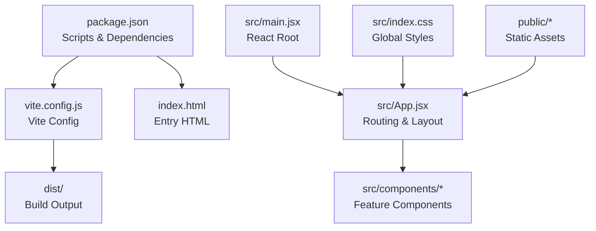

# Getting Started

<cite>
**Referenced Files in This Document**
- [package.json](file://package.json)
- [vite.config.js](file://vite.config.js)
- [README.md](file://README.md)
- [index.html](file://index.html)
- [src/main.jsx](file://src/main.jsx)
- [src/App.jsx](file://src/App.jsx)
- [src/index.css](file://src/index.css)
- [src/components/Navbar.jsx](file://src/components/Navbar.jsx)
- [src/components/Hero.jsx](file://src/components/Hero.jsx)
- [src/components/About.jsx](file://src/components/About.jsx)
- [.vscode/settings.json](file://.vscode/settings.json)
</cite>

## Table of Contents
1. [Introduction](#introduction)
2. [Prerequisites](#prerequisites)
3. [Installation](#installation)
4. [Development Workflow](#development-workflow)
5. [Build Process](#build-process)
6. [Project Structure](#project-structure)
7. [Running Locally](#running-locally)
8. [Verification Steps](#verification-steps)
9. [Troubleshooting](#troubleshooting)
10. [Conclusion](#conclusion)

## Introduction
This guide helps you set up and run the Vertex Education website development environment locally. It covers prerequisites, installation via npm, development server startup, build process, and provides troubleshooting tips to ensure a smooth developer experience.

## Prerequisites
- Node.js: The project requires a Node.js version that satisfies Vite’s runtime engine constraints. According to the lockfile, Vite enforces a minimum Node.js version requirement of 20.19.0 or higher, or 22.12.0 or higher. Ensure your local Node.js version meets one of these ranges before proceeding.
- npm: The project uses npm scripts defined in the package manifest.

**Section sources**
- [package.json](file://package.json#L1-L31)
- [package-lock.json](file://package-lock.json#L2866-L2870)

## Installation
1) Install dependencies
- From the repository root, run:
  ```
  npm install
  ```

2) Verify installation
- After installation completes, confirm that the development server script is available:
  ```
  npm run dev
  ```

**Section sources**
- [package.json](file://package.json#L6-L11)

## Development Workflow
- Start the development server:
  ```
  npm run dev
  ```
- The development server starts Vite, which provides:
  - Hot Module Replacement (HMR) for fast UI updates during development
  - Live reloading when source files change
  - A local development URL (typically http://localhost:5173)

- Preview the production build locally:
  ```
  npm run preview
  ```

- Lint the codebase:
  ```
  npm run lint
  ```

**Section sources**
- [package.json](file://package.json#L6-L11)
- [README.md](file://README.md#L1-L17)

## Build Process
- Build the project for production:
  ```
  npm run build
  ```
- The build output is emitted to the dist directory and includes optimized assets and HTML.

**Section sources**
- [package.json](file://package.json#L8-L8)

## Project Structure
High-level layout of the repository:
- Root configuration files:
  - package.json: Defines scripts, dependencies, and devDependencies
  - vite.config.js: Vite configuration using the React plugin
  - index.html: Application entry HTML with a root div and script tag
  - README.md: Template notes and links to official plugins
- Source code:
  - src/main.jsx: Bootstraps the React app with BrowserRouter and renders the root
  - src/App.jsx: Top-level routing and page composition
  - src/index.css: Global styles and theme variables
  - src/components/*: Feature components (Navbar, Hero, About, etc.)
- Assets:
  - public/*: Static assets referenced by the app (images, favicons)
- Output:
  - dist/*: Production build artifacts



**Diagram sources**
- [package.json](file://package.json#L1-L31)
- [vite.config.js](file://vite.config.js#L1-L8)
- [index.html](file://index.html#L1-L14)
- [src/main.jsx](file://src/main.jsx#L1-L14)
- [src/App.jsx](file://src/App.jsx#L1-L45)
- [src/index.css](file://src/index.css#L1-L101)

**Section sources**
- [package.json](file://package.json#L1-L31)
- [vite.config.js](file://vite.config.js#L1-L8)
- [index.html](file://index.html#L1-L14)
- [src/main.jsx](file://src/main.jsx#L1-L14)
- [src/App.jsx](file://src/App.jsx#L1-L45)
- [src/index.css](file://src/index.css#L1-L101)

## Running Locally
1) Start the development server
- From the repository root, run:
  ```
  npm run dev
  ```
- Open the development server URL shown in the terminal (commonly http://localhost:5173).

2) Access the application
- The app renders the root element defined in index.html and mounts the React tree via src/main.jsx.

3) Explore the routing
- src/App.jsx defines routes for the home page and a dynamic colleges route. Navigate between sections using the Navbar component.

4) Customize and iterate
- Edit components under src/components/* and styles under src/index.css to build out the site.

**Section sources**
- [package.json](file://package.json#L7-L7)
- [index.html](file://index.html#L9-L12)
- [src/main.jsx](file://src/main.jsx#L1-L14)
- [src/App.jsx](file://src/App.jsx#L30-L42)
- [src/components/Navbar.jsx](file://src/components/Navbar.jsx#L1-L82)

## Verification Steps
- Confirm the dev server starts without errors and opens in your browser
- Verify the app renders the Navbar, Hero, and About sections on the home route
- Test navigation by clicking links in the Navbar to scroll to sections
- Run the linter to check for style and linting issues:
  ```
  npm run lint
  ```

**Section sources**
- [package.json](file://package.json#L9-L9)
- [src/App.jsx](file://src/App.jsx#L16-L28)
- [src/components/Navbar.jsx](file://src/components/Navbar.jsx#L56-L78)

## Troubleshooting
- Node.js version mismatch
  - Symptom: Errors indicating unsupported Node.js version when running scripts
  - Resolution: Upgrade to a Node.js version that satisfies Vite’s engine requirements (20.19.0+ or 22.12.0+)
  - Reference: Vite engine constraints in the lockfile

- Missing dependencies
  - Symptom: Errors during dev or build
  - Resolution: Reinstall dependencies
    ```
    npm install
    ```

- ESLint issues
  - Symptom: Lint errors blocking development
  - Resolution: Run the linter and address reported issues
    ```
    npm run lint
    ```

- VS Code settings
  - The repository includes an empty VS Code settings file. If you encounter formatting or editor-related issues, review your VS Code configuration or leave the settings file as-is.

**Section sources**
- [package.json](file://package.json#L19-L29)
- [package-lock.json](file://package-lock.json#L2866-L2870)
- [.vscode/settings.json](file://.vscode/settings.json#L1-L2)

## Conclusion
You are now ready to develop the Vertex Education website locally. Use the provided scripts to start the dev server, preview builds, and lint the codebase. Keep your Node.js version aligned with Vite’s requirements and leverage the component and styling structure to build and iterate efficiently.