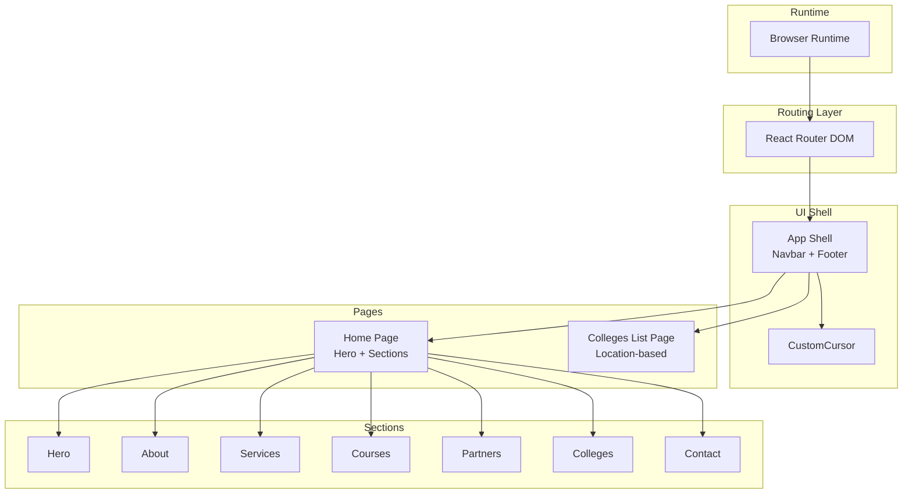
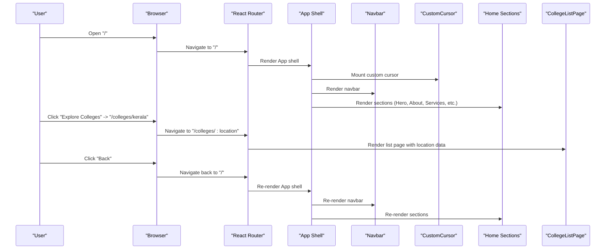
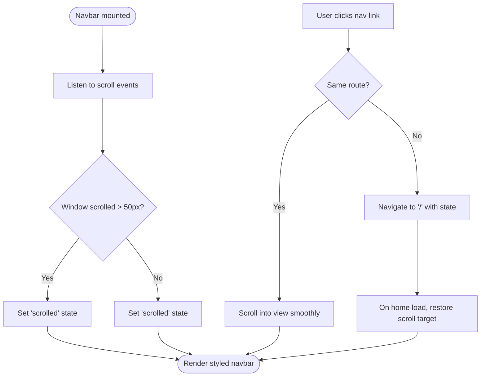
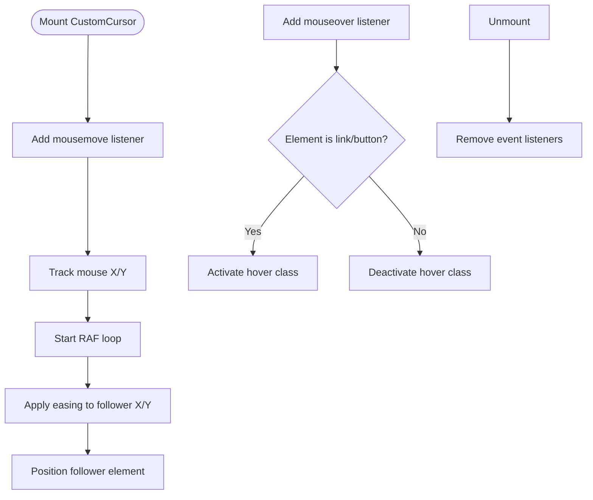
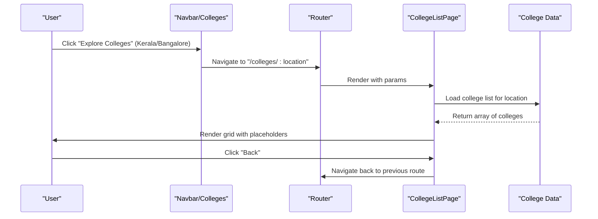
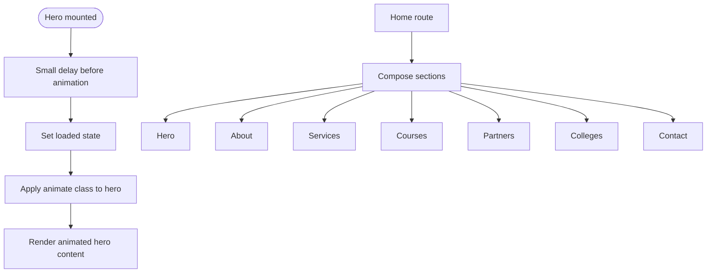
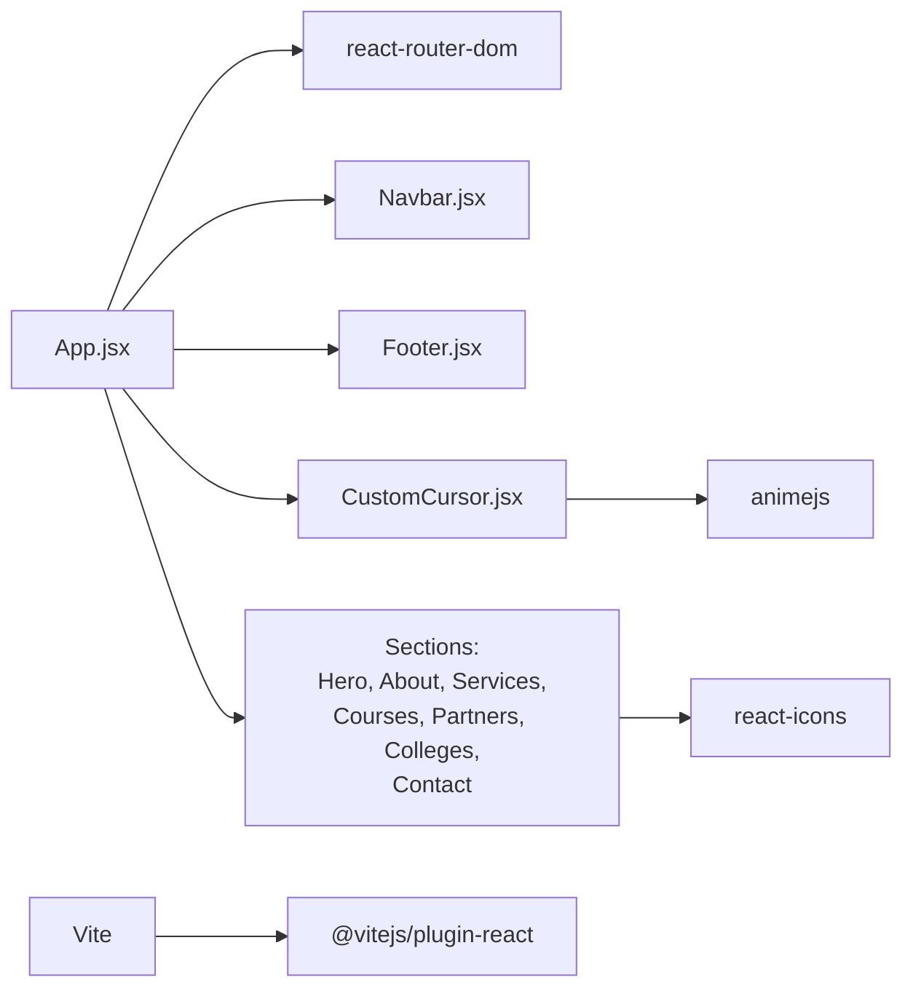

# Project Overview

<cite>
**Referenced Files in This Document**
- [README.md](file://README.md)
- [package.json](file://package.json)
- [vite.config.js](file://vite.config.js)
- [src/main.jsx](file://src/main.jsx)
- [src/App.jsx](file://src/App.jsx)
- [src/components/Navbar.jsx](file://src/components/Navbar.jsx)
- [src/components/CustomCursor.jsx](file://src/components/CustomCursor.jsx)
- [src/components/Hero.jsx](file://src/components/Hero.jsx)
- [src/components/About.jsx](file://src/components/About.jsx)
- [src/components/Services.jsx](file://src/components/Services.jsx)
- [src/components/Courses.jsx](file://src/components/Courses.jsx)
- [src/components/Partners.jsx](file://src/components/Partners.jsx)
- [src/components/Colleges.jsx](file://src/components/Colleges.jsx)
- [src/components/CollegeListPage.jsx](file://src/components/CollegeListPage.jsx)
- [src/components/Contact.jsx](file://src/components/Contact.jsx)
- [src/components/Footer.jsx](file://src/components/Footer.jsx)
- [src/index.css](file://src/index.css)
</cite>

## Table of Contents
1. [Introduction](#introduction)
2. [Project Structure](#project-structure)
3. [Core Components](#core-components)
4. [Architecture Overview](#architecture-overview)
5. [Detailed Component Analysis](#detailed-component-analysis)
6. [Dependency Analysis](#dependency-analysis)
7. [Performance Considerations](#performance-considerations)
8. [Troubleshooting Guide](#troubleshooting-guide)
9. [Conclusion](#conclusion)

## Introduction
Vertex Education is an educational consultancy platform designed to empower students pursuing higher education by connecting them with trusted admission counseling, placement support, global study opportunities, financial aid guidance, and campus experience services. The platform targets students across Karnataka, Kerala, and Tamil Nadu who seek expert guidance to transform their aspirations into actionable outcomes. It positions itself as a single source of truth for high-quality education pathways, emphasizing personalized support and institutional reach spanning premier universities.

Contextual positioning:
- The educational consulting industry focuses on bridging the gap between student aspirations and institutional opportunities. Digital platforms like Vertex Education streamline discovery, guidance, and enrollment processes, reducing friction in decision-making and increasing access to curated pathways.
- Vertex Education’s mission aligns with industry trends toward transparency, accessibility, and student-centric experiences, supported by modern web technologies that enhance engagement and usability.

## Project Structure
The project is a React application built with Vite, using React Router for navigation and a modular component architecture. The frontend is organized around feature-based components, each encapsulating UI and styling for a specific page or section. Routing is configured to support both the landing/home experience and dynamic location-based college listings.

Key structural elements:
- Application bootstrap initializes routing and renders the primary layout with shared navigation, footer, and route-based content.
- Navigation supports smooth scrolling to sections on the homepage and mobile-friendly responsive behavior.
- Interactive elements include a custom animated cursor and hover effects integrated across cards and CTAs.
- Styling leverages CSS custom properties for theme consistency and responsive typography.

**Diagram sources**
- [src/main.jsx](file://src/main.jsx#L1-L14)
- [src/App.jsx](file://src/App.jsx#L1-L45)
- [src/components/Navbar.jsx](file://src/components/Navbar.jsx#L1-L82)
- [src/components/CustomCursor.jsx](file://src/components/CustomCursor.jsx#L1-L87)
- [src/components/Hero.jsx](file://src/components/Hero.jsx#L1-L36)
- [src/components/About.jsx](file://src/components/About.jsx#L1-L48)
- [src/components/Services.jsx](file://src/components/Services.jsx#L1-L53)
- [src/components/Courses.jsx](file://src/components/Courses.jsx)
- [src/components/Partners.jsx](file://src/components/Partners.jsx)
- [src/components/Colleges.jsx](file://src/components/Colleges.jsx#L1-L41)
- [src/components/CollegeListPage.jsx](file://src/components/CollegeListPage.jsx#L1-L83)
- [src/components/Contact.jsx](file://src/components/Contact.jsx#L1-L70)
- [src/components/Footer.jsx](file://src/components/Footer.jsx#L1-L20)

**Section sources**
- [src/main.jsx](file://src/main.jsx#L1-L14)
- [src/App.jsx](file://src/App.jsx#L1-L45)
- [src/components/Navbar.jsx](file://src/components/Navbar.jsx#L1-L82)
- [src/components/CustomCursor.jsx](file://src/components/CustomCursor.jsx#L1-L87)
- [src/components/Hero.jsx](file://src/components/Hero.jsx#L1-L36)
- [src/components/About.jsx](file://src/components/About.jsx#L1-L48)
- [src/components/Services.jsx](file://src/components/Services.jsx#L1-L53)
- [src/components/Courses.jsx](file://src/components/Courses.jsx)
- [src/components/Partners.jsx](file://src/components/Partners.jsx)
- [src/components/Colleges.jsx](file://src/components/Colleges.jsx#L1-L41)
- [src/components/CollegeListPage.jsx](file://src/components/CollegeListPage.jsx#L1-L83)
- [src/components/Contact.jsx](file://src/components/Contact.jsx#L1-L70)
- [src/components/Footer.jsx](file://src/components/Footer.jsx#L1-L20)

## Core Components
Vertex Education’s UI is composed of cohesive, reusable components that collectively deliver a seamless user experience. The core components include:

- Navigation and Layout
  - Navbar: Provides responsive navigation, scroll-aware styling, and smooth scrolling to sections. It also handles cross-route navigation to the homepage with targeted scroll restoration.
  - Footer: Minimalist branding and copyright information.

- Interactive Experience
  - CustomCursor: Implements a dual-layer animated cursor with a trailing effect and hover state activation for links and buttons, enhancing interactivity.

- Content Sections
  - Hero: Engaging hero area with staggered entrance animations and a CTA leading to contact.
  - About: Highlights reach, mission, and scope tailored to the educational consultancy domain.
  - Services: Presents five service pillars—Admission Counseling, Placement Support, Global Opportunities, Financial Aid, and Campus Experience—using icons and concise descriptions.
  - Courses, Partners: Placeholder components for course offerings and institutional partnerships.
  - Colleges: Location gateway cards linking to location-specific college lists.
  - Contact: Contact information and a form area for inquiries.

- Dynamic Content
  - CollegeListPage: Renders a location-based grid of associated colleges, with a back navigation and responsive placeholders for missing images.

Technology stack overview:
- Frontend framework: React 19
- Routing: React Router DOM 7.x
- Icons: react-icons (Font Awesome)
- Animation library: animejs 4.x
- Build toolchain: Vite 7.x with @vitejs/plugin-react
- Linting: ESLint with React hooks and refresh plugins

**Section sources**
- [src/components/Navbar.jsx](file://src/components/Navbar.jsx#L1-L82)
- [src/components/Footer.jsx](file://src/components/Footer.jsx#L1-L20)
- [src/components/CustomCursor.jsx](file://src/components/CustomCursor.jsx#L1-L87)
- [src/components/Hero.jsx](file://src/components/Hero.jsx#L1-L36)
- [src/components/About.jsx](file://src/components/About.jsx#L1-L48)
- [src/components/Services.jsx](file://src/components/Services.jsx#L1-L53)
- [src/components/Courses.jsx](file://src/components/Courses.jsx)
- [src/components/Partners.jsx](file://src/components/Partners.jsx)
- [src/components/Colleges.jsx](file://src/components/Colleges.jsx#L1-L41)
- [src/components/CollegeListPage.jsx](file://src/components/CollegeListPage.jsx#L1-L83)
- [src/components/Contact.jsx](file://src/components/Contact.jsx#L1-L70)
- [package.json](file://package.json#L12-L29)
- [vite.config.js](file://vite.config.js#L1-L8)

## Architecture Overview
The application follows a client-side routing model with a single-page app architecture. The router defines two primary routes:
- Root route (“/”) renders the home page containing multiple sections.
- Dynamic route (“/colleges/:location”) renders a location-specific college list page.

The shell integrates a custom cursor overlay and a persistent navigation bar with a footer. Styling is centralized via CSS custom properties for theme consistency.

**Diagram sources**
- [src/main.jsx](file://src/main.jsx#L1-L14)
- [src/App.jsx](file://src/App.jsx#L1-L45)
- [src/components/Navbar.jsx](file://src/components/Navbar.jsx#L1-L82)
- [src/components/CustomCursor.jsx](file://src/components/CustomCursor.jsx#L1-L87)
- [src/components/CollegeListPage.jsx](file://src/components/CollegeListPage.jsx#L1-L83)

## Detailed Component Analysis

### Navigation and Smooth Scrolling
The Navbar component manages responsive behavior, scroll-aware styling, and smooth scrolling to sections. It also supports cross-route navigation to the homepage with a scroll-to-target state, ensuring consistent UX across routes.

**Diagram sources**
- [src/components/Navbar.jsx](file://src/components/Navbar.jsx#L1-L82)

**Section sources**
- [src/components/Navbar.jsx](file://src/components/Navbar.jsx#L1-L82)

### Custom Animated Cursor
The CustomCursor component implements a dual-layer cursor with a trailing effect using requestAnimationFrame for smoothness. Hover states on interactive elements activate a visual mode for the follower element.

**Diagram sources**
- [src/components/CustomCursor.jsx](file://src/components/CustomCursor.jsx#L1-L87)

**Section sources**
- [src/components/CustomCursor.jsx](file://src/components/CustomCursor.jsx#L1-L87)
- [src/index.css](file://src/index.css#L25-L30)
- [src/index.css](file://src/index.css#L92-L93)

### Location-Based College Directory
The Colleges section provides gateway cards to locations, linking to a dynamic route that renders a location-specific list. The CollegeListPage component fetches data based on URL params, displays a grid of colleges, and offers a back navigation.

**Diagram sources**
- [src/components/Colleges.jsx](file://src/components/Colleges.jsx#L1-L41)
- [src/components/CollegeListPage.jsx](file://src/components/CollegeListPage.jsx#L1-L83)

**Section sources**
- [src/components/Colleges.jsx](file://src/components/Colleges.jsx#L1-L41)
- [src/components/CollegeListPage.jsx](file://src/components/CollegeListPage.jsx#L1-L83)

### Hero and Section Composition
The Hero component uses a staged animation trigger on mount to animate headline and subtitle elements. The Home page composes multiple sections (About, Services, Courses, Partners, Colleges, Contact) to present the platform’s value proposition and contact information.

**Diagram sources**
- [src/components/Hero.jsx](file://src/components/Hero.jsx#L1-L36)
- [src/App.jsx](file://src/App.jsx#L16-L28)

**Section sources**
- [src/components/Hero.jsx](file://src/components/Hero.jsx#L1-L36)
- [src/App.jsx](file://src/App.jsx#L16-L28)
- [src/components/About.jsx](file://src/components/About.jsx#L1-L48)
- [src/components/Services.jsx](file://src/components/Services.jsx#L1-L53)
- [src/components/Courses.jsx](file://src/components/Courses.jsx)
- [src/components/Partners.jsx](file://src/components/Partners.jsx)
- [src/components/Colleges.jsx](file://src/components/Colleges.jsx#L1-L41)
- [src/components/Contact.jsx](file://src/components/Contact.jsx#L1-L70)

## Dependency Analysis
External runtime dependencies and development tooling are managed via npm. The application relies on React for UI composition, React Router for navigation, react-icons for icons, animejs for animations, and Vite for build tooling.

**Diagram sources**
- [src/App.jsx](file://src/App.jsx#L1-L45)
- [package.json](file://package.json#L12-L29)
- [vite.config.js](file://vite.config.js#L1-L8)

**Section sources**
- [package.json](file://package.json#L12-L29)
- [vite.config.js](file://vite.config.js#L1-L8)

## Performance Considerations
- Bundle and rendering efficiency: Vite’s fast refresh and SWC-based plugin reduce cold-start times during development and optimize builds.
- Animation performance: The custom cursor uses requestAnimationFrame for smooth trailing effects; avoid heavy per-frame computations to maintain 60fps.
- Image handling: Placeholder patterns for missing images prevent layout shifts while preserving grid consistency.
- Routing: Client-side routing minimizes server round-trips for navigation within the SPA.

## Troubleshooting Guide
Common areas to inspect:
- Navigation scroll behavior: Verify scroll thresholds and smooth-scroll logic in the Navbar component.
- Route transitions: Confirm that state-based scroll restoration works correctly when navigating from the Colleges gateway to the home route.
- Cursor responsiveness: Ensure mousemove and mouseover listeners are attached and cleaned up on unmount.
- Dynamic data loading: Validate that the location param maps to existing data keys and that fallback messages appear when data is empty.

**Section sources**
- [src/components/Navbar.jsx](file://src/components/Navbar.jsx#L1-L82)
- [src/components/CustomCursor.jsx](file://src/components/CustomCursor.jsx#L1-L87)
- [src/components/CollegeListPage.jsx](file://src/components/CollegeListPage.jsx#L1-L83)

## Conclusion
Vertex Education delivers a modern, student-focused digital experience that combines intuitive navigation, interactive storytelling, and location-aware content. Its modular React architecture, powered by Vite and React Router, enables rapid iteration and scalability. By focusing on core services—admission counseling, placement support, global opportunities, financial aid, and campus experience—the platform addresses real student needs in a structured, accessible way. The custom cursor and sectioned content reinforce engagement, while the theme-driven design ensures brand consistency across devices.