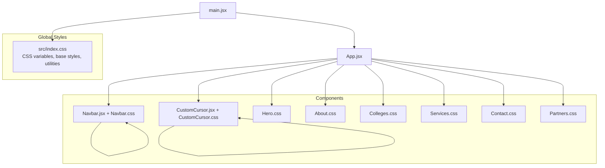
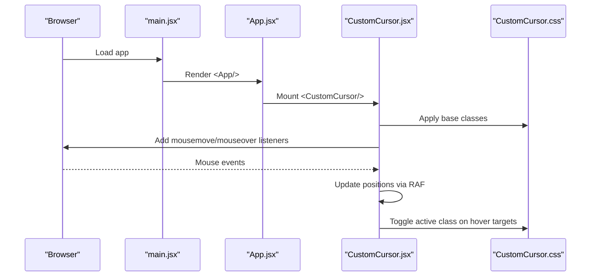
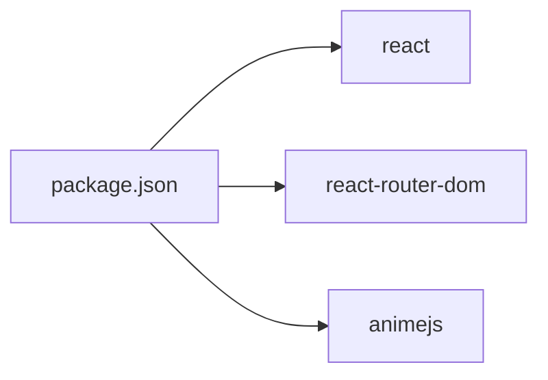

# Styling and Theming

<cite>
**Referenced Files in This Document**
- [index.css](file://src/index.css)
- [App.css](file://src/App.css)
- [CustomCursor.css](file://src/components/CustomCursor.css)
- [CustomCursor.jsx](file://src/components/CustomCursor.jsx)
- [Navbar.css](file://src/components/Navbar.css)
- [Navbar.jsx](file://src/components/Navbar.jsx)
- [Hero.css](file://src/components/Hero.css)
- [About.css](file://src/components/About.css)
- [Colleges.css](file://src/components/Colleges.css)
- [Services.css](file://src/components/Services.css)
- [Contact.css](file://src/components/Contact.css)
- [Partners.css](file://src/components/Partners.css)
- [App.jsx](file://src/App.jsx)
- [main.jsx](file://src/main.jsx)
- [package.json](file://package.json)
</cite>

## Table of Contents
1. [Introduction](#introduction)
2. [Project Structure](#project-structure)
3. [Core Components](#core-components)
4. [Architecture Overview](#architecture-overview)
5. [Detailed Component Analysis](#detailed-component-analysis)
6. [Dependency Analysis](#dependency-analysis)
7. [Performance Considerations](#performance-considerations)
8. [Troubleshooting Guide](#troubleshooting-guide)
9. [Conclusion](#conclusion)
10. [Appendices](#appendices)

## Introduction
This document describes the styling and theming architecture of the Vertex Education website. It explains how CSS-in-JS is applied via inline styles and dynamic class toggles, how CSS variables power the theme, how responsive design is implemented across breakpoints, and how animations and transitions are orchestrated. It also documents the color scheme, typography, spacing, and utility classes, and provides guidelines for extending styles consistently while maintaining performance and accessibility.

## Project Structure
The styling system is organized around:
- Global baseline and theme variables in a single stylesheet
- Component-scoped CSS modules imported by React components
- Utility classes for layout and common patterns
- A custom cursor implemented with React and CSS

**Diagram sources**
- [main.jsx](file://src/main.jsx#L1-L14)
- [App.jsx](file://src/App.jsx#L1-L45)
- [index.css](file://src/index.css#L1-L101)
- [Navbar.jsx](file://src/components/Navbar.jsx#L1-L82)
- [CustomCursor.jsx](file://src/components/CustomCursor.jsx#L1-L87)

**Section sources**
- [main.jsx](file://src/main.jsx#L1-L14)
- [App.jsx](file://src/App.jsx#L1-L45)
- [index.css](file://src/index.css#L1-L101)

## Core Components
- Global theme and utilities: CSS variables define colors, gradients, fonts, spacing, and a container utility. Base elements normalize defaults and apply global utilities.
- Component styling: Each major page area is styled in its own CSS module and imported by the corresponding React component.
- Cursor system: A custom cursor is implemented with two layered DOM elements and animated via a requestAnimationFrame loop in the component.

Key styling methodology highlights:
- CSS-in-JS approach: Dynamic class names (e.g., scrolled, mobile-menu-open) are toggled in React to drive stateful styles.
- Theming with CSS variables: Root-level variables supply primary colors, backgrounds, gradients, and typography families; components consume these variables for consistency.
- Responsive design: Breakpoints are defined per component using media queries; shared container and spacing variables ensure uniformity.
- Animations and transitions: Hover effects, scroll-triggered animations, and keyframe-driven motion are implemented with pure CSS and minimal JS hooks.

**Section sources**
- [index.css](file://src/index.css#L1-L101)
- [Navbar.jsx](file://src/components/Navbar.jsx#L1-L82)
- [CustomCursor.jsx](file://src/components/CustomCursor.jsx#L1-L87)
- [CustomCursor.css](file://src/components/CustomCursor.css#L1-L34)

## Architecture Overview
The runtime styling pipeline:
- Global CSS is imported in the app entry to establish theme variables and base styles.
- Each component imports its local CSS and renders with static or dynamic class names.
- The custom cursor updates positions via React effects and requestAnimationFrame, applying CSS transitions for smoothness.

**Diagram sources**
- [main.jsx](file://src/main.jsx#L1-L14)
- [App.jsx](file://src/App.jsx#L1-L45)
- [CustomCursor.jsx](file://src/components/CustomCursor.jsx#L1-L87)
- [CustomCursor.css](file://src/components/CustomCursor.css#L1-L34)

## Detailed Component Analysis

### Global Theme and Utilities
- CSS variables: Centralized palette (primary, secondary, accents), backgrounds, gradients, and typography families are defined in the root scope.
- Base styles: Normalize margins/padding, hide default cursor, enable smooth font rendering, and style generic elements.
- Utilities: Container, section title gradient, and button styles leverage variables and transitions for consistent behavior.

Guidelines:
- Add new tokens to the root variables for theme-wide changes.
- Prefer variables over hardcoded values in components.
- Keep utility classes minimal and composable.

**Section sources**
- [index.css](file://src/index.css#L1-L101)

### Navigation Bar
- Dynamic classes: scrolled and mobile-menu-open alter appearance and behavior.
- Hover and focus states: link underlines, CTA transitions, logo scaling.
- Mobile responsiveness: hamburger menu, off-canvas slide-in panel with backdrop.

Responsive breakpoints:
- 992px: Switch to mobile layout and overlay menu.
- 480px: Further adjust logo size and panel width.

Accessibility:
- Ensure keyboard navigation support for the mobile menu.
- Provide sufficient color contrast for hover states.

**Section sources**
- [Navbar.css](file://src/components/Navbar.css#L1-L166)
- [Navbar.jsx](file://src/components/Navbar.jsx#L1-L82)

### Hero Section
- Background composition: Gradient layers and animated floating shapes.
- Content fade-in: Opacity and transform transitions triggered by a parent animate class.
- Responsive typography and shape sizing.

Animation implementation:
- Keyframes define a subtle float effect for background shapes.
- Content elements animate in when the hero container receives the animate class.

**Section sources**
- [Hero.css](file://src/components/Hero.css#L1-L147)

### About Section
- Card hover effects: Transform, shadow, and a gradient accent bar on hover.
- Stat presentation: Large number styling with primary color emphasis.

**Section sources**
- [About.css](file://src/components/About.css#L1-L75)

### Services Section
- Grid layout with auto-fit columns.
- Card hover transforms and icon rotation/glow transitions.

**Section sources**
- [Services.css](file://src/components/Services.css#L1-L51)

### Colleges Section
- 3D card hover: Preserve-3d and rotateY/X transforms for depth perception.
- Overlay transitions and explore button reveal.
- Back button hover translation.

Responsive:
- Adjusts grid columns and card heights at smaller screens.

**Section sources**
- [Colleges.css](file://src/components/Colleges.css#L1-L257)

### Contact Section
- Two-column layout with flexible gutters.
- Form field focus states and placeholder styling.
- Info item icons with rounded containers and color accents.

**Section sources**
- [Contact.css](file://src/components/Contact.css#L1-L112)

### Partners Section
- Marquee animation using keyframes and flexbox.
- Partner cards with hover state transitions and glow effects.

**Section sources**
- [Partners.css](file://src/components/Partners.css#L1-L67)

### Custom Cursor
- Two-layer cursor: a small dot and a larger ring.
- Smooth trailing effect: requestAnimationFrame loop with easing.
- Interaction feedback: active class increases size and applies glow.

Integration:
- Mounted in the root App and attached to document mousemove/mouseover events.
- Uses CSS transitions for smooth resizing and color blending.

**Section sources**
- [CustomCursor.jsx](file://src/components/CustomCursor.jsx#L1-L87)
- [CustomCursor.css](file://src/components/CustomCursor.css#L1-L34)

## Dependency Analysis
- Runtime dependencies: The project relies on React, React Router, and Anime.js for optional animation features. These influence styling choices (e.g., when to use JS-driven motion).
- Styling dependencies: Components depend on their local CSS modules; global variables are consumed from the root stylesheet.

**Diagram sources**
- [package.json](file://package.json#L1-L31)

**Section sources**
- [package.json](file://package.json#L1-L31)

## Performance Considerations
- CSS delivery:
  - Keep styles scoped to components to reduce bundle size.
  - Use CSS variables to minimize repeated declarations.
  - Avoid heavy animations on low-power devices; prefer hardware-accelerated properties (transform, opacity).
- Rendering:
  - requestAnimationFrame is used for smooth cursor movement; avoid unnecessary reflows.
  - Prefer transform and opacity for animations; they are generally cheaper than layout-affecting properties.
- Bundle size:
  - Anime.js is present; use it selectively for complex sequences rather than per-frame motion where CSS transitions suffice.

[No sources needed since this section provides general guidance]

## Troubleshooting Guide
Common styling issues and resolutions:
- Cursor not visible:
  - Ensure global cursor hiding is intentional and custom cursors are mounted.
  - Verify z-index stacking order and pointer-events settings.
- Hover states not triggering:
  - Confirm interactive elements are not blocked by overlays or incorrect selectors.
  - Check for conflicting transitions or pseudo-class precedence.
- Responsive layout breaks:
  - Validate media query breakpoints and ensure container widths are respected.
  - Test on target viewport sizes and adjust component-specific rules as needed.
- Animation stutter:
  - Prefer transform and opacity; avoid animating layout properties.
  - Limit the number of simultaneous animations.

**Section sources**
- [CustomCursor.jsx](file://src/components/CustomCursor.jsx#L1-L87)
- [CustomCursor.css](file://src/components/CustomCursor.css#L1-L34)
- [Navbar.css](file://src/components/Navbar.css#L1-L166)
- [Hero.css](file://src/components/Hero.css#L1-L147)

## Conclusion
The Vertex Education website employs a clean, maintainable styling architecture:
- CSS-in-JS is used sparingly for stateful UI (e.g., navbar scrolled/mobile states) while most styling remains in dedicated CSS modules.
- A robust CSS variable system centralizes theming for consistent color, typography, and spacing.
- Responsive patterns are implemented per component with shared utilities and breakpoints.
- Animations combine CSS transitions and keyframes with targeted JS for smooth cursor behavior.
Adhering to the guidelines below will help maintain consistency, performance, and accessibility across the site.

## Appendices

### Color Scheme
- Primary: Used for branding, links, and highlights.
- Secondary: Used for accents and supportive actions.
- Backgrounds: Light backgrounds for content areas; gradients for buttons and titles.
- Text: Distinct weights for headings and body copy.

**Section sources**
- [index.css](file://src/index.css#L1-L23)

### Typography System
- Headings: Premium serif family for hierarchy.
- Body: Sans-serif for readability.
- Font weights: Light to extra-bold to support various emphasis levels.

**Section sources**
- [index.css](file://src/index.css#L20-L22)

### Spacing Conventions
- Section padding: Defined as a root variable for consistent vertical rhythm.
- Container: Max-width wrapper with horizontal padding.
- Component-specific gaps: Managed within each module’s grid and layout rules.

**Section sources**
- [index.css](file://src/index.css#L17-L23)
- [About.css](file://src/components/About.css#L19-L23)
- [Colleges.css](file://src/components/Colleges.css#L7-L12)

### Utility Classes
- Container: Centered layout with max-width and padding.
- Section title: Gradient text treatment.
- Button: Rounded, gradient-filled, hover lift and shadow.

**Section sources**
- [index.css](file://src/index.css#L67-L98)

### Responsive Breakpoints
- 992px: Mobile navigation activation and overlay panel.
- 768px: Hero and card adjustments.
- 480px: Additional fine-tuning for smaller screens.

**Section sources**
- [Navbar.css](file://src/components/Navbar.css#L57-L126)
- [Hero.css](file://src/components/Hero.css#L113-L147)
- [Colleges.css](file://src/components/Colleges.css#L213-L257)

### Guidelines for Adding New Styles
- Use CSS variables for colors, fonts, and spacing.
- Scope styles to the component’s CSS module; import locally.
- Prefer utility classes for common patterns (container, button).
- Add responsive variants within the component’s stylesheet.
- For motion, favor CSS transitions and keyframes; reserve JS for precise interactivity (e.g., cursor).

[No sources needed since this section provides general guidance]

### Modifying Existing Themes
- Update root variables to change brand colors or backgrounds.
- Reuse gradients and shadows from established patterns.
- Maintain contrast ratios for text and interactive elements.

**Section sources**
- [index.css](file://src/index.css#L3-L23)

### Accessibility Considerations
- Ensure sufficient color contrast for text and interactive states.
- Provide focus indicators for keyboard navigation.
- Avoid relying solely on color to convey meaning; pair with icons or text.
- Minimize motion where motion-sensitive users may be affected.

[No sources needed since this section provides general guidance]